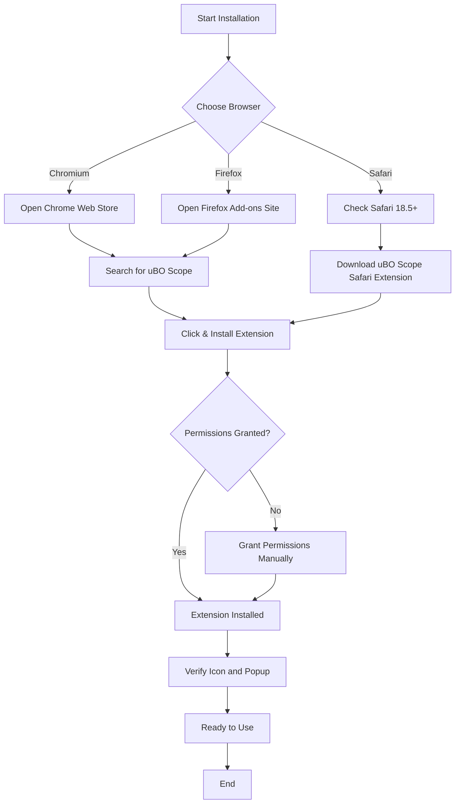

# Installing and Enabling uBO Scope

## Overview
This guide walks you through installing uBO Scope on Chromium-based browsers (like Google Chrome and Microsoft Edge), Mozilla Firefox, and Apple Safari. You'll learn how to download the extension from official sources, install it, and verify that it is enabled correctly for immediate use.

## Prerequisites
- A supported browser:
  - Chromium 122.0 or later
  - Firefox 128.0 or later
  - Safari 18.5 or later
- Internet connectivity to access the official extension repository or website
- Basic knowledge of your browser’s extension/add-on management interface

## Expected Outcome
After completing this guide, uBO Scope will be installed and active in your browser toolbar. You'll be ready to start monitoring third-party network connections on websites.

## Installation Steps

### 1. Installing uBO Scope on Chromium Browsers

1. Open your Chromium-based browser.
2. Navigate to the Chrome Web Store or the official distribution page for uBO Scope.
3. Search for "uBO Scope" or directly access the extension page.
4. Click the `Add to Chrome` button.
5. Confirm any permissions requested by the extension, such as access to active tabs and web request monitoring.
6. Wait for the extension to be installed. The uBO Scope icon appears in your browser toolbar.

### 2. Installing uBO Scope on Firefox

1. Open Firefox.
2. Visit the Firefox Add-ons site or the official uBO Scope repository.
3. Search for "uBO Scope".
4. Click `Add to Firefox`.
5. Review permission prompts requesting access to tabs, storage, and webRequest APIs.
6. Confirm installation. Once complete, the uBO Scope icon will show in the toolbar.

### 3. Installing uBO Scope on Safari

uBO Scope requires Safari 18.5 or later due to compatibility restrictions.

1. Open Safari and ensure your browser version is 18.5 or newer.
2. Download the uBO Scope Safari extension from the official source or Safari Extensions Gallery.
3. Follow the on-screen instructions to install the extension.
4. Upon installation, enable the extension in Safari’s Extensions preferences if not enabled automatically.


## Verifying uBO Scope Installation

After installation, verify the extension is enabled and working:

1. Look for the uBO Scope icon (default title: ‘uBO Scope’) in your browser toolbar.
2. Click the icon to open the popup (typically `popup.html`).
3. Confirm the popup loads without errors and shows initial information like the connected domains count.
4. Navigate to a website and observe the badge updating as uBO Scope reports third-party connections.

<Tip>
If the icon is not visible, check your browser’s extension management settings to ensure uBO Scope is enabled and not hidden.
</Tip>

## Managing Permissions

uBO Scope requires the following permissions to function:
- Access activeTab: to monitor requests from the current tab
- Storage: to save temporary network data
- WebRequest: to observe network connections
- Host permissions for `http://*/*` and `https://*/*` (and websocket protocols for non-Safari browsers) to capture requests

Ensure you grant these permissions during installation or enable them manually in your browser’s extension settings.

## Post-Installation Tips

- Keep your browser up-to-date to guarantee compatibility.
- After installation, try visiting various websites to see connection tracking in real time.
- Consult the popup UI guide to understand connection outcomes (allowed, blocked, stealth-blocked).

## Troubleshooting Common Installation Issues

<AccordionGroup title="Troubleshooting Installation Problems">
<Accordion title="Extension Not Visible in Toolbar">
- Check if the extension is enabled in your browser extensions/add-ons settings.
- In some Chromium browsers, pin the uBO Scope icon to the toolbar.
- Restart your browser if required.
</Accordion>
<Accordion title="Installation Fails or Extension is Disabled Automatically">
- Verify you are using a supported version of your browser.
- Disable conflicting extensions that may hinder webRequest API usage.
- For Safari, confirm the extension meets minimum browser version requirements.
</Accordion>
<Accordion title="Popup Does Not Open or Shows 'NO DATA'">
- Reload the current tab after installation.
- Open the extension settings and reset permissions if possible.
- Restart the browser to clear any stale states.
</Accordion>
</AccordionGroup>

## Additional Resources

- Explore the [System Requirements & Supported Browsers](https://docs.uboscope.org/getting-started/installation-setup/prerequisites) for detailed compatibility info.
- After installation, consult the [Understanding the Popup and Badge](https://docs.uboscope.org/guides/getting-started/understanding-ui-badge) guide to learn how to interpret results.
- Visit the [Troubleshooting Common Issues](https://docs.uboscope.org/getting-started/validation-troubleshooting/common-issues) page if you face operational challenges.

---

## Summary Diagram of Installation Workflow


This flowchart illustrates the simple browser-specific installation and verification steps.

---

## Code Reference for Packaging (Advanced Users)

For users who want to build or package uBO Scope manually (mainly developers):

- `tools/make-package.sh` is the script that assembles the extension for a given platform.
- Platform-specific scripts like `tools/make-chromium.sh`, `tools/make-firefox.sh`, and `tools/make-safari.sh` call the main packaging script.

Example to create a Chromium build:
```bash
./tools/make-chromium.sh 1.0.1
```
This will generate a ZIP package with version 1.0.1 embedded.

For detailed packaging and versioning instructions, see the respective scripts in the `tools/` directory of the source repository.

---

## Final Notes
uBO Scope’s installation process is streamlined to get you monitoring network connections with minimal friction. By following this guide, you will ensure the extension is installed safely, properly enabled, and ready to provide real-time insights into third-party connections throughout your browsing sessions.

Should you need help beyond installation, consult the related guides on popup UI usage and troubleshooting.

---

## Reference Links
- [uBO Scope GitHub Repository](https://github.com/gorhill/uBO-Scope)
- [Official uBO Scope Documentation Home](https://docs.uboscope.org/)
- [System Requirements & Supported Browsers](https://docs.uboscope.org/getting-started/installation-setup/prerequisites)
- [Understanding the Popup and Badge](https://docs.uboscope.org/guides/getting-started/understanding-ui-badge)
- [Troubleshooting Common Issues](https://docs.uboscope.org/getting-started/validation-troubleshooting/common-issues)

---

<style>
code {
    background-color: #f5f5f5;
    padding: 0 3px;
    border-radius: 3px;
}
</style>
