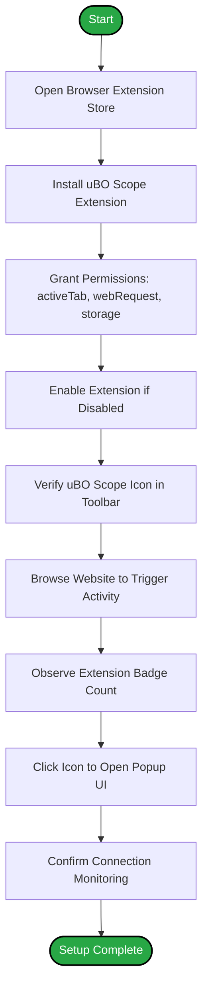

# Installing and Enabling uBO Scope

## Overview
This guide walks you through the straightforward process of installing uBO Scope on your preferred web browser, ensuring you grant the necessary permissions, and confirming that the extension icon and badge appear correctly in your browser's toolbar. Whether you're using Chrome, Firefox, or Safari, these steps will get uBO Scope up and running smoothly.

---

## Prerequisites
Before you begin, please ensure:

- You are using a supported browser version:
  - **Chrome**: Version 122 or later
  - **Firefox**: Version 128 or later
  - **Safari**: Version 18.5 or later
- You have internet access to reach the browser extension marketplaces.
- You understand that uBO Scope requires permissions to access network requests (`webRequest`), active tabs, and browser storage.

For detailed prerequisites, see [System Requirements and Prerequisites](../../getting-started/installation-basics/prerequisites).

---

## 1. Installation

### Chrome
1. Open the [Chrome Web Store page for uBO Scope](https://chromewebstore.google.com/detail/ubo-scope/bbdpgcaljkaaigfcomhidmneffjjjfgp).
2. Click **Add to Chrome**.
3. Review the permission prompt carefully. uBO Scope requires:
   - Access to your active tab
   - Access to web requests
   - Access to local storage
4. Confirm by clicking **Add extension**.
5. Wait for the extension to download and install automatically.

### Firefox
1. Visit the [Firefox Add-ons page for uBO Scope](https://addons.mozilla.org/firefox/addon/ubo-scope/).
2. Click **Add to Firefox**.
3. Confirm the requested permissions:
   - Permissions to access network requests
   - Permission to access the active tab
   - Permission to use storage
4. Click **Add** and wait for installation to complete.

### Safari
1. For Safari, uBO Scope installation is supported starting with Safari 18.5.
2. Install via the official Apple Extensions gallery or developer-provided package as applicable.
3. Grant necessary permissions when prompted.

---

## 2. Confirm Extension Activation

After installation, verify the extension is enabled and actively monitoring:

- **Locate the uBO Scope icon:** Look for the uBO Scope icon in your browser toolbar. It typically looks like a stylized shield or small logo.

- **Verify badge count:** The icon badge shows the number of distinct allowed third-party domains with network connections originating from the active tab. Initially, this may be blank or zero if no browsing activity is detected.

- **Enable if disabled:** If the icon does not appear, or if the badge is not updating, ensure that the extension is enabled in your browser's extensions management page.

For help with locating and confirming activation, see [First Launch and Extension Activation](../../getting-started/first-use-configuration/first-launch).

---

## 3. Usage Confirmation Steps

### Observe badge updates
1. Browse to a trusted website (for example, a news site or your favorite homepage).
2. Look at the uBO Scope toolbar icon.
3. Observe the badge number increasing, indicating distinct third-party remote servers contacted by the tab.
4. Click the icon to open the popup UI, which provides detailed outcomes of allowed, stealth-blocked, and blocked connections.

### Check permissions
- uBO Scope needs permission to monitor network requests across HTTP and HTTPS URLs.
- In Chrome and Firefox, this is declared as `host_permissions` for all URLs (`https://*/*` and `http://*/*`). Chrome additionally includes `ws://*/*` and `wss://*/*` to cover WebSocket traffic.

### Troubleshoot installation issues
- If the icon is missing, confirm:
  - The extension was installed successfully
  - The extension is enabled
  - Your browser version meets minimum requirements
  - You have granted all requested permissions

For more troubleshooting guidance, refer to [Troubleshooting Common Installation and Usage Issues](../../getting-started/troubleshooting-support/common-issues).

---

## 4. Best Practices and Tips

- **Keep your browser updated** to ensure full compatibility and access to required WebExtensions APIs.

- **Restart your browser** after installing uBO Scope for best results.

- **Understand the badge meaning:** A lower badge count represents fewer distinct third-party connections, which generally means better privacy.

- **Use uBO Scope alongside your preferred content blocker** to get an independent measurement of network requests.

- Regularly consult detailed popup data to audit third-party connections.

---

## 5. Additional Resources

- [Installing uBO Scope (Platform-Specific Instructions)](../../getting-started/installation-basics/installing-ubo-scope)
- [Understanding the Toolbar and Popup UI](../../getting-started/first-use-configuration/basic-usage)
- [Quick Validation and Testing to Confirm Operation](../../getting-started/first-use-configuration/quick-validation)
- [What is uBO Scope? Core Product Introduction](../../overview/introduction-core-concepts/what-is-uboscope)

---

## Summary
This guide has shown you how to install uBO Scope on Chrome, Firefox, and Safari; confirm the extension is enabled; understand the meaning of the toolbar badge; and troubleshoot common installation issues. By completing these steps, you ensure uBO Scope can monitor all third-party connections transparently and independently.

Welcome to a clearer view of your browser’s network behaviors and improved privacy awareness.

---

## Common Issues and How to Fix Them

<AccordionGroup title="Common Installation Issues">
<Accordion title="Extension Icon Not Visible">
- Confirm installation completed successfully.
- Check that the extension is enabled in your browser's extension manager.
- Restart your browser.
- Ensure you are on a supported browser and version.
</Accordion>
<Accordion title="Badge Count Not Updating">
- Refresh the active tab after installation.
- Make sure the website you are visiting initiates network requests.
- Confirm permissions granted include access to webRequest API.
</Accordion>
<Accordion title="Permissions Prompt Did Not Appear or Was Denied">
- Go to your browser’s extension settings.
- Manually enable required permissions or reinstall the extension.
- Sometimes clearing browser cache and restarting helps.
</Accordion>
</AccordionGroup>

---

## How to Uninstall uBO Scope

If you wish to remove uBO Scope:

1. Open your browser’s extensions or add-ons page.
2. Locate the uBO Scope extension.
3. Click **Remove** or **Uninstall**.
4. Confirm your choice.

Uninstalling will stop network connection monitoring and remove uBO Scope from your browser.

---

## Feedback and Support

For further assistance or to report issues, visit the [uBO Scope GitHub repository](https://github.com/gorhill/uBO-Scope) where you can find source code, report bugs, and request features.

---

## Version Notes
- Current version: 1.0.1
- Manifest version: 3
- Permissions: `activeTab`, `storage`, `webRequest`
- Supports HTTP, HTTPS, WebSocket protocols (depending on browser)

---

## Illustrative Diagram: Installation and Activation Flow

