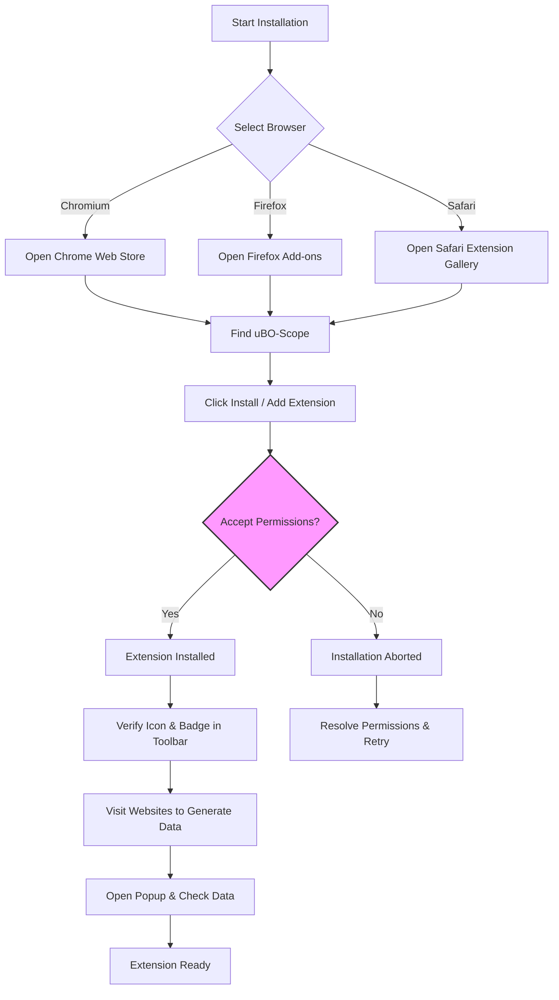

# Installing uBO-Scope on Your Browser

A straightforward, practical guide to installing uBO-Scope on Chromium, Firefox, and Safari browsers. This guide walks you through accessing the official extension stores, granting necessary permissions, and performing the first steps to activate and verify the extension, ensuring you can start monitoring network connections immediately.

---

## 1. Overview

uBO-Scope is designed to provide transparency into all remote connections your browser attempts or successfully establishes when browsing websites. Installing it correctly is critical to ensure it can monitor network requests using browser APIs with the appropriate permissions.

This page helps you get uBO-Scope set up on supported browsers and explains how to verify that the extension is active and visible.

**Supported Browsers:**
- Chromium-based browsers (Chrome 122+)
- Firefox (128+)
- Safari (18.5+)


## 2. Prerequisites

Before you start the installation, ensure:

- You are using a supported browser version (see above).
- Your browser allows installation of extensions from official stores.
- No conflicting permissions or policies block installation.
- Internet connectivity to access the browser's extension store.

If you need detailed system requirements or deeper understanding of supported platforms, see the [Prerequisites & Supported Platforms](../../getting-started/setup-install/prerequisites) page.


## 3. Installing uBO-Scope

### 3.1 Installation from Official Browser Stores

Installing from official stores ensures you receive updates and have verified permissions.

| Browser           | Where to Install                                                                          |
|-------------------|-------------------------------------------------------------------------------------------|
| Chromium (Chrome) | [Chrome Web Store](https://chromewebstore.google.com/detail/ubo-scope/bbdpgcaljkaaigfcomhidmneffjjjfgp) |
| Firefox           | [Firefox Add-ons](https://addons.mozilla.org/firefox/addon/ubo-scope/)                    |
| Safari            | Follow Safari extension installation from Safari Extensions Gallery or the official site. Refer to Apple guidelines for Safari 18.5+ extensions. |

#### Steps to Install:

1. Open your browser.
2. Navigate to your browser's extension/add-ons store using the links above.
3. Search for "uBO Scope" or access directly via provided URLs.
4. Click **Add to Browser** or **Install**.
5. Accept any permission prompts the extension requests, noting that it requires `activeTab`, `storage`, and `webRequest` permissions to function correctly.


### 3.2 Manual Installation (Advanced Users & Developers)

Developers or users who want to build and install uBO-Scope manually (e.g., from source) can use the build scripts provided for Firefox.

> This option is intended for Linux environments and technical users.

**Example: Building Firefox extension package**

- Run the shell script `tools/make-firefox.sh` with an optional version argument to create `.xpi` package:

```bash
./tools/make-firefox.sh 1.0.1
```

- Once created, load the unpacked extension or the `.xpi` file into Firefox via `about:debugging` or `about:addons` > Install Add-on From File.

> For other browser platforms, building processes will be similar but may require platform-specific steps.


## 4. Required Permissions and Essential Configuration

uBO-Scope requires certain permissions to monitor network requests and report connections:

- **activeTab**: Access information about the currently active tab where connections are monitored.
- **webRequest**: Listen to network requests to capture connection events.
- **storage**: Save session data, including connection outcomes and domain counts.

During installation, your browser will prompt for these permissions. Ensure you explicitly accept them, or the extension will not function correctly.


## 5. Verifying Installation and Initial Use

Once installed, verify that uBO-Scope is active and ready:

1. **Toolbar Icon Presence**: The uBO-Scope icon should appear in your browser's extension toolbar.

2. **Badge Indicator**: When visiting websites, the icon displays a badge showing the count of distinct third-party remote servers connected to the page. Lower counts usually indicate better privacy.

3. **Popup Interface**:
   - Click the toolbar icon to open the popup.
   - You should see domain data categorized into "not blocked", "stealth-blocked", and "blocked".
   - If the popup shows "NO DATA", refresh the webpage or visit a different site to trigger data capture.


## 6. Initial Steps After Installation

- Visit a few websites to allow uBO-Scope to start collecting data.
- Observe badge counts to get a sense of network connection exposure.
- Open the popup to explore detailed domain outcomes.


## 7. Common Pitfalls and Tips

- **Extension Icon Not Visible**: Check your browser’s extensions menu or pin the icon to the toolbar.
- **Permission Denied**: Reinstall or adjust permissions in your browser’s extension management settings.
- **No Data in Popup**: Make sure you have navigated to a webpage that performs network requests and that webRequest API is supported by your browser.
- **Outdated Browser Version**: Update your browser to meet minimum version requirements.


<Tip>
Browsers can remove the extension icon from the toolbar by default. Make sure to pin uBO-Scope’s icon for easy access.
</Tip>

<Tip>
The badge count reflects unique third-party domains your browser connected to from the active tab — a higher count means more external connections.
</Tip>


## 8. Next Steps

After installation:
- Explore [Launching the Extension](../first-run-usage/launch-extension) to understand the popup interface.
- Learn to interpret badge counts with [Understanding Badge Counts & Domain Data](../first-run-usage/interpreting-badge).
- Find quick early insights in [Quick Validation & First Insights](../first-run-usage/quick-validation).
- If you encounter problems, see [Troubleshooting Installation & Permissions](../../getting-started/troubleshooting/install-troubleshooting).


## 9. Additional Resources

- Official GitHub Repository: [https://github.com/gorhill/uBO-Scope](https://github.com/gorhill/uBO-Scope)
- Browser-specific Manifest Examples:
  - [Firefox manifest.json](../../platform/firefox/manifest.json)
  - [Chromium manifest.json](../../platform/chromium/manifest.json)
  - [Safari manifest.json](../../platform/safari/manifest.json)


---

## Appendix: Installation Workflow Diagram




---

This completes the installation guide for uBO-Scope. Follow these steps to have the extension actively monitor your web connections, providing valuable insight into third-party connections and privacy exposure.