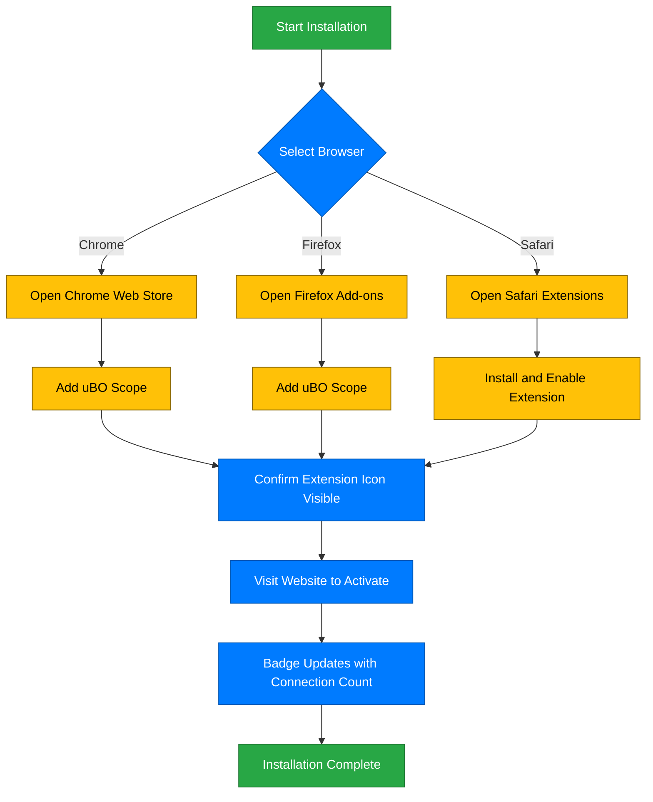

# Installing uBO Scope

This guide shows you how to quickly install the uBO Scope browser extension on Chrome, Firefox, and Safari. By following these steps, you’ll have the extension ready to monitor and report remote server connections in just a few minutes.

---

## 1. Overview

### What This Guide Covers

- Browser compatibility and version requirements
- Where and how to download the extension safely
- Step-by-step installation and activation

### What You Will Achieve

- Successfully install uBO Scope on your preferred browser
- Confirm that the extension is active and ready to use

### Estimated Time to Complete

About 5 minutes, depending on your familiarity with your browser’s extension installation process.

### Difficulty Level

Beginner — no technical knowledge required.

---

## 2. Supported Browsers and Compatibility

Before installing, ensure your browser meets the minimum requirements:

| Browser | Minimum Version | Additional Notes |
|---------|-----------------|-----------------|
| Chrome  | 122.0 or later  | Extension available via Chrome Web Store
|
| Firefox | 128.0 or later  | Extension available via Firefox Add-ons
|
| Safari  | 18.5 or later   | Available for Safari on macOS


**Important:**

- uBO Scope relies on the `webRequest` API, which may have different capabilities depending on the browser version.
- Ensure your browser is updated to avoid compatibility issues.

---

## 3. Installation Sources and Links

Install uBO Scope only from official and trusted sources to guarantee authenticity and security:

- **Chrome:** [Chrome Web Store - uBO Scope](https://chromewebstore.google.com/detail/ubo-scope/bbdpgcaljkaaigfcomhidmneffjjjfgp)
- **Firefox:** [Mozilla Add-ons - uBO Scope](https://addons.mozilla.org/firefox/addon/ubo-scope/)
- **Safari:** Available on the Safari Extensions Gallery or through system extension management on macOS Ventura+ (see Safari extensions documentation).


<Tip>
Always avoid downloading extensions from third-party sites or unverified sources.
</Tip>

---

## 4. Step-by-Step Installation Instructions

### 4.1 Chrome Installation

<Steps>
<Step title="Open Chrome Web Store">
Navigate to the official uBO Scope page via the link above.
</Step>
<Step title="Add the Extension">
Click the 'Add to Chrome' button. Confirm the permissions in the prompt and accept.
</Step>
<Step title="Confirm Installation">
Once installed, the uBO Scope icon will appear in your toolbar.
</Step>
</Steps>

### 4.2 Firefox Installation

<Steps>
<Step title="Open Firefox Add-ons">
Visit the official uBO Scope page via the link above.
</Step>
<Step title="Add to Firefox">
Click 'Add to Firefox' and approve requested permissions.
</Step>
<Step title="Verify the Extension">
Look for the uBO Scope icon in your browser toolbar as confirmation.
</Step>
</Steps>

### 4.3 Safari Installation

<Steps>
<Step title="Open Safari Extensions">
Open Safari and navigate to Preferences > Extensions.
</Step>
<Step title="Find uBO Scope">
Search for uBO Scope in the Safari Extensions Gallery or Safari’s Extensions preferences pane.
</Step>
<Step title="Install Extension">
Click to install and enable the extension.
</Step>
<Step title="Verify Activation">
Confirm the uBO Scope toolbar icon appears and is enabled.
</Step>
</Steps>

---

## 5. Post-Installation Activation

After installing, activate uBO Scope by:

1. Clicking the uBO Scope icon in your browser’s toolbar.
2. A popup panel will appear showing "NO DATA" initially.
3. Visit any website to begin recording network connections; the badge count will update.

<Tip>
If the badge count does not appear, try refreshing the page or restarting the browser.
</Tip>

---

## 6. Verifying Successful Installation

- Look for the uBO Scope icon in your browser’s toolbar.
- The badge count on the icon shows the number of distinct third-party domains connected.
- Click the icon to open the popup panel; network connection stats should populate as you browse.

<Test>
Visit a popular website (e.g., https://www.wikipedia.org) and watch the badge count update.
</Test>

---

## 7. Troubleshooting Common Installation Issues

<AccordionGroup title="Installation Troubleshooting">
<Accordion title="Extension Icon Not Visible After Installation">

- Ensure the extension is enabled in your browser’s extension management page.
- Check if the icon is hidden in the overflow menu (e.g., in Chrome, click extension puzzle icon).

</Accordion>
<Accordion title="Permissions Not Granted or Installation Fails">

- Confirm you are installing from an official source.
- Restart your browser and try again.
- Verify your browser version meets minimum requirements.

</Accordion>
<Accordion title="Badge Count Does Not Update">

- Refresh the webpage you are browsing.
- Ensure uBO Scope has required permissions; check browser extension permissions settings.
- Restart the browser if necessary.

</Accordion>
</AccordionGroup>

---

## 8. Best Practices and Tips

- Keep your browser up to date to ensure the extension operates smoothly.
- Visit a variety of websites after installation to observe how uBO Scope tracks remote connections.
- Use the extension to assess your content blockers’ effectiveness by monitoring blocked and allowed connections.

---

## 9. Next Steps

- Proceed to the guide [Your First uBO Scope Session](/guides/getting-started/your-first-session) to learn how to interpret the popup statistics.
- Explore [Interpreting the Popup Panel](/guides/analyzing-connections/interpreting-popup-stats) for deeper insights.
- If you encounter issues, consult [Troubleshooting Common Issues](/getting-started/troubleshooting/troubleshooting-common-issues) for detailed help.

---

## 10. Additional Resources

- [uBO Scope GitHub Repository](https://github.com/gorhill/uBO-Scope) — Source code and development updates.
- [Supported Browsers & System Requirements](/getting-started/installation-and-requirements/supported-browsers-requirements) — Details on compatibility.
- [Understanding Badge Count](/guides/analyzing-connections/understanding-badge-count) — Explains badge count significance.

---

<Info>
By following this guide, you'll have uBO Scope installed and ready to help you visualize the network connections your browser makes, enabling better insight into online privacy and content blocking efficacy.
</Info>

---

## Appendix: Manual Installation via Build Packages (Advanced Users)

If you prefer to build and install the extension manually (mostly for development or special deployment), follow these steps:

1. Clone the [uBO-Scope GitHub repository](https://github.com/gorhill/uBO-Scope).
2. Run the build script for your platform:

```bash
./tools/make-package.sh chromium 1.0.1 # for Chromium
./tools/make-package.sh firefox 1.0.1  # for Firefox
./tools/make-package.sh safari 1.0.1   # for Safari
```

3. Load the generated extension directory into your browser as an unpacked extension (developer mode).

<Tip>
This method requires familiarity with browser developer modes and may need additional setup.
</Tip>

---

# End of Guide

---

# Diagram: Installation Flow Overview


