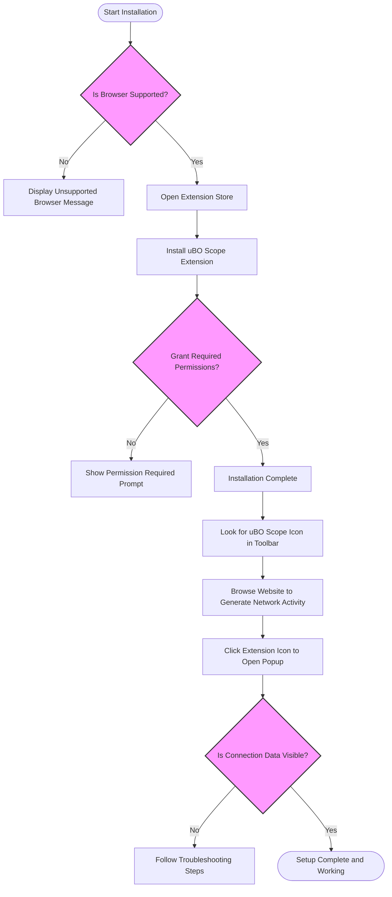

# Installing and Setting Up uBO Scope

This guide walks you through the process of finding, installing, and verifying uBO Scope on your Chromium, Firefox, or Safari browser. You'll learn about the permissions uBO Scope requires, how to confirm a successful installation, and what to expect after setup.

---

## 1. What You Will Accomplish

- **Locate and install uBO Scope** from official browser extension stores.
- **Grant necessary permissions** so uBO Scope can monitor network requests.
- **Verify the installation and functionality** of the extension.

By the end of this guide, you will have uBO Scope running and ready to reveal network connections on your active browser tabs.

---

## 2. Prerequisites

Before starting, ensure you have:

- A supported browser:
  - Chromium version 122.0 or later
  - Firefox version 128.0 or later
  - Safari version 18.5 or later
- Stable internet connection to access extension stores
- Basic familiarity with installing browser extensions

If you have not confirmed your browser version or compatibility, see [Supported Browsers & Requirements](/getting-started/setup-installation/prerequisites-browsers).

---

## 3. Step-by-Step Installation

Follow the instructions corresponding to your browser.

### 3.1 Install on Chromium

1. Open the [Chrome Web Store page for uBO Scope](https://chromewebstore.google.com/detail/ubo-scope/bbdpgcaljkaaigfcomhidmneffjjjfgp).
2. Click **Add to Chrome**.
3. In the permission prompt, review and accept the following permissions:
   - Access to active tab data
   - Storage access
   - Monitoring of all web requests through `webRequest` API
4. Wait for the extension to install; the uBO Scope icon appears in your browser toolbar.

### 3.2 Install on Firefox

1. Navigate to the [Firefox Add-ons page for uBO Scope](https://addons.mozilla.org/firefox/addon/ubo-scope/).
2. Click **Add to Firefox**.
3. Accept permissions similar to those in Chromium.
4. Upon installation, you will see the uBO Scope icon next to the address bar.

### 3.3 Install on Safari

1. Open the Safari Extensions Gallery or the [Mac App Store Safari Extensions section](https://apps.apple.com/app).
2. Search for ‘uBO Scope’ or install from a trusted source where available.
3. Ensure you grant:
   - Access to active tab data
   - Storage
   - Network request monitoring permissions
4. After installation, enable uBO Scope in Safari’s Extensions preferences if necessary.

---

## 4. Understanding Required Permissions

uBO Scope requires specific permissions for accurate network monitoring:

- **`activeTab`**: To access the current tab and associate network requests correctly.
- **`storage`**: To save session data and settings.
- **`webRequest`**: To capture all network events, including redirects, errors, and successful connections.

These permissions enable uBO Scope to detect and classify all remote server connections your active tab attempts.

<Tip>
If permissions are not granted or limited by browser settings, uBO Scope will fail to report accurate connection data.
</Tip>

---

## 5. Verifying Installation Success

Once installed, confirm the extension functions properly using these steps:

1. **Check Extension Icon**:
   - Locate the uBO Scope toolbar icon in your browser.
   - The badge displays a count representing the number of distinct third-party servers connected.
2. **Generate Activity**:
   - Visit a popular website (e.g., https://example.com) to trigger network requests.
3. **Open the Popup Panel**:
   - Click the uBO Scope icon.
   - The popup shows the active tab’s connected domains categorized as:
     - **Not Blocked**: Connections allowed successfully
     - **Stealth-Blocked**: Connections that were redirected or silently blocked
     - **Blocked**: Connections stopped by content blockers or errors
4. **Confirm Data Display**:
   - Ensure the domain list populates with counts.
   - The summary reflects the total number of distinct connected third-party domains.

<Tip>
If the popup shows 'NO DATA' or empty lists after browsing sites, wait a moment and refresh the tab or reload the extension if necessary.
</Tip>

---

## 6. What to Expect After Setup

- A real-time badge count updating with distinct third-party servers your active tab connects to.
- A popup interface giving insight into connection outcomes, aiding in evaluating privacy and content blocker effectiveness.
- Continuous background monitoring of network requests without interrupting your browsing.

---

## 7. Troubleshooting Common Issues

<AccordionGroup title="Troubleshooting Installation and Setup">
<Accordion title="Extension Icon Missing After Installation">
- Ensure the extension is enabled in your browser’s extensions manager.
- Try restarting the browser.
- Verify that installation was from an official source.
</Accordion>
<Accordion title="Popup Displays NO DATA or Blank Lists">
- Reload the active tab to generate network traffic.
- Confirm permissions were properly granted during install.
- Disable conflicting extensions that might interfere with webRequest API.
- Check for browser updates and ensure minimum supported versions.
</Accordion>
<Accordion title="Badge Count Does Not Update Correctly">
- Browsers may impose limitations on background service workers; allow some seconds for updates.
- Clear local extension storage or reinstall to reset session data.
- Consult the Troubleshooting Installation Problems guide for advanced tips.
</Accordion>
</AccordionGroup>

---

## 8. Best Practices and Tips

- **Keep browsers updated** to ensure compatibility with uBO Scope permissions and APIs.
- **Use uBO Scope alongside your content blocker** to gain transparent insight beyond block counts.
- **Interpret badge counts as distinct third-party servers connected** — a lower count indicates fewer third-party connections, enhancing privacy.
- **Avoid relying on ad blocker test websites**; they do not provide reliable assessments.

---

## 9. Additional Resources

- [Supported Browsers & Requirements](/getting-started/setup-installation/prerequisites-browsers): for detailed compatibility info.
- [Troubleshooting Installation Problems](/getting-started/troubleshooting-validation/troubleshooting-install): assistance with installation issues.
- [Validating uBO Scope Functionality](/getting-started/troubleshooting-validation/quick-validation-steps): quick checks post-install.
- [Understanding the Popup Interface](/guides/getting-started/understanding-the-popup): deeper look at the popup view.
- [uBO Scope GitHub Repository](https://github.com/gorhill/uBO-Scope): source code, releases, and issue tracking.

---

By following this guide, you will have successfully installed and set up uBO Scope to begin monitoring third-party network connections effortlessly and with full clarity.

---

## Diagram: Installation and Verification Flow

