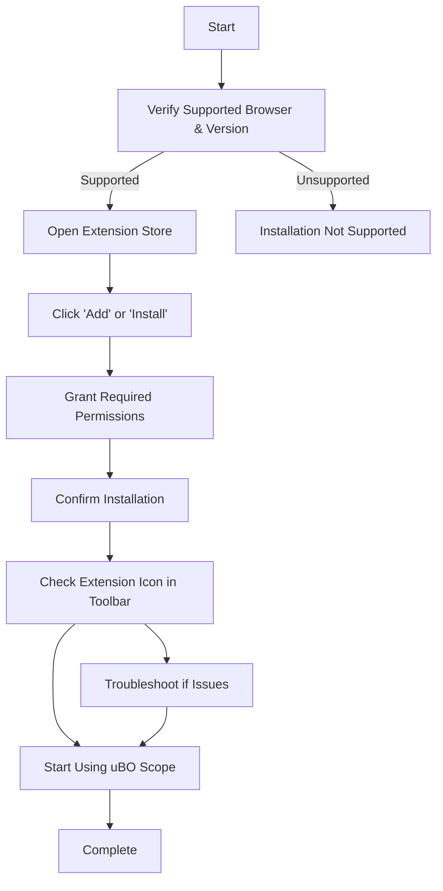

# Installing uBO Scope

## Overview
This guide walks you through installing uBO Scope, a browser extension that transparently reports network connections to third-party remote servers. You will learn platform-specific installation steps for Google Chrome, Mozilla Firefox, and Safari, along with the required permissions to enable real-time monitoring. By following these instructions, you will ensure uBO Scope is set up correctly and ready for immediate use.

---

## 1. Compatibility and Prerequisites

Before installing, verify the following to ensure smooth operation:

- **Supported Browsers:**
  - Google Chrome (version 122.0 or later)
  - Mozilla Firefox (version 128.0 or later)
  - Safari (version 18.5 or later)
- **Permissions Required:** `webRequest`, `activeTab`, `storage`.
- **Internet Connection:** To fetch permissions and install from the browser web stores.

> The extension uses the browser’s `webRequest` API, so versions older than those above may not support all features.

---

## 2. Installation Steps

### 2.1 Install uBO Scope on Google Chrome

1. Open Google Chrome.
2. Go to the [Chrome Web Store page for uBO Scope](https://chromewebstore.google.com/detail/ubo-scope/bbdpgcaljkaaigfcomhidmneffjjjfgp).
3. Click **Add to Chrome**.
4. Confirm by clicking **Add extension** in the prompt.
5. Once installed, the uBO Scope icon appears in the toolbar.

### 2.2 Install uBO Scope on Mozilla Firefox

1. Open Mozilla Firefox.
2. Visit the [Firefox Add-ons page for uBO Scope](https://addons.mozilla.org/firefox/addon/ubo-scope/).
3. Click **Add to Firefox**.
4. Approve the permissions by clicking **Add**.
5. The uBO Scope icon will appear next to the address bar.

### 2.3 Install uBO Scope on Safari

1. Open Safari on macOS or iOS device.
2. Access the Safari Extensions Gallery or the App Store if available.
3. Search for uBO Scope.
4. Install the extension.
5. Enable it in Safari Extensions preferences.

> Safari's support for webRequest permissions is limited compared to Chromium and Firefox; behaviors might vary slightly.

---

## 3. Permissions Explanation

uBO Scope requires specific browser permissions to operate effectively:

- **webRequest:** Enables monitoring of network requests.
- **activeTab:** Accesses the currently active tab to focus monitoring.
- **storage:** Stores session data to maintain state across browsing sessions.

These permissions are necessary for accurate reporting and updating of the toolbar badge.

---

## 4. Verifying the Installation

After installation:

1. Click on the uBO Scope icon in the toolbar.
2. The popup will load and display the domains accessed by the active tab.
3. The badge count on the extension icon should show the number of distinct third-party domains contacted.

If you see "NO DATA" or the count remains zero after visiting active websites, refer to troubleshooting tips.

---

## 5. Initial Extension Setup

The extension requires no further manual configuration right after installation:

- Permissions are automatically requested during install.
- The extension starts monitoring network requests immediately.
- The badge count updates dynamically as you browse.

You can immediately start using the popup to analyze active tab network connections.

---

## 6. Best Practices for Installation

- **Install from official stores only** to ensure authenticity and latest updates.
- **Keep your browser updated** to full compatibility with the extension’s API usage.
- **Verify permissions** if you encounter issues with data not displaying.
- **Restart the browser** if the extension icon or badge doesn’t appear after installation.

---

## 7. Common Pitfalls & Troubleshooting

<AccordionGroup title="Troubleshooting Installation Issues">
<Accordion title="Extension Icon Not Visible After Installation">
Verify that the extension is enabled in your browser’s extension settings. For Chrome and Firefox, navigate to `chrome://extensions` or `about:addons` respectively and ensure uBO Scope is active. On Safari, check the Extensions preference pane.
</Accordion>
<Accordion title="Popup Does Not Show Connection Data or Shows 'NO DATA'">
- Make sure you have visited some websites in active tabs to generate network activity.
- Confirm permissions are properly granted.
- Try refreshing the active tab.
- Restart the browser to reload the extension.
</Accordion>
<Accordion title="Badge Count Does Not Update">
- The badge shows distinct third-party domains connected, which may be zero on simple pages.
- If persistent, check for conflicts with other privacy extensions.
- Ensure your browser supports the webRequest API fully.
</Accordion>
</AccordionGroup>

---

## 8. Additional Resources

- [uBO Scope GitHub Repository](https://github.com/gorhill/uBO-Scope)
- [First Launch & Quick Overview](../making-first-use/first-launch-quick-overview)
- [Validating Your Installation](../making-first-use/validating-install-worked)
- [Troubleshooting Common Setup Issues](../making-first-use/troubleshooting-install)

---

## Summary
By completing this installation, you enable uBO Scope to monitor all outgoing network requests transparently. This helps you gain insight into third-party connections your browser makes, augmenting your privacy awareness without additional configuration.

You are now ready to start browsing backed by uBO Scope’s vigilant reporting.


---

## Appendix: Automated Build Packaging (Optional)

For developers or advanced users building from source, you can use the provided packaging script:

```bash
./tools/make-package.sh <platform> [version]
```

- Replace `<platform>` with `chromium`, `firefox`, or `safari`.
- Optionally specify the version.

This creates a packaged extension ready for loading into the corresponding browser.

---

## Visual Summary of Installation Flow



---

# End of Guide

---

For further mastery of uBO Scope, proceed to exploring the popup interface and interpreting badge counts under **Navigating the Popup UI** and **Interpreting the Toolbar Badge Count** in the Guides section.