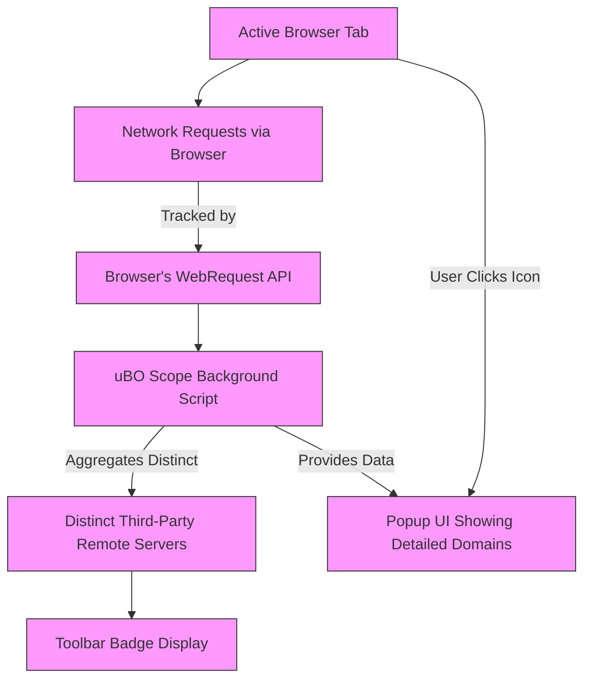

# Understanding the Badge Count and Its Implications

---

## Overview

The toolbar badge in uBO Scope is your window into the privacy impact of your current browsing session. This guide explains what the badge count represents, why it matters, and how you can use this insight to evaluate the presence and behavior of third-party connections while you browse.

By learning to interpret the badge, you gain a powerful, real-time indicator of how many unique third-party remote servers your browser is communicating with. This knowledge helps you make informed decisions about your content blockers’ effectiveness and the privacy implications of the websites you visit.

---

## What the Badge Count Represents

- The badge number **shows the count of distinct third-party remote servers** that a webpage has connected to.
- This count updates live as you navigate, reflecting the actual number of third-party domains your browser fetched resources from.
- A **lower badge count is better**: it means fewer external parties are involved in loading the page.

### Important Clarifications

- Not all third parties flagged are malicious or undesirable; many are legitimate services such as content delivery networks (CDNs).
- The badge is not a raw block count or number of requests, but the **number of unique domains from third parties** that managed to serve content.
- Connections made by the first-party (the site you have in the address bar) are excluded from this count.

---

## How uBO Scope Detects These Connections

- The extension uses the browser’s `webRequest` API to listen to all network requests initiated by webpages.
- It logs each remote server a network request targets, categorizing them based on the request’s outcome:
  - **Allowed**: Successful requests fulfilled by third parties.
  - **Blocked**: Requests that failed (blocked by a content blocker or network issue).
  - **Stealth-blocked**: Redirected requests that are stealthily blocked.

This gives a comprehensive, outcome-based view of third-party connections.

---

## Why the Badge Count Is More Informative Than Traditional Metrics

### Debunking Common Myths

| Myth | Reality |
|---|---|
| "Higher block count means a better blocker" | A blocker with a high block count may still let more distinct third parties through, increasing exposure. |
| "Ad blocker test pages measure reliability properly" | These test pages use unreal and fabricated scenarios, missing stealth-blocking techniques and real-world connection patterns. |

The badge count shows how many unique third-party domains your browser connected to — this is the true measure of privacy exposure, regardless of block counts reported elsewhere.

---

## Using the Badge Count to Assess Your Privacy

1. **Check the badge as you browse**: Whenever you load or switch tabs, glance at the badge on the uBO Scope icon.
2. **Lower numbers indicate cleaner sessions**: Fewer unique third parties implies less potential tracking or data sharing.
3. **Compare across sites**: Popular sites may have numerous allowed third parties; use the badge to benchmark which sites expose you more.
4. **Combine with the popup interface**: Click the badge to open the popup and explore details about which domains are allowed, blocked, or stealth-blocked.

### Practical Example

- Visiting a news site shows badge count `8` → indicates eight distinct third-party domains served content.
- Switching to a banking site shows badge count `2` → more privacy with fewer external connections.

This helps you understand where your browsing privacy stands in real time.

---

## Best Practices for Leveraging Badge Insights

- **Use the badge count as your baseline metric**, not individual extension block counts.
- **Combine with content blockers strategically**: Confirm your primary blocker is effectively limiting unique third-party connections.
- **Investigate sites with unusually high badge counts**: They might load excessive third-party content or trackers.
- **Regularly check the badge when visiting new or suspicious sites** to stay aware of your exposure.

---

## Troubleshooting Badge Count Issues

<AccordionGroup title="Common Badge Count Issues">
<Accordion title="Badge Count Doesn’t Appear">

- Ensure the extension is installed and active.
- Confirm that permission to access `webRequest` API is granted.
- Refresh the page or reload the extension.
- Verify the browser supports required extension APIs.
</Accordion>
<Accordion title="Badge Count is Always Zero or Unchanging">

- Make sure you are actively browsing sites that load network resources.
- Check for conflicts with other extensions that might block all requests.
- Restart the browser to reset extension state.
</Accordion>
<Accordion title="Badge Count Seems Too High or Low Compared to Expectations">

- Understand that badge count reflects distinct third-party servers and not the total number of requests.
- Some legitimate CDNs or external services may increase the count.
- Visit the popup UI for detailed domain lists to analyze.
</Accordion>
</AccordionGroup>

---

## Summary

The badge count is your frontline indicator of third-party connection exposure per browser tab. It goes beyond simple block counts or unreliable test pages by reporting **unique remote servers that actually served resources** — the core of a privacy-conscious browsing experience.

Use it to quickly assess site privacy, identify unexpected third-party connections, and validate your content blockers’ effectiveness. Pair badge insights with the detailed popup view for a comprehensive understanding of your browsing session's privacy landscape.

---

## Related Documentation

- [Key Concepts and Terminology](/overview/core-concepts-architecture/key-terms-concepts) — Deep dive into terms used by uBO Scope to classify connections and badge counting.
- [First Run & Quick Validation](/getting-started/first-use-validation/first-run-quick-validation) — Learn how to verify the badge and first-use experience.
- [The uBO Scope Popup Explained](/guides/getting-started/first-look) — Understand how to interpret detailed connection data beyond the badge.
- [Debunking Block Count Myths](/guides/practical-guides/debunking-block-myths) — Why the badge gives better insight than raw block counts.

---

## Next Steps

- Install and activate uBO Scope following the [Installation Guide](/getting-started/setup-installation/extension-installation).
- Start monitoring the badge count as you browse to become attuned to third-party connection trends.
- Explore the popup interface for site-specific connection details — the actionable counterpart to the badge count.
- Consult troubleshooting guides if the badge doesn’t function as expected.

<Check>
For enhanced privacy monitoring, regularly use the badge count as an immediate, unbiased indicator of third-party exposure during your browsing sessions.
</Check>

---

### Diagram: How the Badge Count Reflects Third-Party Connections

This flowchart visualizes how network requests by the active tab are intercepted, analyzed, and summarized into the badge count displayed in the toolbar, with an option for users to explore detailed information in the popup.
