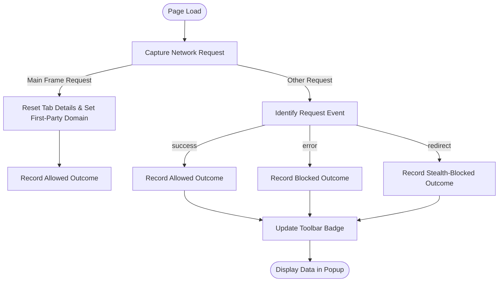

# Interpreting Domain Reports and Connection Outcomes

## Overview
This guide teaches you how to make sense of the domain connection data generated by uBO Scope. You will learn how to differentiate between first-party and third-party requests, why having fewer third-party connections is generally a sign of better privacy, and how to dispel common misconceptions about ad blocker reports and the use of test sites.

By mastering this understanding, you can more confidently analyze your browsing exposure, evaluate content blockers, and interpret the extension’s reports meaningfully.

---

## 1. Understanding Domain Connection Data

### 1.1 What uBO Scope Reports
uBO Scope monitors all network requests your browser makes when loading a webpage, categorizing connections by their outcome:
- **Allowed**: Requests that successfully connected.
- **Stealth-blocked**: Requests that were redirected or altered stealthily to avoid detection but not allowed.
- **Blocked**: Requests that were explicitly blocked.

Each domain is counted distinctly, focusing on the number of unique third-party domains connected or blocked.

### 1.2 First-Party vs Third-Party Connections
- **First-party** refers to domains that match or are part of the site you are visiting (the main domain).
- **Third-party** domains are any other domains from which resources or requests originate.

<u>uBO Scope’s toolbar badge counts the number of distinct third-party domains your browser connected to on any visited page. A lower count indicates a smaller surface area for external tracking or privacy exposure.</u>

### 1.3 Why Fewer Third-Party Connections Matter
Third-party connections represent external entities that can track or influence your browsing experience silently. Reducing these limits:
- Your exposure to trackers and advertisers.
- Potential data leakage.
- Unwanted content or cookies being loaded.

Some third-party domains are benign or even necessary (e.g., CDN providers), but the fewer unnecessary third-parties, the better.

---

## 2. Making Sense of the Popup Interface

When you open uBO Scope’s popup for an active tab, you will see:

- **Domains Connected:** Total count of distinct domains connected, displayed in the summary.
- **Sections Divided by Outcome:** 
  - **Allowed (Not Blocked):** Domains your browser successfully connected with.
  - **Stealth-Blocked:** Domains where requests were rerouted or hidden to avoid detection.
  - **Blocked:** Domains whose requests were explicitly blocked.

<u>Note:</u> The popup categorizes domains by their broad connection outcome, helping you quickly gauge which domains are still interacting with your browser and which aren’t.

### 2.1 Domain and Subdomain Insight
uBO Scope breaks down counts by domain based on the Public Suffix List (PSL) — a comprehensive listing of TLDs and effective domain levels. This means 
- Subdomains of a domain are counted together under that domain.
- Internationalized domain names are converted to Unicode for clarity.

This helps avoid fragmentation of domains and presents a clearer summary of unique entities.

---

## 3. Debunking Common Myths

### 3.1 Myth: Higher Block Counts Mean Better Blocking
Many believe that an extension that blocks more requests is inherently better. This is a misconception.

<u>uBO Scope clarifies:</u>
- The critical number is how many distinct third-party domains your browser actually connects to, not raw block counts.
- A higher block count can occur while still allowing connections to more unique third-party domains, meaning more exposure.
- A reliable blocker reduces the _distinct_ third-party servers connected, not just block a snippet of requests.

### 3.2 Myth: Ad Blocker Test Sites Are Reliable Benchmarks
Beware of “ad blocker test” sites claiming to test blocking efficiency.

<u>Why you should avoid them:</u>
- These sites rely on fabricated network requests that don’t reflect real-world browsing.
- Many blockers operate stealthily, avoiding detection by these sites.
- Results from these sites can mislead users into thinking blocking behavior is better or worse than it actually is.

Instead, uBO Scope provides real connection data from genuine browsing, offering an accurate picture.

---

## 4. Practical Tips for Users

- **Focus on the toolbar badge:** The number shows distinct third-party domains connected; aim for fewer.
- **Regularly check the popup:** Understand which domains are allowed, stealth-blocked, or blocked for each site.
- **Ignore raw block metrics elsewhere:** Don’t equate a higher block count to better privacy.
- **Avoid test sites for evaluation:** Real-world connection data is the truest indicator.
- **Look for notable third-parties:** Recognize CDN or essential service domains, which are often legitimate.

---

## 5. Step-by-Step: How to Interpret a Domain Report

<Steps>
<Step title="Open uBO Scope Popup">
Click the uBO Scope toolbar icon to reveal the popup showing current tab connection data.
</Step>
<Step title="Check Total Domains Connected">
Look at the summary section for the total number of distinct domains your browser connected to while loading the page.
</Step>
<Step title="Review Allowed Domains">
Expand the 'not blocked' section to see which third-party domains successfully loaded resources.
</Step>
<Step title="Review Stealth-Blocked Domains">
Identify any domains where requests were stealth-blocked, meaning blocked or redirected without full detection.
</Step>
<Step title="Review Blocked Domains">
Check which domains were explicitly blocked by your content blockers.
</Step>
<Step title="Compare Counts and Domain Origins">
Understand that a low total third-party count with many blocked or stealth-blocked domains typically indicates strong content blocking.
</Step>
</Steps>

---

## 6. Troubleshooting Common Issues

<AccordionGroup title="Troubleshooting Connection Outcome Interpretation">
<Accordion title="No Domains Showing in Popup">
Ensure you have active network requests for the current tab. Some tabs (e.g., internal browser pages or new tabs) have no remote connections.

Confirm the extension is enabled and tracking properly; see installation troubleshooting guides if needed.
</Accordion>
<Accordion title="Unexpectedly High Number of Allowed Domains">
Some sites legitimately use many third-party services (analytics, CDNs, embedded content). This may not indicate a blocker failure.

Check if the domains are well-known or essential third parties rather than potential trackers.
</Accordion>
<Accordion title="Misunderstanding Stealth-Blocked">
Stealth-blocked domains result from redirects or clever blocking.

Remember, stealth-blocked domains mean requests did not fully connect, even if not explicitly blocked.
</Accordion>
<Accordion title="Suspecting Test Site Impact">
If testing on ad blocker test sites, expect skewed results.

Test on real, popular websites to get accurate and meaningful domain data.
</Accordion>
</AccordionGroup>

---

## 7. Additional Resources and Next Steps

- Learn to interpret badge counts in detail: [Understanding Badge Counts & Domain Data](/getting-started/first-run-usage/interpreting-badge)
- Get started with extension installation and setup: [Installing uBO-Scope](/getting-started/setup-install/install-browser)
- Understand the popup interface layout: [Understanding the Popup and Toolbar Badge](/guides/getting-started/understanding-the-popup)
- Explore advanced content blocker assessment: [Comparing Content Blockers with uBO-Scope](/guides/advanced-usage/analyzing-content-blockers)
- Troubleshooting assistance: [Common Issues & Installation Troubleshooting](/getting-started/troubleshooting/common-issues)

---

## Summary

This guide empowers you to interpret the domain reports and connection outcomes displayed by uBO Scope effectively. By distinguishing first-party and third-party connections and focusing on the number and nature of allowed third-party domains, you gain actionable insights into your browsing privacy.

 Armed with this knowledge, you avoid pitfalls associated with misleading block counts or unreliable test sites, making your privacy evaluation grounded, practical, and clear.

---

## Appendix: Understanding Key Terms

| Term              | Meaning                                                                                  |
|-------------------|------------------------------------------------------------------------------------------|
| First-party Domain | The domain corresponding to the site you are visiting.                                   |
| Third-party Domain | Any domain other than the first-party involved in network connections.                   |
| Allowed           | Requests that succeeded and were not blocked.                                           |
| Stealth-blocked   | Requests stealthily blocked or redirected to hide blocking.                            |
| Blocked           | Requests explicitly blocked by content blockers.                                        |
| Public Suffix List| A maintained list that helps identify effective domain names (eTLD+1) for grouping data. |

---

## Example Scenario

Imagine visiting example.com:

- uBO Scope badge shows "12," meaning your browser connected to 12 unique third-party domains.
- In the popup, you see 7 allowed domains (e.g., cdn.example.com, api.mapservice.com), 3 stealth-blocked, and 2 fully blocked.

Interpretation:
- The allowed domains may include essential services like CDNs.
- Stealth-blocked suggest some requests were intercepted without breaking site functionality.
- Blocked domains indicate actively prevented connections.
- A total of 12 third-party connections is reasonable but could be optimized by further blocking if desired.

This level of detail helps make informed decisions about your content blocking setup.

---

## Related Diagram: Workflow of Network Request Classification

This flow demonstrates how uBO Scope listens to network requests, categorizes their outcomes, updates internal session data, and refreshes the user interface to reflect real-time connection status.

---

*End of guide.*
