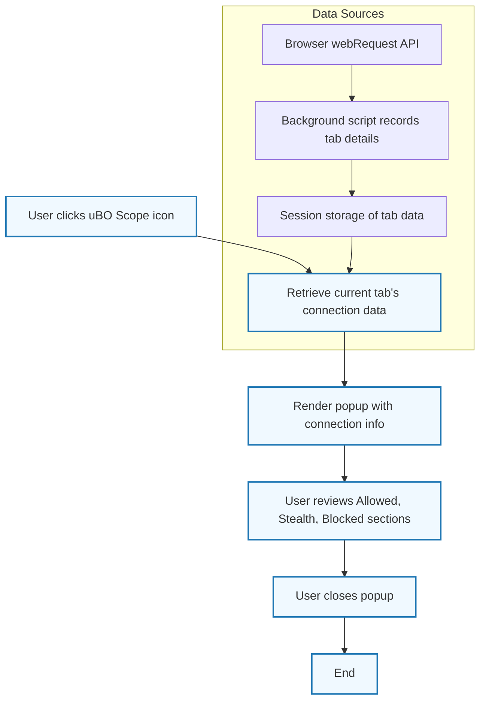

# Monitoring Network Connections in uBO Scope

## Workflow Overview

### What this guide helps you accomplish
This guide walks you through the core workflow of monitoring network connections for a specific browser tab using the uBO Scope extension popup. You will learn how to observe which third-party servers a webpage connects to in real-time, understand connection statuses including allowed, blocked, and stealth requests, and interpret privacy metrics provided by uBO Scope.

### Prerequisites
- uBO Scope extension installed and enabled in your supported browser (Chromium, Firefox, Safari).
- Browser tab actively loading or loaded with the webpage you want to analyze.
- Familiarity with basic web terminology such as domains, hostnames, and network requests.

### Expected Outcome
- Clear visibility of all third-party connections initiated by the current tab.
- A breakdown of these connections classified as "not blocked", "stealth-blocked", or "blocked".
- Accurate count of distinct third-party domains connected, reflected in the browser toolbar badge and popup summary.
- Ability to assess the privacy posture of the visited webpage based on connection outcomes.

### Estimated Time
Approximately 5-10 minutes to get acquainted with the interface and interpret the connection data.

### Difficulty Level
Beginner to Intermediate – no technical setup beyond installing the extension is required.

---

## Step-by-Step Instructions

### 1. Open the uBO Scope Popup for the Active Tab
- Click the uBO Scope extension icon in your browser toolbar.
- The popup will immediately display network connection data relevant to the current active tab.

> **Expected Result:** The popup shows the hostname of the active tab at the top and summarizes the number of connected domains.

---

### 2. Understand the Hostname and Domain Display
- The header shows two parts if applicable:
  - The subdomain or left side of the hostname (if different from domain).
  - The base domain (e.g., example.com).
- This separation helps identify whether connections are first-party or third-party.

> **Tip:** Many privacy leaks come from third-party domains, so noticing the domain difference here is helpful.

---

### 3. Review Connection Outcome Sections
The popup divides connections into three sections:

- **Not blocked:** Third-party domains with network requests **successfully allowed**.
- **Stealth-blocked:** Domains with network activity that was **redirected or intercepted stealthily** by content blockers.
- **Blocked:** Third-party domains where network requests were **explicitly blocked (failed or errored)**.

> **Example:** If a domain appears under "blocked", it means that requests to it were prevented, indicating active blocking by your content blockers.

---

### 4. Examine the Domain Rows in Each Section
- Each domain entry shows:
  - The domain name (decoded using punycode if necessary).
  - The count of distinct requests made to this domain.

> **Verification:** The domains listed correspond exactly to those contacted by the webpage in real-time.

---

### 5. Interpret the Domains Connected Count
- At the top summary, a number indicates the total unique third-party domains contacted for this tab.
- A lower count generally indicates better privacy, as fewer third parties are involved.

> **Best practice:** Use this count to gauge how many external services a page is connecting to and identify potential privacy concerns.

---

### 6. Use Real-Time Updates (Implicit)
- uBO Scope updates the popup data dynamically as the page loads and network requests happen.
- Refresh or reopen the popup if you navigate the active tab to a new page.

> **Note:** The data reflects the current active tab only.

---

### 7. Close Popup & Continue Browsing
- Close the popup window when done reviewing.
- You can re-open it anytime to re-check the current tab's network connections.

---

## Practical Tips and Best Practices

- **Identify stealth requests:** "Stealth-blocked" connections can indicate that your content blocker is silently redirecting or preventing requests without breaking page functionality.
- **Compare allowed vs blocked:** Understand that not all blocked connections translate into fewer third-party domains — sometimes allowed connections still expose privacy risks.
- **Use badge counts wisely:** The toolbar badge reflects the count of distinct allowed domains. A high count suggests more third-party exposure.
- **Refresh popup on navigation:** Navigating to a new page requires reopening or refreshing the popup to see updated data.

---

## Common Pitfalls and Troubleshooting

### The Popup Shows "NO DATA"
- Ensure the current tab is fully loaded and the extension has permission.
- If persistent, try refreshing the page or disabling other conflicting extensions.

### Domains and Counts Don't Update in Real-Time
- The popup updates upon opening. Close and reopen it after navigating to a new page.
- Network requests outside browser tabs (e.g., background requests) may not be tracked.

### Toolbar Badge Does Not Show a Number
- There might be zero third-party connections for this tab (good privacy).
- Ensure the extension is enabled and permissions are granted.

---

## Examples

Assume you visit `https://example.com`.

**Popup Displays:**

- Hostname at the top: `sub.example.com` and base domain: `example.com`.
- Allowed section lists `cdn.examplecdn.com (15)`, `analytics.tracker.com (3)`.
- Stealth-blocked section lists `ads.tracker.com (5)`.
- Blocked section lists `malicious.com (7)`.
- Summary shows "domains connected: 3".

**Interpretation:** The page connects mainly to three third-party services, some requests are stealth-blocked, while others are explicitly blocked, helping you understand the current exposure.

---

## Visualization

---

## Next Steps & Related Documentation

- For understanding how the extension counts connections and why this matters, read the [Understanding Connection Counting](../overview/core-concepts-and-features/connection-counting-explained) guide.
- To learn about the terminology used in the popup and connection statuses, see [Key Terms in uBO Scope](../overview/core-concepts-and-features/key-terms-and-concepts).
- To validate the extension is working properly, consult [Validating Extension Activity](../../getting-started/first-run-and-troubleshooting/validating-extension-activity).
- For troubleshooting common popup or badge issues, refer to the [Troubleshooting and FAQ](../../guides/practical-guides/troubleshooting-and-faqs) page.
- Check [Supported Browsers & Integration Points](../overview/architecture-and-system-overview/platform-support-integration) for details on browser compatibility.

<Tip>
Monitoring network connections with uBO Scope's popup empowers you to understand exactly which third-party servers your browser tab contacts, how content blockers affect these requests, and helps you maintain control over your privacy exposure.
</Tip>