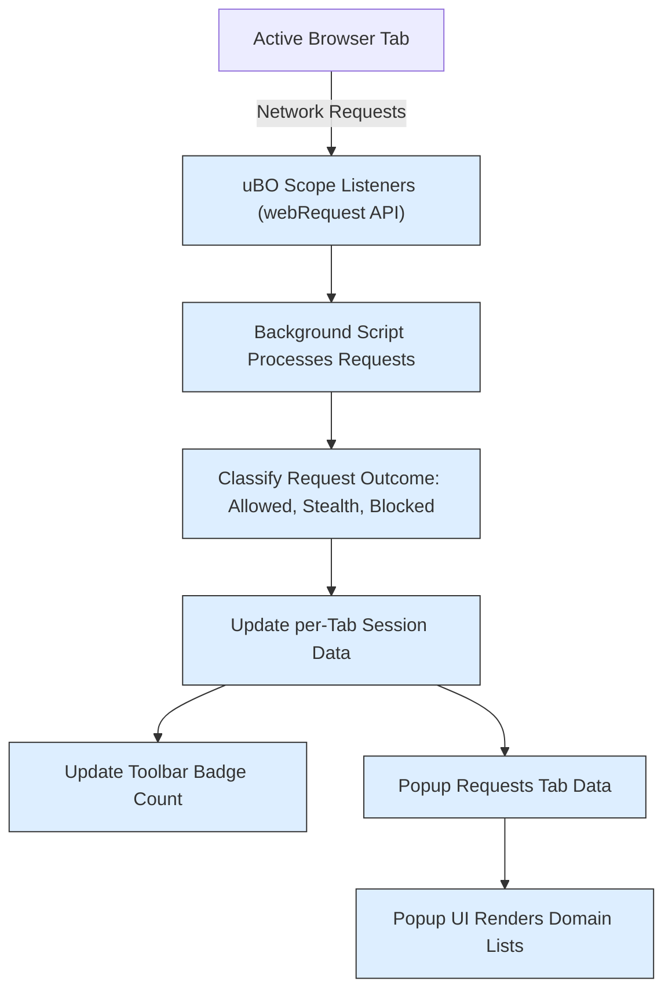

# Navigating the Popup UI

## Overview
The uBO Scope popup interface provides a real-time, user-friendly window into the third-party remote connections initiated by the active browser tab. This guide will help you navigate the popup's sections and understand the different categories of connections displayed, empowering you to quickly interpret what is happening behind the scenes as you browse.

### What You Will Learn
- How the popup groups third-party domains by connection outcome
- What each section (Allowed, Stealth-blocked, Blocked) means
- How to read the domain lists and counts
- What the badge count represents

### Prerequisites
- uBO Scope installed and running in your browser
- A loaded browser tab with network activity (preferably a publicly accessible website)
- Basic understanding of third-party network requests (covered in the [Core Concepts & Terminology](../overview/introduction-core-concepts/core-terminology) page)

### Expected Outcome
After following this guide, you will navigate the popup effortlessly, interpret domain connection statuses accurately, and better understand your exposure to third-party servers per tab.

### Time Estimate
Approximately 5 minutes

---

## Popup Interface Walkthrough

The popup UI is divided into distinct parts that together provide a comprehensive snapshot of third-party network activity for the current browser tab.

### 1. Hostname Header
At the very top, you see the hostname of the active tab displayed prominently.

- The hostname is split into two spans: a subdomain prefix (if any) and the registered domain portion.
- For example, if the URL is `news.example.com`, "news." appears in the first span and "example.com" in the second.
- If the tab's hostname equals its domain, the prefix span remains empty.

This header indicates exactly which website's network activity you are viewing, helping you stay oriented.

### 2. Summary Section
Below the hostname is a summary line:

```text
    domains connected: <number>
```

- This number counts the distinct third-party domains to which connections were successfully established (allowed connections).
- It reflects the same count shown as the badge on the extension's toolbar icon for the tab.

Understanding this number helps you keep track of how many unique external servers your current tab contacts.

### 3. Connection Outcome Sections
The core of the popup presents three outcome sections, clearly labeled:

#### Not Blocked (Allowed)
- Displays domains that the browser successfully connected to. These are third-party domains that were allowed by your blocking setup or were not subject to blocking.
- Each domain is listed alongside a count of how many times requests to that domain were made.
- This section represents visible external exposures.

#### Stealth-blocked
- Shows domains whose connections were stealthily blocked or redirected.
- "Stealth" blocking means the requests never reached the remote server, but this behavior is intentionally hidden from the webpage to prevent site breakage or detection.
- These connections are counted separately from outright blocked requests.

#### Blocked
- Lists domains where network requests were explicitly blocked.
- These are known failed connections due to blocking mechanisms.
- Each domain also displays the request count.

### 4. Domain Rows
In each section:

- Domains are sorted alphabetically.
- Each row shows:
  - The domain name in a right-aligned text element
  - A badge with the count of connections made to that domain

This layout lets you quickly scan domains and assess frequency.

### 5. Dynamic Rendering
The popup updates dynamically for the active tab whenever opened:

- The data shown reflects the most recent monitoring results.
- If no data is available for the tab, the header shows 'NO DATA' and the list areas are empty.

---

## Step-by-Step: Using the Popup
<Steps>
<Step title="Open the uBO Scope Popup">
Click the uBO Scope toolbar icon in your browser to open the popup. Wait a moment for data to load.
</Step>
<Step title="Identify the Active Tab Hostname">
Look at the hostname header at the top of the popup: this shows which page's network activity is displayed.

If it shows 'NO DATA', either the tab has no recorded requests, or the extension hasn't captured data yet.
</Step>
<Step title="Check the Total Domain Count">
Note the "domains connected" number in the summary section. This count shows how many unique third-party domains were successfully connected.
</Step>
<Step title="Review Allowed Domains">
Under the 'not blocked' section, view the list of domains your current tab reached successfully.

Look at the counts to see domains with the most frequent connections.
</Step>
<Step title="Examine Stealth-blocked Domains">
Check the 'stealth-blocked' section for any domains where connections were silently prevented.

Presence here indicates some form of subtle blocking in effect.
</Step>
<Step title="Look at Blocked Domains">
In the 'blocked' section, see domains that were explicitly blocked by your content blocker or other mechanisms.

High counts here show many blocked network requests, potentially reducing tracking or resource load.
</Step>
<Step title="Interpret the Data in Context">
Remember a lower number of allowed third-party domains generally means less network exposure.

Use this to validate or tune your blocking configuration.
</Step>
</Steps>

---

## Practical Tips and Best Practices
- **Refresh the popup when switching tabs**: The popup shows data for the currently active tab. Close and reopen it if you switch tabs to update the content.
- **Understand legitimate third parties**: Not all third-party domains are harmful—CDNs and analytics are often necessary. Use the domain names as clues.
- **Correlate with badge count**: The total count in the popup summary matches the toolbar badge number. Use the badge for quick glance privacy insight.
- **Watch for stealth-blocked domains**: If many domains appear here, it indicates your content blocker is actively and silently preventing suspected connections.
- **Compare allowed and blocked sections**: A large allowed list with few blocked may mean limited content blocking; vice versa shows stricter blocking.

---

## Common Questions & Troubleshooting

### Why does the popup show "NO DATA" for this tab?
- The tab is new or has no network requests yet
- The extension has not yet recorded the tab's activity
- Permissions or installation issues (see the [Troubleshooting Common Setup Issues](../getting-started/making-first-use/troubleshooting-install) guide)

### Why is the domains connected count different from what I expect?
- The count refers to unique third-party domains, not total requests
- The extension counts only domains with allowed (successful) connections
- Some network requests may be stealth-blocked or blocked, appearing in other sections

### What if domains appear in multiple outcome sections?
- A domain may have had requests in multiple outcomes (allowed on some requests, blocked/stealth blocked on others)
- Each occurrence is tracked separately by request outcome

---

## Summary
This popup interface offers a transparent, granular view into your active tab's third-party network footprint, categorizing servers into allowed, stealth-blocked, and blocked. By understanding this layout and data logic, you gain control over how external connections affect your browsing privacy.

---

## Related Documentation
- [First Launch & Quick Overview](../getting-started/making-first-use/first-launch-quick-overview) — Introduction to the popup and badge interface
- [Interpreting the Toolbar Badge Count](../guides/core-workflows/interpreting-badge-counts) — How the badge count relates to the popup
- [Troubleshooting Common Setup Issues](../getting-started/making-first-use/troubleshooting-install) — Solve common problems with the popup data
- [Core Concepts & Terminology](../overview/introduction-core-concepts/core-terminology) — Definitions behind domains and statuses

---

## Technical Diagram: Popup UI Data Flow


This diagram shows how network requests from the active tab flow through the extension to surface data in the popup interface.
