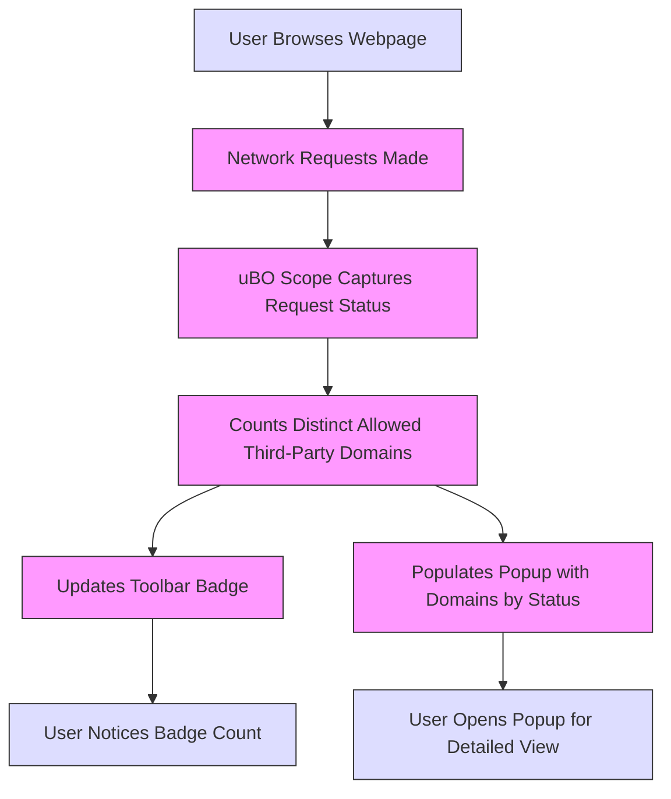

# Overview of the Popup and Toolbar Badge

## Workflow Overview

### Task Description
This guide helps you understand the main user interface elements of uBO Scope—the toolbar badge and the popup window. You'll learn how to interpret the badge's count of third-party domains and read the categorized domain connections in the popup for every active browser tab.

### Prerequisites
- uBO Scope installed and enabled in a supported browser (Chrome 122+, Firefox 128+, or Safari 18.5+).
- Basic familiarity with using browser extensions and the browser toolbar.
- Browsing activity generating network requests to observe meaningful data.

### Expected Outcome
After following this guide, you will be able to:
- Recognize what the badge count on the uBO Scope icon represents.
- Open the popup window to view detailed domain connection information.
- Differentiate between allowed, stealth-blocked, and blocked third-party connections.
- Quickly assess the network connection landscape for the current browser tab.

### Time Estimate
5-10 minutes to read and familiarize yourself with the UI.

### Difficulty Level
Beginner

---

## Step-by-Step Instructions

### 1. Locate the uBO Scope Toolbar Icon
- Find the uBO Scope extension icon on your browser toolbar. It uses a distinctive logo matching the one shown during installation.
- If not visible, ensure the extension is enabled and pinned to the toolbar.

### 2. Understand the Badge Number
- The badge displays a numeric count representing **the number of distinct third-party remote servers your browser connected to for the current tab**.
- A **lower count indicates fewer third-party connections**, which may imply better privacy or fewer external dependencies.

> **Important:** This count refers only to distinct third-party hosts from which resources were successfully fetched and does not include blocked connections.

### 3. Open the Popup Window
- Click the uBO Scope toolbar icon to open the popup.
- The popup loads detailed information about the network connections related to the active tab.

### 4. Interpret the Popup Header
- The header displays the active tab’s hostname and domain at the top.
- If the hostname has subdomains, these are shown separately for context.

### 5. Inspect the Summary Section
- Below the header, the summary area prominently shows the total number of connected domains.

### 6. Review Domain Outcomes Categorized by Status
- The popup organizes third-party connections into three distinct sections:
  - **Not Blocked (Allowed):** Domains whose network requests were successful and allowed.
  - **Stealth-Blocked:** Domains that the browser redirected or stealthily blocked.
  - **Blocked:** Domains with network requests that failed or were explicitly blocked.

- Each section lists domains along with the number of connection attempts.

### 7. Use the Domain List
- Domains are displayed in rows showing:
  - The domain name (converted to Unicode from punycode if applicable).
  - The number of connection attempts to this domain.

- Sections with no data are hidden automatically for clarity.

### 8. Close the Popup
- Click outside the popup or the browser's close UI to dismiss the panel.

---

## Practical Tips and Best Practices

- **Keep the badge count low** to enhance privacy and reduce third-party tracking exposure.
- Use the popup regularly to detect unexpected or suspicious third-party domains.
- Understand that some known third-party domains such as CDNs are usually legitimate.
- Remember the badge reflects only third-party domains allowed through content blockers and network requests.

---

## Examples

Suppose you visit a news website:
- The uBO Scope badge shows “3” indicating three distinct third-party domains were successfully connected.
- Opening the popup reveals:
  - Allowed: `cdn.newsassets.com` (5 connections), `analytics.safe.com` (2 connections)
  - Stealth-Blocked: `ads.badserver.com` (1 connection)
  - Blocked: `trackers.evilads.net` (4 connections)

This clear breakdown helps verify that known benign services are allowed, while suspicious requests are being blocked or stealthily handled.

---

## Troubleshooting Common Issues

<AccordionGroup title="Troubleshooting Popup and Badge Issues">
<Accordion title="The Badge Shows No Number">
- Ensure you have active browsing on a tab with network requests.
- Verify the extension is enabled and has the necessary permissions.
- Reload the tab to reset data collection.
</Accordion>
<Accordion title="Popup Displays No Data or 'NO DATA'">
- Refresh the popup by closing and reopening it.
- Confirm you are viewing the popup on an active tab with network activity.
- Disable other conflicting extensions that might interfere.
</Accordion>
<Accordion title="Badge Count Seems Incorrect or Too High">
- Understand that the badge counts distinct allowed third-party domains only.
- Some legitimate services might cause unexpected additional connections.
- Try clearing browser cache and restarting the browser.
</Accordion>
</AccordionGroup>

---

## Next Steps & Related Content

- Learn more about **Understanding Domain Statuses: Allowed, Blocked, Stealth** to deepen your insight into what these categories mean.
- Follow the guide on **Identifying Third-Party Remote Connections** to turn domain visibility into actionable privacy decisions.
- Explore **Validating Content Blocking: Myths and Realities** to assess how uBO Scope complements your content blockers.

---

## Visual Summary

This flow illustrates how browsing activity relates to the badge and popup display.

---

By mastering the badge and popup overview, you unlock uBO Scope's core value—transparent, independent insights into the third-party network connections your browser engages in every moment.

