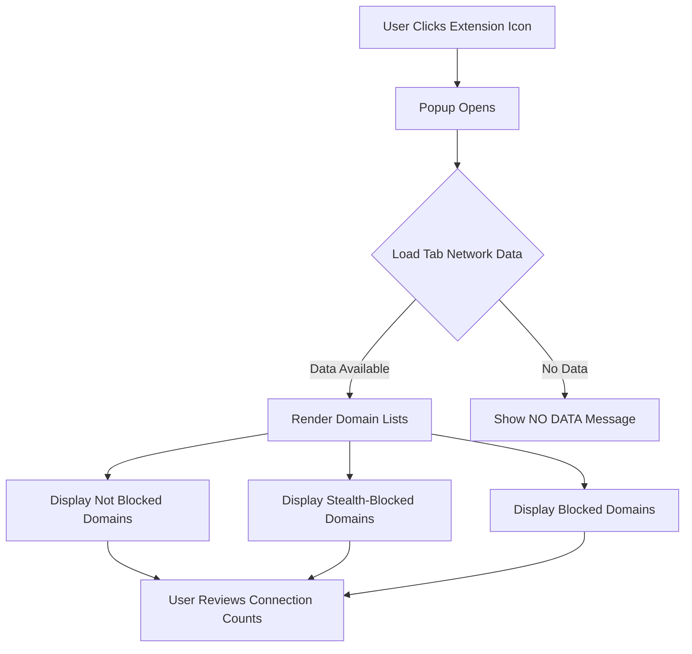

# Understanding the Popup: Reading Connection Summaries

## Overview

This guide walks you through the uBO Scope popup interface, designed to give you clear, actionable insights into the third-party network connections your browser makes on the active tab. You will learn how to read and interpret the categorized domain lists for allowed, stealth-blocked, and blocked requests, and understand how these relate to the badge counts shown on the toolbar icon.

---

## What This Page Helps You Achieve

- Understand the different categories of network requests shown in the popup.
- Interpret domain connection counts and their privacy implications.
- Gain practical knowledge to assess your browsing exposure to third-party servers.

## Prerequisites

- uBO Scope must be installed and active in your browser.
- Have a webpage open and active with network activity.
- Basic familiarity with your browser's extension icon and popup.

## Expected Outcome

By the end of this guide, you will confidently navigate the popup UI, know what each connection category means, and be able to draw meaningful conclusions about third-party connections initiated by the active webpage.

## Time Estimate

~5 minutes

## Difficulty Level

Beginner to Intermediate

---

# The Popup Interface: A User-Centered Walkthrough

The popup UI serves as a real-time snapshot of the third-party domains your browser connects to for the active tab. It is divided into clear sections displaying connections grouped by their outcome, each providing insight into how your browser and content blockers are interacting with the web.

## Key Popup Components

- **Tab Hostname Header**: Shows the hostname of the active tab and its registered domain.
- **Summary Section**: Displays the total count of distinct third-party domains connected on the active tab.
- **Outcome Sections**:
  - *Not Blocked (Allowed)*
  - *Stealth-Blocked*
  - *Blocked*

Each outcome section lists domains detected in that category along with how many requests were observed for each.

---

## Understanding the Tab Hostname Header

The header shows two textual parts:

- The full tab hostname (e.g., `news.example.com`)
- The registered domain (e.g., `example.com`)

This helps you quickly differentiate the site you are analyzing from third-party domains connected to it.

## Summary Section

Under the headline, you see "domains connected: X", where **X** is the number of distinct third-party domains your browser connected to on this tab that were **not blocked**.

This matches the count displayed on the browser toolbar badge and serves as an immediate privacy exposure metric.

---

# Section-by-Section Breakdown

### 1. Not Blocked (Allowed)

This lists third-party domains from which the browser successfully fetched resources or allowed connections. These represent what your web activity exposed to external servers, including content delivery networks (CDNs), analytics, and advertisements.

- **Use Case:** Seeing which domains your browser allowed connections to helps identify possible privacy leaks or understand backend services used by the page.

### 2. Stealth-Blocked

Domains categorized here belong to requests the extension recognized as stealth-blocked. Stealth-blocking refers to network requests blocked in a way that attempts to avoid detection by websites, often by intercepting or redirecting under-the-radar.

- **Value:** It signals advanced blocking techniques in action capturing requests that might otherwise go unnoticed but still don’t reach their destination.

### 3. Blocked

This category lists domains from which the browser attempted connections that were explicitly blocked (e.g., by content blockers or failed network requests).

- **Insight:** This helps confirm which connections your content blockers prevented explicitly.

---

# How to Interpret Domain Counts

Each domain entry in the outcome sections shows a count of individual network requests observed toward that domain during the page session.

- Higher counts generally mean more frequent connections to that domain.
- Distinct domain counts (total unique domains) give a better privacy exposure indication than raw request counts.

---

# Practical Example

Imagine visiting `example-news.com`. The popup shows:

- Allowed:
  - `cdn.example.net` (25 requests)
  - `ads.adnetwork.com` (5 requests)

- Stealth-Blocked:
  - `tracker.hiddenads.com` (3 requests)

- Blocked:
  - `malicious.badserver.com` (2 requests)

From this, you understand your browser fetched resources successfully from a CDN and ad network, stealth-blocked hidden trackers, and explicitly blocked malicious attempts.

---

# Step-by-Step Guide to Use the Popup

<Steps>
<Step title="Open the uBO Scope Popup">
Click the uBO Scope toolbar icon when on the webpage you want to inspect. The popup will appear showing connection summaries for the active tab.
</Step>
<Step title="Read the Tab Hostname Header">
Verify that the header matches the current website you are investigating.
</Step>
<Step title="Check the Domains Connected Summary">
Note the total distinct allowed domains count; this reflects your real exposure.
</Step>
<Step title="Review the 'Not Blocked' Section">
Explore which third-party domains your browser connected to without restrictions.
</Step>
<Step title="Examine 'Stealth-Blocked' Entries">
See if advanced stealth-blocking is active preventing some network communications covertly.
</Step>
<Step title="Look at the 'Blocked' Section">
Identify which connections your content blockers explicitly stopped.
</Step>
<Step title="Use the Domain Counts to Prioritize Attention">
Higher counts in allowed or stealth might warrant further investigation; blocked entries can confirm your blockers work.
</Step>
</Steps>

---

# Best Practices & Tips

- Frequently monitor the popup while browsing sensitive sites to track unexpected third-party exposures.
- Use the count of allowed distinct domains as a reliable privacy metric over raw block counts.
- Remember stealth-blocked entries indicate subtle blocking—absence here does not imply weaker protection.
- If the popup shows ‘NO DATA,’ refresh the page or ensure the extension has permissions.

---

# Common Issues & Troubleshooting

<AccordionGroup title="Popup Troubleshooting">
<Accordion title="Popup Shows NO DATA or Is Empty">
- Ensure you have an active tab with network requests.
- Check that uBO Scope is installed and enabled.
- Reload the webpage to trigger new network requests.
- Confirm browser permissions include webRequest access.
</Accordion>
<Accordion title="Domain Counts Seem Incorrect or Static">
- Wait a few seconds as data aggregates asynchronously.
- Reload the page and check if counts update.
- Review content blocker settings that might affect request handling.
</Accordion>
<Accordion title="Blocked Domains Are Missing Despite Blocker Active">
- Understand stealth-blocking may hide blocked requests.
- Confirm that your content blocker and uBO Scope are properly configured.
- Consult the Troubleshooting Common Issues guide for deeper diagnostics.
</Accordion>
</AccordionGroup>

---

# Summary

The popup interface of uBO Scope is your window into the real third-party network connections your browser processes on each webpage. Understanding how to read the Not Blocked, Stealth-Blocked, and Blocked domains empowers you to gauge your privacy exposure accurately and verify content blocker effectiveness.

Use this guide as a companion while exploring the popup to build confidence in interpreting these connection summaries and making informed privacy decisions.

---

# Related Documentation

- [What Is uBO Scope?](/overview/intro-value/what-is-ubo-scope) — Learn the core purpose and value.
- [Interpreting Badge Counts & Making Decisions](/guides/getting-started/interpret-badge-counts) — Understand how badge counts correlate with the popup data.
- [Troubleshooting Common Issues](/getting-started/essentials/troubleshooting) — Resolve common popup and extension problems.
- [System Architecture Overview](/overview/concepts-architecture/system-architecture-overview) — Gain insight into how uBO Scope collects and processes data.

---

# Next Steps

- Validate your installation using the [Quick Validation Guide](/getting-started/essentials/quick-validation).
- Explore real-world usage scenarios with [Analyzing Websites: What Happens Behind the Scenes](/guides/real-world-usage/analyzing-websites).
- Deepen your understanding of blocking methods in [Understanding Stealth-Blocking & Advanced Request Outcomes](/guides/advanced-insights/stealth-blocking-details).

---

# Visual Diagram: Popup Data Flow Concept

This diagram outlines the popup’s interaction flow on opening, showing how network data for the active tab is loaded and categorized for user review.

---