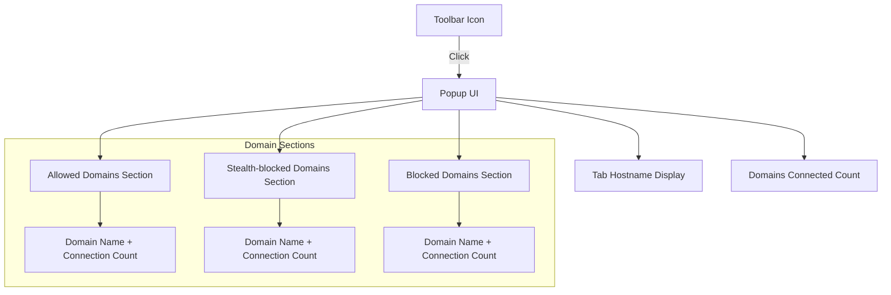

# Quick Tour: The uBO-Scope Popup UI

## Overview
This guide offers a practical tour of the **uBO-Scope Popup UI**, the main interface users interact with to monitor real-time domain connection statuses for the active browser tab. You'll learn how to interpret connection states — **allowed**, **stealth-blocked**, and **blocked** — as well as understand the significance of the toolbar badge count. Additionally, the guide walks you through navigating the popup to glean immediate insights into your current tab's network activity.

## Workflow Overview

### Task Description
Learn how to effectively navigate and understand the uBO-Scope popup interface, interpreting connection statuses and the toolbar badge, to gain transparency on web requests made by your browser in real time.

### Prerequisites
- uBO-Scope installed and enabled in your browser.
- At least one active tab with network activity to analyze.
- Basic familiarity with browser extensions and how to open their popups.

### Expected Outcome
Upon completion, you will confidently interpret the popup UI elements — including domain connection status sections and badge counts — and use this information to assess real-time network requests made by the active browser tab.

### Time Estimate
5 minutes for a thorough initial understanding and hands-on exploration.

### Difficulty Level
Beginner

---

## Step-by-Step Instructions

<Steps>
<Step title="Open the uBO-Scope Popup">
- Click the uBO-Scope icon in your browser toolbar to open the popup UI.
- The popup automatically loads connection data for the currently active tab.
- If you don’t see data immediately, ensure your page has active network requests or refresh the tab.

<Check>
You should see a heading with the tab’s hostname at the top and the domains connected count below it.
</Check>
</Step>

<Step title="Interpret the Tab Hostname Display">
- The top heading shows two parts:
  - The first part (faded) representing the subdomain(s) (if any).
  - The second part (bold) representing the main domain.
- For example, for "news.example.com", "news." is shown first (faded), "example.com" second (bold).

<Info>
This helps you identify exactly which domain the current tab is connected to at a glance.
</Info>
</Step>

<Step title="Understand Domain Connection Status Sections">
- The popup UI classifies connected domains into three categories:
  1. **Not blocked (allowed):** Domains your browser connected to successfully.
  2. **Stealth-blocked:** Domains where connection attempts were stealthily blocked (hidden blocking).
  3. **Blocked:** Domains where connection attempts were blocked outright.
- Each section lists domains in that category along with how many connections occurred for each.
- Sections with no data remain hidden to keep your view focused.

<Check>
Verify that the three categories are labeled clearly, and domain rows display both the domain name and a small numeric badge indicating the connection count.
</Check>
</Step>

<Step title="Check the Toolbar Badge Count">
- Look at the uBO-Scope icon in the toolbar; a numeric badge appears there.
- This badge shows the number of distinct third-party domains your active tab made successful connections to.
- A lower badge count means fewer third-party connections, which is generally better for privacy.

<Warning>
Do not confuse this badge count with block counts by content blockers — it indicates allowed successful connections only.
</Warning>

<Check>
The badge number matches the count shown in the popup under “domains connected”.
</Check>
</Step>

<Step title="Navigate and Explore Domain Detail Rows">
- Each domain row shows:
  - Domain name (using Unicode representation for internationalized domains).
  - A badge with the number of connections observed.
- Use this detailed view to quickly spot which domains are most frequently connected.

<Tip>
Hover (if supported) or scan the popup text to understand which network requests are coming from which domains.
</Tip>
</Step>
</Steps>

---

## Practical Example

Imagine you open the uBO-Scope popup while viewing a news website:

- You see the tab hostname as "news." (faded) and "example.com" (bold).
- The "domains connected" count is 8, indicating 8 unique third-party domains your active tab contacted.
- The **allowed** section lists domains like cdn.examplecdn.com with connection counts.
- The **stealth-blocked** section might show trackers that were stealthily blocked.
- The **blocked** section shows domains your browser or content blocker explicitly denied connections to.

This immediate view helps you judge the privacy impact, spotting unwanted trackers as blocked domains and identifying benign domains as allowed.

---

## Troubleshooting & Tips

<AccordionGroup title="Troubleshooting Common Popup UI Issues">
<Accordion title="No Data Displayed in Popup">
- Confirm the tab is active and loading sites with network activity.
- Refresh the tab to trigger network requests.
- Ensure uBO-Scope has necessary permissions (e.g., tab and webRequest permissions).
- Check if the extension icon is pinned and enabled.
</Accordion>

<Accordion title="Badge Count Does Not Update as Expected">
- Badge updates asynchronously after network events; wait a few seconds after page loads.
- Network requests made outside the browser’s webRequest API won’t show up.
- If multiple browser windows or private mode is used, the count may be affected.
</Accordion>

<Accordion title="Domain Names Appear in Unexpected Format">
- Domains are converted from punycode to Unicode for clarity.
- You might see subdomains separated from main domain in the hostname heading.
- Some obscure or internal domains may appear as is due to URL structure.
</Accordion>
</AccordionGroup>

<Tip>
Use the popup to periodically monitor tabs where you suspect high tracker or third-party activity to keep your browsing privacy in check.
</Tip>

---

## Next Steps & Related Content

- After mastering the popup UI, explore the [How Domain Connection Status Works](https://example.com/guides/analyzing-network-activity/how-domain-connection-status-works) page to deepen your understanding of connection categories.
- Learn about interpreting [Toolbar Badge Counts](https://example.com/guides/analyzing-network-activity/interpreting-badge-count) to better evaluate your browsing footprint.
- For setup and installation guidance, consult the [Installation Across Browsers](https://example.com/getting-started/essentials/installation) and [First-Time Configuration & Extension Access](https://example.com/getting-started/essentials/configuration-basics) documents.
- Troubleshoot common issues with the [Troubleshooting Common Issues](https://example.com/getting-started/essentials/troubleshooting) guide.

---

<u>For source code reference and deeper architecture insight, visit the official repository at [uBO-Scope on GitHub](https://github.com/gorhill/uBO-Scope).</u>

---

## Visual Reference: Popup UI Layout

---

This diagram shows how the toolbar icon user interaction opens the popup, which is divided into hostname info, total domain count, and categorized domain connection lists.

---