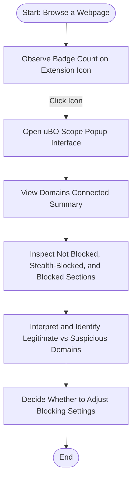

# Understanding the Popup & Badge Count

## Overview

This guide helps you open and effectively use the uBO Scope popup interface. It explains the badge displayed on the extension icon, showing the number of distinct third-party remote servers contacted by the current page. You'll learn why a lower badge count is better and how to distinguish legitimate third-party domains from potentially suspicious ones.

## What You Will Achieve

- Understand what the badge count represents and why it matters.
- Learn to open and navigate the popup interface to inspect network connections.
- Interpret the details of allowed, stealth-blocked, and blocked third-party domains.
- Develop the ability to identify suspicious remote servers among third parties.

## Prerequisites

- uBO Scope extension installed and enabled in your Chromium, Firefox, or Safari browser.
- An active browser tab with a loaded webpage containing remote server connections.
- Basic familiarity with browser extensions and opening extension popups.

## Time Estimate

About 5 minutes to familiarize yourself with the popup and badge interpretation.

---

## 1. Accessing the Popup Interface

1. Locate the uBO Scope extension icon in your browser's toolbar. The icon looks like the uBO Scope logo.
2. Observe the badge text directly on the icon — this number indicates distinct third-party remote servers contacted.
3. Click the icon to open the popup interface.

<Check>
If you don’t see the icon, ensure the extension is installed and pinned to your toolbar. Refer to the installation guide if needed.
</Check>

## 2. Understanding the Badge Count

- The badge number reflects the count of **distinct third-party remote servers** contacted on the current page.
- This count includes all servers contacted, whether requests were successful, stealth-blocked, or blocked, but only those allowed (not blocked) are counted for badge display.
- A **lower badge count is preferable**, as it means fewer third parties received data, improving privacy.

<Tip>
Third-party servers usually include CDN providers or essential service domains; a high badge count might indicate excessive third-party tracking or connections.
</Tip>

## 3. Exploring the Popup Interface

The popup is divided into several sections giving detailed insight into network outcomes:

- **Tab Hostname and Domain:** Displays the domain of the current webpage.
- **Domains Connected (Summary):** Shows the total number of distinct third-party domains connected.
- **Not Blocked:** Lists domains from which network requests succeeded.
- **Stealth-Blocked:** Lists domains involved in redirects or handled stealthily (hidden network activity).
- **Blocked:** Lists domains where connection attempts were blocked.

Each section lists domains along with a count of network requests to that domain.

### How to Interpret Sections

| Section       | Meaning                                                           | What to Watch For                          |
|---------------|-------------------------------------------------------------------|--------------------------------------------|
| Not Blocked   | Domains successfully contacted without being blocked.            | Legitimate service domains; minimal count preferred.
| Stealth-Blocked | Domains that attempted redirection or stealth connections.      | Unexpected or unknown domains may warrant investigation.
| Blocked       | Domains where requests were blocked by the content blocker or other means. | Helpful for spotting unwanted or intrusive domains.

## 4. Practical Tips for Usage

- **Regularly check the badge and popup** when visiting new or unfamiliar sites to monitor third-party requests.
- **Compare domains in the not blocked vs blocked lists** to evaluate your content blocker’s effectiveness.
- Use the detailed domain counts to identify which domains dominate network requests.
- Consider lower badge counts as an indicator of better privacy but remember some legitimate services inherently require multiple third-party connections.

## 5. Identifying Legitimate vs Suspicious Third Parties

- Legitimate third parties are usually popular CDN providers, analytics services, or content delivery networks needed for website functionality.
  - Examples include domains ending in `cloudflare.net`, `akamai.net`, or other well-known CDN providers.
- Suspicious third parties may be unknown domains, newly observed domains with many connection attempts, or domains unrelated to the current site's purpose.
- Cross-check suspicious domains online if unsure to assess their reputation.

<Tip>
Use the badge and popup to inform your content blocking strategy and adjust settings or filters accordingly.
</Tip>

## 6. Step-by-Step Example

### Scenario: Visit a News Website

1. You load a news website.
2. The uBO Scope icon badge shows a number (e.g., 8).
3. Click the icon to open the popup.
4. See the main site’s domain at the top and 8 domains connected shown in the summary.
5. Review 'Not Blocked' domains and recognize legitimate CDNs.
6. Observe any unknown domains in 'Stealth-Blocked' or 'Blocked' sections.
7. Decide if additional blocking might be needed based on analysis.

## 7. Troubleshooting Common Issues

<AccordionGroup title="Troubleshooting Popup & Badge Count">
<Accordion title="The Badge is Empty or Not Updating">
- Ensure the current tab is active and has loaded network requests.
- Refresh the webpage and reopen the popup to refresh data.
- Verify that uBO Scope is enabled and has necessary permissions.
- Restart the browser if the badge remains stale.
</Accordion>
<Accordion title="Popup Shows 'NO DATA' or Is Blank">
- Confirm the extension is running by checking installed extensions.
- Try switching tabs to force data reload.
- Refresh the active tab.
- If problem persists, reinstall the extension.
</Accordion>
<Accordion title="Suspicious Domains Appear in Not Blocked Section">
- These may still be legitimate CDNs or services.
- Research domain reputation online.
- Use uBO Scope data to adjust blocking rules accordingly.
</Accordion>
</AccordionGroup>

## 8. Best Practices

- Frequently monitor badge counts to stay aware of third-party connections.
- Use the popup to deep-dive on domains and identify connections that matter most.
- Combine uBO Scope data with content blocker rules for optimal privacy.
- Stay updated on documentation and extension updates for new features.

## 9. Next Steps

- Proceed to the [Running Your First Network Analysis](../getting-started/first-analysis) to see how to analyze network data beyond the popup.
- Review the [Core Concepts & Key Terms](../../overview/getting-started/core-concepts-and-terminology) page to understand third-party connections more deeply.
- Consult the [First Validation Guide](../../getting_started/first_run_validation/first_validation) to confirm your setup is working correctly.

---

## Additional Resources

- [Installing and Setting Up uBO Scope](../getting-started/install-setup)
- [Validating Content Blocker Effectiveness](../../guides/practical-use-cases/validate-content-blocker)
- [Troubleshooting Installation & Startup Issues](../../getting_started/first_run_validation/troubleshooting_installation)
- Official uBO Scope GitHub Repository: [github.com/gorhill/uBO-Scope](https://github.com/gorhill/uBO-Scope)


---

## Appendix: Popup Interface Elements

```html
<h2 id="tabHostname">
  <span></span><span>NO DATA</span>
</h2>
<main>
  <section id="summary">
    domains connected: <span>?</span>
  </section>
  <section class="outcome allowed">
    <h3>not blocked</h3>
    <div class="domains"></div>
  </section>
  <section class="outcome stealth">
    <h3>stealth-blocked</h3>
    <div class="domains"></div>
  </section>
  <section class="outcome blocked">
    <h3>blocked</h3>
    <div class="domains"></div>
  </section>
</main>
```

Each `.domains` container lists domains with request counts, helping you see network activity clearly.

---

## Summary Diagram: User Flow for Using the Popup and Badge



This sequence guides you to leverage the popup for actionable privacy insights.
