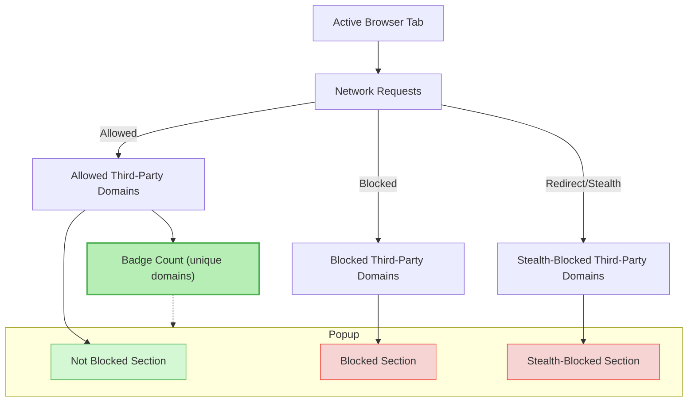

# Interpreting the Badge Count and Popup Table

## Overview
The **uBO Scope** extension presents real-time information about third-party network connections initiated by the active browser tab. This guide clarifies the meaning behind the badge count shown on the browser toolbar icon and explains how to interpret the categorized domain connection table within the extension's popup interface.

By mastering this page, you will quickly distinguish between allowed, blocked, and stealth-blocked domains and understand how uBO Scope reports these network activities transparently.

---

## 1. Understanding the Badge Count

### What the Badge Count Represents
- The badge count displays the **number of unique third-party domains** from which the active tab successfully made network connections.
- These connections correspond to **allowed** network requests — those that were not blocked by any content blocker or stealth mechanism.
- A **lower badge count** generally indicates fewer distinct third-party servers contacted, aligning with more privacy-conscious browsing.

### What It Does NOT Represent
- It does **not** count blocked or stealth-blocked requests.
- It does **not** reflect the total number of network requests, only **distinct domains connected to successfully**.

<Tip>
Think of the badge count as a live tally of visible third-party domains your webpage actually reached out to, offering clear visibility into real network activity without interference from blockers.
</Tip>

### How Domains Are Counted
- The count focuses on **third-party domains**, defined as domains different from the main domain of the current tab.
- Domains are normalized using the Public Suffix List to group subdomains under their registered domain, ensuring the badge shows unique, meaningful domain counts.

---

## 2. Exploring the Popup Table

When you click the uBO Scope icon, the popup shows a categorized table of domains associated with the active tab’s network requests.

### Popup Structure
The popup groups domains into three distinct sections:

| Outcome       | Meaning                                  | Visual Cue           |
|---------------|------------------------------------------|----------------------|
| **Not Blocked** | Domains where network requests succeeded and were allowed. | Green themed section  |
| **Stealth-Blocked** | Domains where connections were redirected or hidden stealthily, often by content blockers using stealth techniques. | Red themed section  |
| **Blocked**   | Domains where network requests failed due to blocking, such as by content blockers or network errors. | Red themed section    |

Each section lists:
- The domain name (converted to Unicode form if punycode is used)
- The count of network requests to that domain

### How to Read the Table
- **Domain Column:** Shows the actual third-party domain contacted or attempted.
- **Count Column:** Number of connection attempts made to that domain from the active tab.

<Tip>
Frequent domains with high counts may indicate routinely contacted services like content delivery networks or analytics providers. This helps you understand not just what connects, but how often.
</Tip>

---

## 3. Defining a "Third-Party" Domain

### Key Concept
- A domain is considered **third-party** if it differs from the main domain of the active tab (based on the public suffix list).
- For example, if you are on "example.com," domains like "cdn.example.net" or "tracker.analytics.com" count as third-party.

### Why This Matters
- uBO Scope focuses on third-party connections because they are the primary vectors for privacy concerns, advertising, and tracking.

---

## 4. Differentiating Allowed, Blocked, and Stealth Connections

| Connection Type  | Description | When It Appears |
|------------------|-------------|----------------|
| **Allowed**      | Connections that succeeded and were not interfered with by blockers. These represent third-party domains your browser communicated with openly. | Listed under “not blocked” with green highlight. 
| **Blocked**      | Connections that failed because they were explicitly blocked or denied by content blockers or network errors. | Listed under "blocked" with red highlight.
| **Stealth-Blocked** | Requests that were redirected, made invisible, or otherwise stealth-blocked to avoid detection by websites or tests. Often from stealthy ad blockers or blocking strategies. | Listed under "stealth-blocked" with red highlight.

### Practical Impact
- The popup makes it easy to spot which third-party domains your browser is freely communicating with, which are blocked outright, and which are stealth-blocked to remain hidden from webpages.

---

## 5. Step-by-Step: Interpreting Your Current Tab’s Badge and Popup

<Steps>
<Step title="Observe the Toolbar Badge">
Look at the uBO Scope icon on your browser toolbar. The number displayed indicates how many distinct third-party domains are currently connected from the active tab.

*If no number appears, it means no allowed third-party connections have been detected yet.*
</Step>

<Step title="Open the Popup Window">
Click the uBO Scope toolbar icon to open the popup. At the top, note the main domain hostname.

Sections below organize domains by their connection outcome: not blocked, stealth-blocked, and blocked.
</Step>

<Step title="Review Allowed Domains">
In the "not blocked" section, note the domains and counts — these are the third parties your active tab is connected to openly.

*These domains contribute directly to the badge count.*
</Step>

<Step title="Check Stealth-Blocked and Blocked Domains">
Review the "stealth-blocked" and "blocked" sections to see where connections failed or were hidden.

*These connections do not affect the badge count but reveal blocking behavior.*
</Step>

<Step title="Relate Badge to Popup Data">
Ensure the number on the badge equals the count of unique domains in the "not blocked" section.

If they differ, try refreshing the tab or verifying the extension permissions.
</Step>
</Steps>

---

## 6. Common Pitfalls and Troubleshooting

<AccordionGroup title="Troubleshooting Badge Count and Popup Issues">
<Accordion title="Badge Count Does Not Update">
- **Cause:** Extension may have delayed processing or insufficient permissions.
- **Solution:** Refresh the tab, check extension permissions, and confirm the tab is active.
- See [Troubleshooting Installation & Setup Issues](/getting-started/installation-basics/troubleshooting) for more details.
</Accordion>
<Accordion title="Popup Shows No Data or 'NO DATA'">
- **Cause:** The tab may not be active or network requests haven't occurred yet.
- **Solution:** Reload the tab page and try again; the extension only records active tab data.
</Accordion>
<Accordion title="Unexpected High Badge Count">
- **Cause:** This may reflect legitimate third-party services like CDNs or analytics.
- **Solution:** Use the popup table to identify domains and assess if they align with normal browsing.
</Accordion>
<Accordion title="Blocked or Stealth-Blocked Sections Are Empty">
- This means no network requests were blocked or stealth-blocked for the current tab.
- This is normal if your browsing session faces no interference or you have no blockers enabled.
</Accordion>
</AccordionGroup>

---

## 7. Best Practices for Using Badge and Popup Data

- Use the **badge count as a quick privacy indicator** — fewer distinct third-party domains generally improve privacy.
- Open the popup to **investigate specific domains** causing the count and understand traffic origins.
- Watch for unusual or unexpected third-party domains and investigate their purpose.
- Use this data to **validate content blockers’ effectiveness** in your browser comparing allowed vs blocked domains.

---

## 8. Next Steps

- Visit the [Key Concepts & What uBO Scope Shows You](/getting-started/essential-concepts/concepts-and-terminology) page to deepen your understanding of core terminology.
- If you encounter any issues, check the [Troubleshooting Installation & Setup Issues](/getting-started/installation-basics/troubleshooting) guide.
- Explore [Confirming uBO Scope Works As Expected](/getting-started/essential-concepts/validating-extension-functionality) to validate your setup with practical tests.

---

## References
- [Core Concepts & Key Terms](/overview/concepts-architecture/core-concepts-terminology)
- [System Architecture & Data Flow](/overview/concepts-architecture/system-architecture)
- [Browser Integration & Permissions](/overview/concepts-architecture/integration-browser-environment)

---

## Summary Diagram: How Badge Count and Popup Data Relate

This diagram illustrates how network requests for the active tab feed into the different outcome categories and how the badge count reflects the number of unique allowed third-party domains.

---