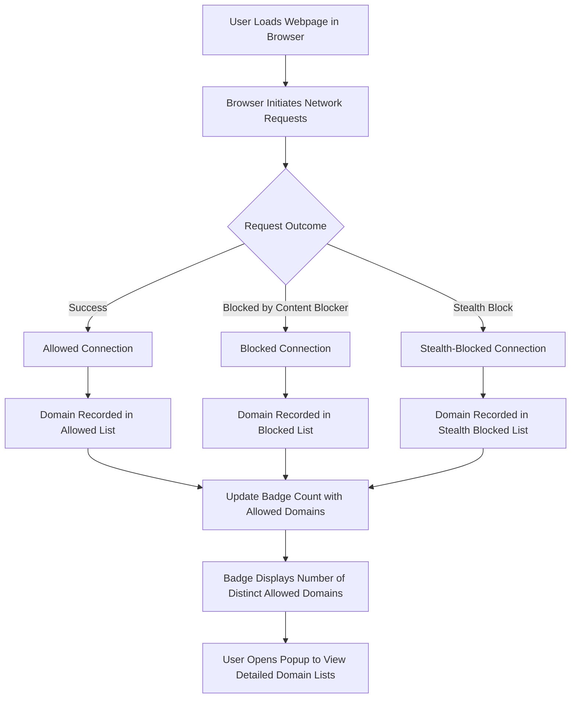

# Making Sense of Badge Counts and Domain Listings

## Understanding the Badge Count: What It Represents and Why Fewer Is Better

When you install and activate uBO Scope, you will notice a small numeric badge displayed on the browser toolbar icon. This badge count is not an arbitrary number, but a powerful indicator of your web browsing exposure at the network level.

**What the Badge Count Shows:**

- It reports the number of *distinct third-party domains* that the active webpage has connected to.
- This count reflects domains that your browser requested resources from, such as ad servers, trackers, or content delivery networks (CDNs).

**Why a Lower Count Means Better Privacy:**

Fewer third-party connections imply that less external tracking or advertising infrastructure is involved on the page. Since many privacy risks arise from unintended or excessive connections to third parties, a lower count corresponds to a reduced digital fingerprint and better privacy.

### Key Insight
> **Not all third-party domains are harmful or unwanted.** Many websites rely on legitimate third parties like CDNs for performance. However, controlling your exposure means minimizing unnecessary third-party connections.

---

## Breaking Down the Domain Listings: Allowed, Blocked, and Stealth-Blocked

Within uBO Scope’s popup interface, you’ll see domains grouped under three distinct categories. Understanding these categories will help you interpret what the extension reveals about the network connections for the page you are visiting.

### 1. Not Blocked (Allowed)

- Domains here represent third-party connections that were successfully made.
- These are network requests that the browser allowed and completed.

**What This Means for You:**
These are the actual domains your browser communicated with. The badge count directly reflects the number of such allowed, distinct domains.

### 2. Blocked

- These domains correspond to third-party network connections that uBO Scope detected but were blocked by a content blocker or failed outright.
- Typical network errors or explicit blocking events fall here.

**What This Means for You:**
Blocked does not impact the badge count, since those connections did not complete successfully.

### 3. Stealth-Blocked

- A unique intermediate category indicating connections that content blockers stealthily blocked.
- These requests may have been silently cancelled or redirected before completing, preventing detection by the webpage.

**Why Stealth-Blocked Matters:**
Many modern content blockers use stealth blocking to avoid detection and reduce site breakage. uBO Scope surfaces these invisible blocks so you can see the real extent of blocking happening behind the scenes.

---

## How to Use This Information to Assess Privacy Exposure

Follow this simple flow each time you open uBO Scope on a webpage:

1. **Check the Badge Count:**
   - Remember, a lower badge count means fewer distinct third-party domains were contacted.
   - Use this as a quick privacy snapshot for the active tab.

2. **Inspect the Not Blocked List:**
   - Review domains under "Not Blocked" to identify active third-party connections.
   - Spot familiar legitimate domains (e.g., well-known CDN providers) versus potentially invasive trackers or ads.

3. **Review Blocked and Stealth-Blocked Domains:**
   - These show the extent of blocking and stealth blocking in effect.
   - Understanding this helps clarify why some resources are not loaded but remain accounted for.

4. **Interpret Counts Next to Domains:**
   - Numbers next to each domain show how many requests were made to that domain.
   - Higher counts can imply heavier usage, though even one connection counts toward exposure.

<Tip>
Fewer third-party domains contacted by a page generally improves privacy, but balance this with the functional needs of the site. uBO Scope helps visualize the real-world network surface your browsing exposes.
</Tip>

---

## Step-by-Step: Interpreting the Badge and Domain Listings

<Steps>
<Step title="Open the uBO Scope popup interface">
Click the uBO Scope extension icon on your browser toolbar to reveal the popup.
</Step>
<Step title="Locate the badge count and hostname">
At the top, observe the number displayed next to the tab’s hostname. This is the count of distinct allowed third-party domains.
</Step>
<Step title="Review the 'Not Blocked' section">
See which domains successfully responded to requests. These actively contributed to page content or tracking.
</Step>
<Step title="Examine the 'Stealth-Blocked' section">
Understand which domains were hidden from the page via stealth blocking. These are blocked requests that web pages often cannot detect.
</Step>
<Step title="Check the 'Blocked' section">
View any network connections blocked outright or failed to load.
</Step>
<Step title="Consider the counts beside each domain">
The badge next to each domain indicates number of requests made during the page load.
</Step>
</Steps>

---

## Common Questions and Practical Tips

<AccordionGroup title="Frequently Asked Questions">
<Accordion title="Why does the badge count not include blocked domains?">
The badge count represents only domains with successful, allowed connections. Blocked and stealth-blocked connections do not complete and thus are excluded from the count.
</Accordion>
<Accordion title="Are all third-party domains shown malicious or unwanted?">
No. Many legitimate services like Content Delivery Networks (CDNs) show as third parties but are essential for site functionality and performance.
</Accordion>
<Accordion title="What is stealth-blocking and why is it important?">
Stealth-blocking prevents detection by the website of blocked requests by silently cancelling or redirecting them. This reduces site breakage and improves user experience, but hides blocking activity from page scripts. uBO Scope reveals these stealth blocks.
</Accordion>
<Accordion title="Can the badge count fluctuate as I navigate between pages?">
Yes. The count reflects third-party domains contacted per active tab. Different pages within the same site can connect to varying third-party domains.
</Accordion>
<Accordion title="How do I verify the impression that fewer connections equals better privacy?">
Use uBO Scope alongside other privacy tools and by comparing badge counts for known trackers versus trusted domains. Consistently lower counts signal reduced tracking surface.
</Accordion>
</AccordionGroup>

---

## Troubleshooting Insights

<Warning>
If the badge count is empty or not updating:
- Confirm uBO Scope has all necessary permissions.
- Verify you are on an active tab with network activity.
- Ensure no other extension conflicts interfere with webRequest API.
- See related troubleshooting guide for installation issues.
</Warning>

<Info>
The extension relies on browser network APIs. Some browser or privacy configurations may restrict visibility into certain requests, affecting badge accuracy.
</Info>

---

## Summary: Harnessing Badge Counts and Domain Listings

The uBO Scope badge and popup domain listings provide an unprecedented transparent look into all third-party servers your browser talks to per page. By interpreting this data:

- You gain a reliable measure of your network-level privacy exposure.
- Can distinguish between allowed connections, outright blocks, and stealth blocks.
- Empower yourself to make informed decisions about browsing privacy and content blocker effectiveness.

---

## Related Documentation and Next Steps

- [Navigating the Popup Interface](/guides/getting-started/popup-tour) — Explore the full uBO Scope UI in detail.
- [Quickstart: See uBO Scope in Action](/getting-started/usage-validation-troubleshooting/quickstart-usage) — Hands-on introduction to uBO Scope.
- [Troubleshooting Common Installation Issues](/getting-started/usage-validation-troubleshooting/troubleshooting-install) — Resolve common setup problems.
- [What is uBO Scope?](/overview/product-intro-core-value/what-is-ubo-scope) — Understand the primary purpose and value.
- [Core Concepts and Terminology](/overview/product-intro-core-value/core-terms-and-concepts) — Clarify terms around connections and blocking categories.

---

## Visual Workflow of Badge Count and Domain Outcome Processing

This flow illustrates how network request outcomes lead to domain categorizations and badge count updates, culminating in the user's informed view of site connections.
