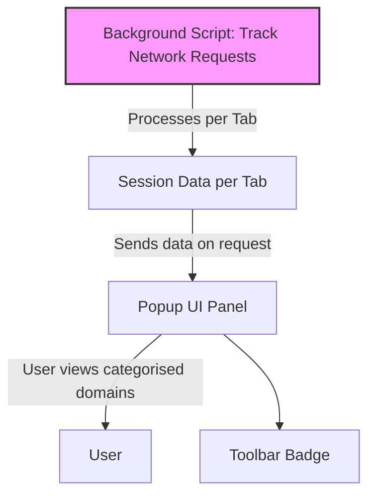

# Understanding the Popup Panel

## Workflow Overview

### Task Description
This guide helps you understand how to access and interpret the uBO Scope extension’s popup panel. The popup provides a clear, categorized view of network connections initiated by the active browser tab, exposing allowed, blocked, and stealth-blocked domains to give you quick insight into the tab's network activity.

### Prerequisites
- uBO Scope extension installed and enabled in your browser.
- An active browser tab with network activity.
- Basic understanding of browser tabs and network requests.

### Expected Outcome
By following this guide, you will confidently navigate the popup panel to:
- Identify the primary domain of the active tab.
- Understand how many third-party domains were contacted.
- Distinguish between domains that were allowed, stealth-blocked, or outright blocked.

### Time Estimate
Approximately 5 minutes to familiarize yourself with the popup panel elements and indicators.

### Difficulty Level
Beginner. No technical expertise required.

---

## Step-by-Step Instructions

### 1. Opening the Popup Panel
- **Action:** Click the uBO Scope extension icon in your browser’s toolbar.
- **Outcome:** The popup panel associated with the active tab opens, displaying connection details.
- **Verification:** You should see the main panel with the hostname and domain displayed prominently.

### 2. Interpreting the Active Tab's Domains
- **Observation:** The top section shows the active tab's hostname split into two parts:
  - The first span displays the subdomain portion, if any.
  - The second span always shows the registered domain.

- **Example:** For a hostname like `news.example.com`, "news." appears in the first span, and "example.com" in the second.
- **Tip:** This splitting helps you quickly identify the exact domain part generating or controlling the network activity.

### 3. Understanding the Summary Count
- **Location:** Below the hostname, the **domains connected** summary shows the total number of distinct third-party domains contacted during the current tab’s session.
- **Value:** This count represents only unique remote domains connected to, aggregating allowed, stealth-blocked, and blocked categories.
- **Value Framing:** A lower number typically indicates fewer third-party connections and can relate to better privacy.

### 4. Browsing the Domain Lists
The popup is divided into three sections, each representing a connection outcome. Each section lists domains along with a count of connections observed:

- **Not Blocked (Allowed) Domains:**
  - These domains successfully connected.
  - You can see which third-party domains loaded content or data.
  - Domains are sorted alphabetically, each showing how many requests were allowed.

- **Stealth-Blocked Domains:**
  - These are domains whose connections were stealthily blocked.
  - "Stealth-blocked" means the connection attempts were silently suppressed without obvious errors.
  - Useful for detecting hidden or stealthy filtering by the content blocker.

- **Blocked Domains:**
  - Domains explicitly blocked resulting in network errors or failures.
  - Indicates content or resources the extension or other blockers prevented from loading.

- **Action:** Click the popup icon and scroll through these sections to gauge the network behavior.
- **Outcome:** You can discern which third-party domains have various outcomes on your browsing session.

### 5. Reading the Domain Rows
- Each domain row has:
  - **Domain name:** Displayed in Unicode format for human readability.
  - **Count badge:** Number of requests made to that domain.
- **Tip:** Higher counts can indicate significant activity or resource loading from that domain.

### 6. Understanding Badge Count on Toolbar Icon
- The toolbar icon's badge shows the count of distinct third-party domains allowed for the active tab.
- This count is synchronized with the popup’s 'not blocked' section.
- **Interpretation:** This quick visual gives a snapshot of third-party connections without opening the popup.

---

## Practical Examples

### Example Scenario: Analyzing Network Connections on a News Website
1. Navigate to a news website.
2. Click the uBO Scope icon to open the popup panel.
3. Observe the hostname area showing the main domain, e.g., "news." and "example.com".
4. Look at the domains connected count to get an overview.
5. Review the allowed domains to see legitimate content delivery networks (CDNs).
6. Check stealth and blocked lists to identify potential trackers or blocked ad servers.

---

## Troubleshooting & Tips

<AccordionGroup title="Troubleshooting & Tips">
<Accordion title="Popup Shows 'NO DATA' or Is Empty">
If the popup panel displays 'NO DATA', it means no network activity data is currently recorded for the active tab.

**Possible Causes:**
- You opened the popup on a new tab with no network requests yet.
- The extension has not yet processed recent requests.

**Solution:**
- Reload the page in the active tab.
- Wait a few seconds and open the popup again.
- Ensure the extension has necessary permissions.
</Accordion>
<Accordion title="Badge Count Isn’t Updating">
If the badge count does not reflect your browsing activity:

**Check:**
- The extension is enabled for the site.
- The extension has permission to intercept web requests (check in browser extensions settings).
- Try restarting the browser or reloading the extension.
</Accordion>
<Accordion title="Understanding Stealth-Blocked Domains">
Stealth-blocking means connection attempts are suppressed without reporting errors, often to make blocking less detectable.

**Tip:**
- Use these insights to learn about hidden tracking attempts.
- Combine with other debugging tools for deeper analysis.
</Accordion>
</AccordionGroup>

<Tip>
For best viewing experience, ensure your browser window is wide enough to avoid layout issues with the popup panel. The extension adapts to smaller widths but some domain names or counts may wrap oddly.
</Tip>

---

## Next Steps & Related Content

- After mastering the popup panel, explore [Analyzing Third-Party Connections](/guides/core-workflows/analyzing-connections) to deepen your understanding of network traffic and filtering.
- Review [Debunking Content Blocking Myths](/guides/core-workflows/debunking-myths) to understand how uBO Scope helps clarify common misconceptions.
- Consult the [Installation and Setup Guide](/guides/getting-started/installation-setup) if you have not installed the extension yet.

---

## Summary
The popup panel is your window into real-time network connections initiated by your active browser tab. By clearly categorizing domains into allowed, stealth-blocked, and blocked, and summarizing the domain footprint, it empowers informed web privacy decisions.

---

## Visual Reference

Here is a structure diagram outlining how data flows into the popup panel from the background tracking and how user interaction surfaces insights:

This flow illustrates the journey of network request data from detection to user-visible interface.

---

## References

- [uBO Scope GitHub Repository](https://github.com/gorhill/uBO-Scope)
- [Installation and Setup Guide](/guides/getting-started/installation-setup)
- [Validating Your Setup](/getting-started/first-use-and-validation/validating-setup)
- [Analyzing Third-Party Connections](/guides/core-workflows/analyzing-connections)

