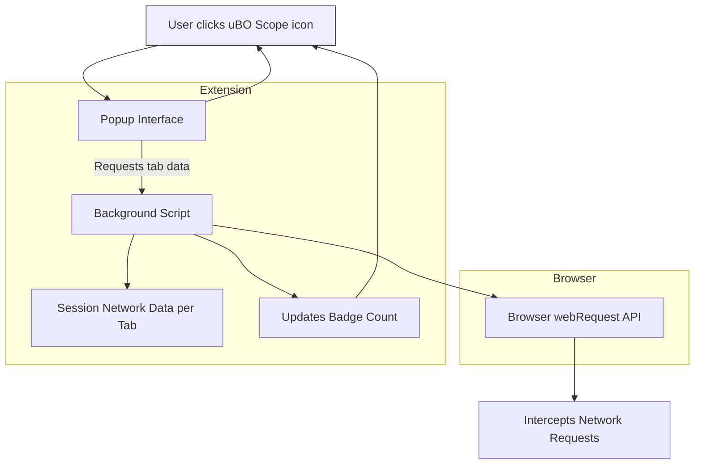

# Interpreting the Badge and Popup

## Overview

This guide helps you understand the key indicators presented by uBO Scope — specifically the toolbar badge count and the detailed popup interface. These tools provide transparency about the third-party domains your browser connects to while visiting websites, empowering you to monitor network activity and assess privacy implications.

You will learn what the badge number means, how to interpret the categorized connection reports in the popup, and actionable insights to better understand web traffic targeting third-party servers.

---

## 1. Understanding the Toolbar Badge

### What the Badge Represents

The badge number on the uBO Scope icon reflects the **number of distinct third-party remote domains** a webpage has connected to during the current tab session.

- This count includes domains where network requests were **allowed** through.
- A **lower badge count indicates fewer unique third-party servers contacted**, which generally signals better privacy.
- The badge **does not count the number of requests**, but the number of unique remote domains.

### Why this Matters

Many users assume that a high block count means better protection. uBO Scope helps debunk this myth by focusing on **actual remote servers contacted** rather than just blocked requests:

- A content blocker that blocks more requests but still allows more distinct third-party connections may result in a **higher privacy risk**.
- Conversely, having a low badge count demonstrates fewer external connections regardless of individual block counts.

### When and How the Badge Updates

- The badge updates **dynamically as the page loads and network requests are made**.
- It tracks distinct domains filtered to third-party networks — excluding the primary site’s own server domains.
- The count resets with each new tab or page navigation.

<Check>
Keep in mind: a non-zero badge count is normal, as many websites legitimately use some third-party services like CDNs and analytics.
</Check>

---

## 2. Navigating the Popup Interface

When you click the uBO Scope icon, the popup presents a categorized breakdown of the domains the current tab has connected with. This detail unlocks visibility into network activity beyond the badge count.

### Popup Sections Explained

The popup is divided into three main sections, each representing a connection outcome:

- **Not Blocked (Allowed)**
  - Domains where network requests succeeded without interference.
  - Reflects third-party servers your browser successfully connected to.
- **Stealth-Blocked (Stealth)**
  - Domains where network requests were stealthily blocked.
  - These may be blocked in a way that prevents detection by the webpage.
- **Blocked**
  - Domains where network requests were explicitly blocked.

Each section lists third-party domains along with the number of connections recorded to each domain during the tab session.

### How Domain Names Are Displayed

- Domain names are translated to their Unicode form for readability using the [Punycode](https://en.wikipedia.org/wiki/Punycode) algorithm.
- The popup distinguishes between the full hostname and its registered domain base.

### Summary Area

At the top or center of the popup, you will find a summary line showing the **total number of distinct domains** your current tab connected to (combining all categories).

---

## 3. Step-by-Step: Using the Badge and Popup to Assess a Website

<Steps>
<Step title="Open uBO Scope on the Active Tab">
Click the uBO Scope extension icon in your browser toolbar.

Expected Result: The popup appears showing domain connection details for the current tab.
</Step>
<Step title="Check the Toolbar Badge Number">
Notice the badge count on the toolbar icon.

- If the badge is empty or zero, no third-party connections were detected or all were blocked.
- If the badge shows a number, that many distinct third-party servers were contacted.
</Step>
<Step title="Review the Not Blocked Section in the Popup">
Look under the “not blocked” section to see which third-party domains successfully loaded resources.

- Each domain is listed with a count of network connections.
- Larger counts suggest more frequent or persistent connections to the domain.
</Step>
<Step title="Explore the Stealth-Blocked and Blocked Sections">
Review domains under “stealth-blocked” and “blocked.”

- These indicate domains where requests were stopped, either stealthily or explicitly.
- This helps understand which third parties were prevented from loading.
</Step>
<Step title="Interpret the Tab Hostname Header">
At the popup header, observe the tab’s hostname and domain details.

- This contextualizes where connections originate.
- Distinguishes subdomains from base domains.
</Step>
</Steps>

---

## 4. Practical Tips and Best Practices

- **Use the Badge as a Privacy Indicator:** Monitor changes in the badge count to notice unusual spikes in third-party connections.
- **Validate Blocker Effectiveness:** Combine the badge data with your content blocker settings to ensure fewer unwanted domains are allowed.
- **Interpret Stealth Blocking Carefully:** Domains listed under stealth-blocked might not be visible to webpages and indicate subtle content-blocking mechanisms.
- **Refresh Popup After Navigation:** The popup updates when you reopen it; refresh the page to see the latest connections.

<Warning>
Remember, not all third-party domains are malicious; many are essential for site functionality (e.g., CDNs). Use context when assessing network activity.
</Warning>

---

## 5. Troubleshooting Common Issues

| Issue | Cause | Solution |
| ----- | ----- | -------- |
| Badge displays zero but web pages load many resources | Browser API limitations or page uses network outside scope | Verify browser version meets minimum requirements, check known limitations in integration docs |
| Popup shows empty lists | Network activity hasn’t occurred yet, or extension not active | Reload page and try again, ensure extension is enabled and allowed permissions |
| Domain names appear as punycode or unresolved | Unicode domain conversion may not apply or popup failed to load data | Reload popup, update browser if Unicode support is limited |

<Note>
If persistent issues occur, consult the troubleshooting docs or verify installation correctness.
</Note>

---

## 6. Summary Diagram of Data Flow

This flow illustrates how uBO Scope listens to network requests, updates stored per-tab connection data, dynamically updates the badge count, and serves connection details to the popup UI.

---

## 7. Next Steps and Related Documentation

- Explore **[Using the Extension](https://docs/overview/usage-and-troubleshooting/using-the-extension)** to deepen your understanding of all extension features.
- Review **[Quick Validation Steps](https://docs/getting-started/usage-and-troubleshooting/quick-validation)** to verify your installation is working.
- Consult **[Troubleshooting Installation & Setup Issues](https://docs/getting-started/usage-and-troubleshooting/troubleshooting)** if you encounter problems.
- Learn more about **Core Concepts & Terminology** to strengthen foundational knowledge.

---

By mastering the badge and popup insights, you gain transparent visibility into third-party network connections, reinforcing your capacity to manage privacy and security effectively during web browsing.
