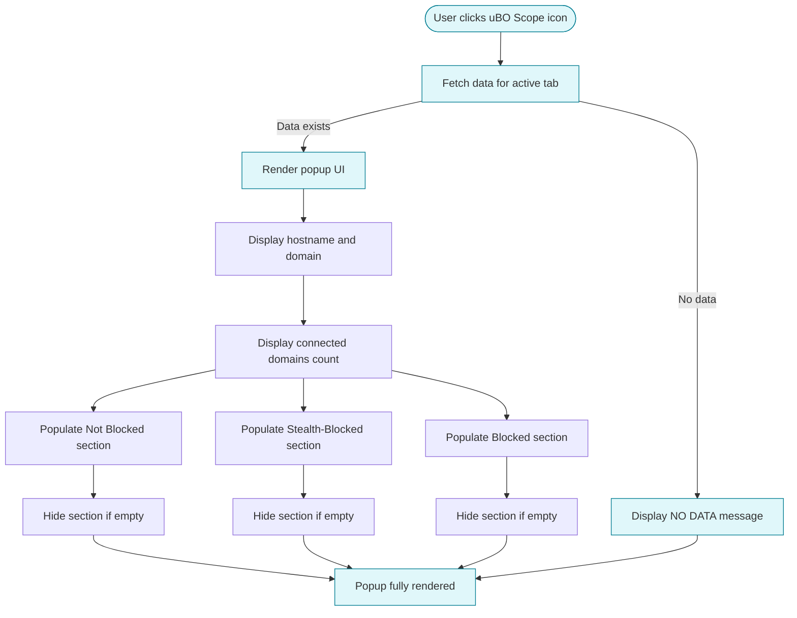

# Understanding the Popup UI and Badge

## Overview

This guide walks you through the main popup interface of uBO Scope, focusing on how to interpret the badge number on the browser toolbar, read the domains table, and quickly understand the connection statuses: **allowed**, **blocked**, and **stealth-blocked**. By the end, you will confidently navigate the popup UI to gain clear insights into the network connections made (or attempted) by webpages in your active browser tab.

---

## 1. What the Badge Number Represents

The badge number displayed on the browser toolbar icon is a concise privacy indicator:

- **It shows the number of distinct third-party remote domains that your browser successfully connected to on the current active tab.**
- A **lower number means fewer third-party connections**, which typically equates to better privacy.
- If the badge is **empty (no number)**, it means either no third-party domains were contacted or data is not yet available.

<u>Why focus on third-party domains?</u> Because many tracking and advertising services operate through third-party remote servers, limiting connections to them helps preserve your privacy.

---

## 2. Popup Panel Layout Explained

Opening the popup reveals a concise panel showing the network connection data for the active tab. It consists of three main sections:

### 2.1 Tab Hostname Header

- At the top, the interface displays the **domain and hostname of the webpage** you are currently viewing.
- The hostname is split into two parts:
  - The **first part** is the subdomains (e.g., `www.` or `news.`), shown with reduced opacity.
  - The **second part** is the root domain, shown in bold.
- If no data is available for the tab yet, it shows `NO DATA`.

### 2.2 Summary Section

- Below the header, a summary line shows:
  - **domains connected: [number]**
  - This number matches the badge on the toolbar and shows the count of unique third-party domains having at least one successful connection.

### 2.3 Domains Table

The rest of the popup is divided into three distinct **connection statuses**, each with a dedicated section and color coding:

| Section         | Meaning                                 | Visual Cue                              |
|-----------------|-----------------------------------------|----------------------------------------|
| **Not blocked** | Domains where network requests succeeded (allowed) | Green header, green badges on counts   |
| **Stealth-blocked** | Connections detected but stealthily blocked (not shown to webpage) | Red header, red badges on counts        |
| **Blocked**     | Connections that were explicitly blocked | Red header, red badges on counts        |

Each section lists domains that fall under the respective category, along with counts indicating how many network requests were observed to each domain.

- If a section has no domains, it is hidden automatically to keep the interface clean.

---

## 3. How to Read the Domains Table

Each domain row shows:

- The domain name (converted to Unicode for readability if it's internationalized).
- A small badge with the count of requests observed to that domain.

### Understanding Counts

- The count is a tally of network requests made to that domain during the current tab session.
- Higher counts indicate heavier connection activity.

### Domain Sorting

- Domains are sorted alphabetically for ease of scanning.

### Example Interpretation

Imagine you see under **not blocked**:

| Domain                | Count |
|-----------------------|-------|
| cdn.example.com       | 12    |
| fonts.gstatic.com     | 5     |

This means your page successfully connected to `cdn.example.com` 12 times and to Google's fonts server 5 times.

If under **blocked** you see:

| Domain                 | Count |
|------------------------|-------|
| tracking.adserver.net | 7     |

This signals that 7 network requests to `tracking.adserver.net` were explicitly blocked.

---

## 4. Quickly Interpreting Connection Statuses

- **Allowed (Not Blocked):** These are domains the page successfully connected to. They may include CDNs, analytics, or other third-party services.

- **Stealth-blocked:** These connections were intercepted and blocked silently without notifying the webpage or logging as traditional 'blocked'. This is a stealthy blocking mechanism used by some content blockers to avoid detection by webpages.

- **Blocked:** Network requests that were explicitly blocked. These are visible attempts that were denied.

**Tip:** The presence and size of stealth-blocked lists indicate advanced, subtle blocking at play and can help users understand why some requests seem invisible to the page.

---

## 5. Step-by-Step: Using the Popup to Assess Privacy

<Steps>
<Step title="Open the Popup">
Click the uBO Scope icon on your browser toolbar to open the popup panel.
</Step>
<Step title="Check the Badge Number">
Look at the badge number on the toolbar icon. This number reflects the count of distinct third-party domains with allowed connections on the active tab.
</Step>
<Step title="Identify the Current Tab's Domain">
At the top of the popup, verify the domain listed matches the webpage you are auditing.
</Step>
<Step title="Review Allowed Domains">
Examine the green "not blocked" section for third-party domains your browser connected to.
</Step>
<Step title="Examine Blocked and Stealth-Blocked Domains">
Look at the red sections titled "blocked" and "stealth-blocked" to find domains whose connection attempts were blocked, either explicitly or silently.
</Step>
<Step title="Compare Counts and Domains">
Use the counts next to each domain to understand which third-party services are the most active.
</Step>
<Step title="Use Insights to Improve Privacy">
Consider cross-referencing domains to decide if you want to block or allow them with extra tools or settings outside uBO Scope.
</Step>
</Steps>

---

## 6. Practical Tips & Best Practices

- **Frequent Badge Monitoring:** The badge number provides a quick privacy snapshot without opening the popup.
- **Popup Refresh:** Close and reopen the popup to refresh data if it doesn’t update immediately.
- **Known Services:** Many allowed domains are safe CDN or infrastructure domains; focus more on unknown or suspicious third-party domains.
- **Understanding Stealth Blocking:** Recognize stealth-blocked domains to avoid false assumptions about requests simply being allowed.
- **Use in Conjunction:** Combine this view with your content blocker’s settings for more granular control.

---

## 7. Troubleshooting Common Issues

<AccordionGroup title="Popup UI Troubleshooting">
<Accordion title="The Popup Shows NO DATA">
- Ensure you have an active tab open that loads a webpage.
- Refresh the webpage and reopen the popup to allow the extension to collect data.
- Check that the extension has permissions to monitor the current tab.
</Accordion>
<Accordion title="Badge Number Is Not Updating">
- Badge updates occur after a short processing delay (~1 second).
- Switch tabs away and back to trigger badge refresh.
- Confirm uBO Scope is installed and enabled.
</Accordion>
<Accordion title="Domains Table Is Empty or Missing Sections">
- If no domains are detected for a status, that section is hidden automatically.
- If expected data is missing, verify you're on a webpage that makes network requests.
</Accordion>
<Accordion title="Count Numbers Seem Unusual">
- Counts refer to individual network request attempts, not size or priority.
- High counts on a domain might indicate repeated resources loading (e.g., ads, analytics).
</Accordion>
<Accordion title="Stealth-Blocked Section Is Hard to Understand">
- Stealth blocking is transparent to webpages; if unsure, consult advanced guides for interpreting stealth outcomes.
</Accordion>
</AccordionGroup>

---

## 8. Diagram: Popup UI Workflow

---

## 9. Next Steps

- Explore the [Basic Configuration](https://docs.uboscope/getting-started/setup-and-validation/basic-configuration) page to understand how to set up and ensure seamless operation.
- Consult the [Making Sense of Allowed, Blocked, and Stealth Connections](https://docs.uboscope/guides/advanced-tips/interpreting-request-details) guide for deeper insight into connection statuses.
- Use the [Auditing Third-Party Network Requests on Any Page](https://docs.uboscope/guides/core-workflows/audit-third-party-requests) for practical auditing workflows.

---

For complete onboarding, start with the [Installing and Setting Up uBO Scope](https://docs.uboscope/guides/getting-started/install-and-setup) guide, then return here to master interpreting the main popup UI.

---