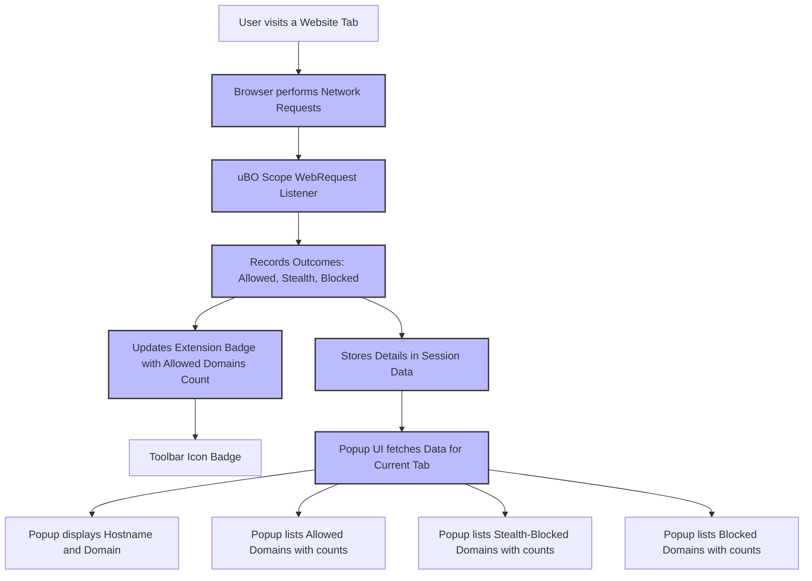

# Understanding the uBO Scope Interface

## Overview

This guide introduces you to the core user interface of uBO Scope, focusing on the popup panel, the badge count on the browser toolbar icon, and how to interpret the extension's essential visual indicators. You will learn how to view active network connections to remote servers for any webpage you browse, helping you better understand and manage your browsing privacy.

---

## What You Will Learn

- How to recognize and interpret the badge count displayed on the toolbar icon
- How to open and navigate the popup interface
- How to read the categorized lists of domains (Allowed, Stealth-Blocked, Blocked)
- How the interface reflects real-time network activity for the current browser tab
- Practical tips for interpreting domain activity and understanding what these connections mean

---

## Prerequisites

- uBO Scope installed and activated in your browser (Chrome, Firefox, or Safari)
- Browser version meets the minimum requirements for Manifest V3 and `webRequest` API access
- You have loaded or visited at least one website whose network activity you want to inspect

<Check>
Ensure uBO Scope is installed and enabled. Refer to the [Browser Installation Guide](https://github.com/gorhill/uBO-Scope/blob/main/guides/getting-started/installation-setup.md) for setup instructions.
</Check>

---

## The User Flow: From Website to Domain Activity Insight

1. **Visit a website in your browser.**
2. **Observe the badge count on the uBO Scope toolbar icon.** This shows the number of distinct third-party domains your browser connected to on that page.
3. **Click the uBO Scope icon to open the popup panel.**
4. **Explore the categorized lists of domains under "Allowed", "Stealth-Blocked", and "Blocked".**
5. **Use the domain names and connection counts to understand your page’s network connections.**

---

## Step-by-Step Instructions

### 1. Identifying the Toolbar Badge

- Locate the uBO Scope icon in your browser’s toolbar. Its icon is represented by the uBlock Origin Scope logo.
- The **badge count number** displayed on the icon represents the count of distinct third-party domains that had network connections during the current tab’s active session.
- A **lower badge number is better**, indicating fewer third-party remote servers your browser communicated with.

<Info>
Not all connected third-party domains are harmful. Common legitimate domains include CDNs and essential service providers.
</Info>

### 2. Opening the Popup Interface

- Click the uBO Scope toolbar icon to reveal the popup panel showing detailed network connection information for the active tab.
- The popup consists of three main sections:
  - **Allowed:** Domains from which network requests succeeded without blocking.
  - **Stealth-Blocked:** Domains where a connection was redirected stealthily by content blockers.
  - **Blocked:** Domains where requests failed or were blocked outright.

### 3. Reading the Popup Information

- At the top, the popup shows the hostname and domain of the current active tab, broken down visually.
- Just below, the **summary section** shows 'domains connected' with a count representing the distinct allowed domains.
- Each category section lists domains with the number of requests made to those domains during your current browsing session.

### 4. Interpreting Domain Activity Counts

- The count next to each domain indicates how many requests were made to that domain.
- Use this data to assess the footprint of external services your currently viewed webpage communicates with.

<Tip>
If the hostname and domain shown appear as punycode (encoded domain names), the interface automatically converts them into Unicode for readability.
</Tip>

### 5. Understanding Connection Outcomes

- **Allowed domains:** These remote domains had successful connections.
- **Stealth-blocked domains:** These domains experienced redirects by stealth-blocking rules; typical in advanced content blockers.
- **Blocked domains:** The network request to these domains failed or was outright blocked by your content block settings.

<Warning>
The badge count only reflects allowed connections to distinct third-party domains, not total request counts.
</Warning>

---

## Practical Example

Imagine you visit example.com and notice the toolbar badge shows "5". This means your browser has connected to five distinct third-party domains while loading that page.

- Open the popup by clicking the icon.
- The popup lists these five domains under "Allowed." 
- You also see two domains under "Blocked" where connection attempts were unsuccessful.
- Observing these domains helps you evaluate if the page is connecting to unexpected or suspicious servers.

---

## Tips and Best Practices

- **Use the badge count as a quick privacy snapshot:** It summarizes third-party exposure per tab.
- **Regularly inspect the popup details:** Gain insight into domains your browsing exposes you to.
- **Be mindful of stealth-blocked domains:** They indicate connections being handled more subtly.
- **Reload tabs if the data seems outdated:** The extension updates in near real-time but reloading ensures fresh data.

---

## Troubleshooting Common Interface Issues

<AccordionGroup title="Troubleshooting Popup and Badge Display Issues">
<Accordion title="Popup Shows No Data or 'NO DATA'">
- Confirm uBO Scope is enabled and permissions are granted.
- Make sure you have navigated to an active tab with network traffic.
- Reload the webpage and reopen the popup.
- Check for any browser restrictions that might block the extension.
</Accordion>

<Accordion title="Badge Count Does Not Update">
- Confirm that your browser supports the required Manifest V3 `webRequest` API.
- Reload the page or switch to a different tab and back.
- Restart the browser if update issues persist.
</Accordion>

<Accordion title="Domain Names Appear in Punycode or Are Hard to Read">
- The popup automatically renders Unicode when possible.
- If you see punycode domains, hovering or clicking may reveal Unicode equivalents.
- Ensure your browser encoding settings are standard UTF-8.
</Accordion>
</AccordionGroup>

---

## How This Interface Fits Into Your Workflow

This interface is your immediate window into the network activity of any site you visit. It complements other uBO Scope documentation such as:

- **Installation & Setup Guides:** Get uBO Scope installed and ready
- **Core Workflow Guides:** Analyze allowed, stealth, and blocked domains in-depth
- **Troubleshooting Documentation:** Resolve common setup and data issues

---

## Next Steps

- After understanding the interface, explore [Analyzing Allowed, Stealth, and Blocked Domains](https://github.com/gorhill/uBO-Scope/blob/main/guides/core-workflows/analyzing-allowed-stealth-blocked.md) to deepen your comprehension of what these classifications mean.
- Use the badge and popup insights to audit your web activity and improve your filter lists if you maintain them.
- Consult the [Debunking Myths About Content Blockers](https://github.com/gorhill/uBO-Scope/blob/main/guides/core-workflows/debunking-content-blocker-myths.md) guide to develop a more accurate understanding of content blocking effectiveness.

---

## Reference Links

- [uBO Scope GitHub Repository](https://github.com/gorhill/uBO-Scope)
- [Browser Installation Guide](https://github.com/gorhill/uBO-Scope/blob/main/guides/getting-started/installation-setup.md)
- [System Requirements](https://github.com/gorhill/uBO-Scope/blob/main/getting-started/install-and-requirements/system-requirements.md)
- [Popup Source Code](https://github.com/gorhill/uBO-Scope/blob/main/js/popup.js)

---

## Visual Layout

---

## Summary

The uBO Scope interface provides real-time insights into remote server connections made by your browser, helping you visualize third-party exposures per webpage. Through the toolbar badge and a detailed categorized popup panel, you can review allowed, stealth-blocked, and blocked connections, empowering you to gain practical privacy awareness.

---

# Appendix

### Definitions of Terms Used in the Popup

| Term           | Meaning |
|----------------|---------|
| Allowed        | Connections that succeeded and were not blocked. |
| Stealth-Blocked| Connections redirected or altered stealthily by blocker rules. |
| Blocked        | Connections that failed or were blocked outright. |

### Interface Elements

| Element        | Purpose |
|----------------|---------|
| Toolbar Badge  | Shows number of distinct allowed third-party domains for active tab. |
| Popup Header   | Displays current tab's hostname and core domain. |
| Summary Count  | Displays total allowed domains count. |
| Allowed Section| Lists allowed domains and request counts. |
| Stealth Section| Lists stealth-blocked domains and request counts. |
| Blocked Section| Lists blocked domains and request counts. |

---

This completes your guided understanding of the uBO Scope interface.

