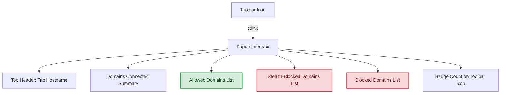

# Your First Insights: Interpreting the Popup

## Workflow Overview

### What This Guide Helps You Accomplish

This guide walks you through the **popup interface** of uBO Scope, teaching you how to interpret the **domain statuses**, understand the **badge count on the toolbar icon**, and identify the **different third-party remote servers** contacted by the current browser tab.

By the end, you will be able to quickly grasp what each section of the popup represents and how to use this information to monitor your network connections.

### Prerequisites

- uBO Scope installed and active in your browser (Chrome, Firefox, Safari).
- At least one active browser tab loaded with a website.
- Basic familiarity with browsing domains and network connections helps but is not required.

### Expected Outcome

- Clear understanding of how domains are categorized in the popup (allowed, stealth-blocked, blocked).
- Ability to read and interpret the badge count shown on the toolbar icon.
- Confidence identifying third-party connections initiated by the current active tab.

### Time Estimate

About 5 minutes for a detailed walkthrough while viewing the popup.

### Difficulty Level

Beginner - Designed for first-time users new to uBO Scope popup.

---

## Step-by-Step Instructions

### 1. Opening the Popup

- Click the uBO Scope toolbar icon in your browser.
- The popup appears centered around the currently active tab.

### 2. Understanding the Top Header: Current Tab Hostname

- At the very top, you see the hostname of the active tab.
- The header splits the hostname into two parts:
  - The subdomain part (lighter text, left side).
  - The main domain part (bold text, right side).

Example:

If visiting `news.example.com`, the popup might show:

```
news. example.com
```

- This helps you identify the primary domain versus its subdomains.

### 3. Domains Connected Summary

- Just below the header is a summary line:
  
  ```
domains connected: [number]
```

- This **number reflects how many distinct third-party domains the tab connected to**.
- These domains exclude the current tab's own domain.

### 4. Domain Status Sections

The popup separates domains into three categories:

- #### Allowed  
  Domains for which network requests succeeded and were not blocked.

- #### Stealth-Blocked  
  Domains whose requests were silently redirected or blocked by stealth (hidden from the tab).

- #### Blocked  
  Domains for which access was explicitly blocked.

Each category has:
- A colored header (green for allowed, red for blocked/stealth).
- A list of domains contacted under that status.

### 5. Domain List Rows

Each domain entry shows:

- **Domain name** — in Unicode format for readability (e.g., accented or IDN domains are displayed properly).
- **Count badge** — the number of times this domain was contacted.

Example row:

```
example.net  3
```

This means the domain "example.net" was connected 3 times during the tab's session.

### 6. Badge Count on the Toolbar Icon

- The toolbar icon badge shows a **single number representing the count of distinct allowed third-party domains** for the current tab.
- This count is a direct indicator of how many external servers your active tab is connecting to.
- A **lower badge count generally indicates fewer third-party connections, which often correlates with better privacy**.

### 7. Interpreting the Information Together

- Compare the badge count with the "domains connected" summary inside the popup.
- If the popup lists many allowed domains, expect the badge count to match that number.
- Use the blocked and stealth sections to see which domains were prevented or redirected.

---

## Practical Example

Imagine you open uBO Scope popup on your favorite news website.

1. You see in the header: `news. example.com` indicating the main domain is `example.com`.
2. The summary says: `domains connected: 10`.
3. The badge on the toolbar icon displays `10`.
4. Allowed section lists domains like `cdn.example.net`, `analytics.site.org`, each with counts indicating repeated connections.
5. Stealth-blocked contains domains that were silently redirected, maybe for tracking purposes.
6. Blocked shows domains explicitly blocked by your content blockers.

You now understand exactly how many and which external domains your browser tab is interacting with.

---

## Tips and Best Practices

- **Refresh the popup after navigating to a new tab or reloading the page** to get updated domain connection data.
- Use the categorized domain lists to identify unusual or unexpected third-party connections.
- Pay close attention to the **badge count**; it’s your quick indicator of third-party exposure.
- Remember that legitimate third-party domains like Content Delivery Networks (CDNs) often appear and are usually benign.

---

## Troubleshooting

<AccordionGroup title="Common Issues When Interpreting the Popup">
<Accordion title="The popup shows 'NO DATA'">
This means the extension has not yet received network data for the current tab.

**Actions:**
- Ensure you have visited a web page in the active tab.
- Reload the page to trigger network requests.
- Wait briefly for the extension to collect data.
</Accordion>
<Accordion title="Badge count is zero but the website is loading content">
Possible causes include blocked network requests or connections not tracked by the extension.

**Actions:**
- Confirm your browser version and permissions meet requirements.
- Check content blocker settings that may interfere.
- Consult the extension’s troubleshooting documentation if problems persist.
</Accordion>
<Accordion title="Domains listed seem incomplete or unexpected">
The extension relies on network request data from your browser.

**Actions:**
- Refresh the popup after browsing activity.
- Understand that some connections may be made outside the current tab's origin.
- Use this data as a guide, not absolute.
</Accordion>
</AccordionGroup>

---

## Next Steps & Related Content

- Explore [Understanding Allowed, Blocked, and Stealth Connections]( /guides/analyzing_connections/understanding-domain-connections ) to deepen your knowledge of connection outcomes.
- Review [Debunking Content Blocker Badge Myths]( /guides/analyzing_connections/debunking-myths ) to better interpret what badge counts mean.
- Learn about [First Run & Initial Setup]( /getting-started/setup/first-run ) to understand early onboarding and key UI elements.


---

## Visual Summary of Popup Structure



---

## Summary

The uBO Scope popup is your immediate window into the network behavior of your active tab. It clearly shows the hostname of the page, counts of third-party domains contacted, and categorizes these domains into allowed, stealth-blocked, and blocked, delivering deep insight at a glance. The badge count on the extension icon quickly reflects the number of distinct allowed third-party domains, a critical privacy metric.

---