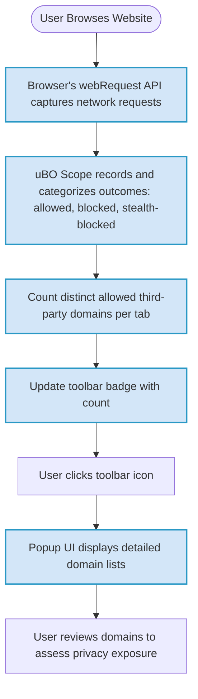

# Best Practices: Badge Counts and Myth Busting

## Understanding the Badge Count: More Than Just a Number

When you see a number displayed on the uBO Scope toolbar icon badge, what you're really seeing is the count of **distinct third-party remote servers contacted** by your browser on the current tab. This number is not about total requests, blocks, or hits—it reflects unique domains that your browser connected with while loading the webpage.

### Why Distinct Third-Party Servers Matter

- **Privacy Impact**: Each distinct third-party server contacted can represent a potential privacy exposure, as these servers may track or collect data.
- **Efficiency**: More third-party servers usually mean more external requests, which can slow down page load times and increase data usage.
- **Security**: Each connection is another surface for potential threats or vulnerabilities.

### Lower Count Is Better

A lower badge count generally indicates that fewer external domains are contacted, which is preferable for maintaining privacy and minimizing tracking. However, not all third-party connections are inherently bad—many websites legitimately rely on a few third-party services such as Content Delivery Networks (CDNs) or essential analytics providers. The badge count helps you identify how many distinct servers your browser talks to, providing a transparent view.

---

## Common Misconceptions and Pitfalls When Interpreting Badge Counts

### Myth 1: A High Block Count Means Better Protection

Some users assess content blockers by the number shown on their badges (higher block numbers imply superior blocking). This is misleading:

- The **uBO Scope badge does NOT show block count**, but the number of distinct third-party servers connected.
- A content blocker that blocks many requests but still allows connections to many distinct servers may result in a high badge count.
- Ultimately, **what matters is how many distinct third-party servers your browser connects to without being blocked**—not how many requests are blocked.

> **Practical Tip:** Use the badge count to monitor how many different servers load resources, rather than counting blocks. A well-configured blocker aims to minimize distinct third-party connections.

### Myth 2: "Ad Blocker Test" Websites Accurately Reflect Extension Effectiveness

Beware of fake or contrived "ad blocker test" pages:

- They simulate network requests that real websites usually never make.
- Extensions often behave stealthily, blocking content without alerting these test sites, resulting in skewed or false negatives.
- Test pages rarely reflect real-world browsing behaviors or network interactions.

> **Best Practice:** Trust real browsing experience and uBO Scope’s continuous monitoring over synthetic benchmarks.

### Myth 3: All Third-Party Connections Are Harmful

Not every third-party connection is malicious or intrusive:

- Legitimate services like CDNs, fonts, and essential analytics are common third parties.
- Some connections are necessary for website functionality and performance.

> **Insight:** Contextualize badge counts with the actual domains shown in the popup UI to distinguish harmless from suspicious domains.

---

## How to Interpret Your Badge Count Effectively

### Step 1: Understand What Counts Toward the Badge

- The badge shows the **number of distinct domains actively connected to on the loaded page**, considering only third-party servers.
- First-party servers (the website’s own domains) are excluded.
- Connections that were blocked or stealth-blocked are not counted in this badge.

### Step 2: Use the Popup UI for Details

- Click the toolbar icon to open the popup.
- Review the lists of allowed (connected), blocked, and stealth-blocked domains.
- Pay special attention to the **allowed third-party domains**, which the badge number represents.

### Step 3: Look for Unexpected or Unfamiliar Domains

- If the badge number is high, investigate encountered domains.
- Some may be benign CDNs, others might be trackers or less trustworthy servers.

<Tip>
Regularly review connected domains to ensure the badge count correlates with expected browsing behavior.
Exploring the detailed domain lists assists in spotting potential privacy risks.
</Tip>

### Step 4: Realize Context Matters

- Different pages naturally connect to different numbers of third parties.
- A news site or social network often contacts more third-party servers than a simple blog.
- Browser extensions, VPNs, or custom DNS setups can also affect these counts.

---

## Best Practices for Using the Badge Count

- **Interpret the badge as a privacy and network activity indicator, not a blocker performance metric.**
- **Consider a low badge count as a positive sign for privacy and minimal third-party exposure.**
- **When badge counts rise unexpectedly, open the popup and investigate what domains are involved.**
- **Combine badge monitoring with regular review of connection details to maintain your privacy baseline.**

<Tip>
To keep badge counts meaningful, disable or adjust other extensions or system settings that might interfere with accurate reporting.
</Tip>

---

## Troubleshooting Common Badge Count Confusion

<AccordionGroup title="Troubleshooting Badge Count Issues">

<Accordion title="Badge Count Remains Zero on Active Websites">
If your badge count is always zero:
- Confirm uBO Scope is installed and enabled.
- Ensure your browser version is supported.
- Verify that `webRequest` permissions are granted to the extension.
- Make sure you have browsed websites that make third-party connections; some simple sites may not.
- Restart your browser to reset session data.
</Accordion>

<Accordion title="Badge Displays Unexpectedly High Counts">
High counts can result from:
- Visiting complex sites with many integrations.
- Background tabs or browser processes contacting third parties.
- VPNs or proxies injecting extra network activity.
- Extensions or other software generating network requests.

Check the popup details and verify if the domains are expected.
</Accordion>

<Accordion title="Badge Count Changes Rapidly or Erratically">
Network activity may vary as pages load resources progressively:
- Wait a few seconds to allow the count to stabilize.
- If erratic behavior persists, try disabling other extensions to find conflicts.
- Clear browser cache and session data, then reload pages.
</Accordion>

</AccordionGroup>

---

## Summary

Reflect on the badge count as a window into your browser’s third-party network interactions, not as a block or permission score. Understanding this helps you make informed privacy decisions and avoid common pitfalls spawned by misinterpreting raw numbers. Use the popup UI for domain details to empower your privacy audit.

---

## Related Documentation

- [Navigating the uBO Scope Popup](https://docs.example.com/guides/group-getting-started/page-navigating-popup-ui) — Learn how to open and interpret domain connection details.
- [Understanding Connection Types and Outcomes](https://docs.example.com/guides/group-interpreting-results/page-understanding-connections) — Dive deeper into what allowed, blocked, and stealth-blocked mean.
- [Quick Validation: Is uBO Scope Working?](https://docs.example.com/getting-started/usage-validation-and-troubleshooting/quick-validation) — Verify proper installation and real-time monitoring.
- [System Architecture Overview](https://docs.example.com/overview/how-it-works-and-architecture/system-architecture-overview) — Understand how uBO Scope tracks network events.

---

## Next Steps

After mastering badge count interpretation:

- Regularly monitor badge counts during your daily browsing.
- Use the popup UI to audit third-party domain connections.
- Combine insights with filter list maintenance if you are a power user.
- Explore deeper privacy tools and documentation to refine your online security posture.

---

# Visual Overview: Badge Count Workflow

