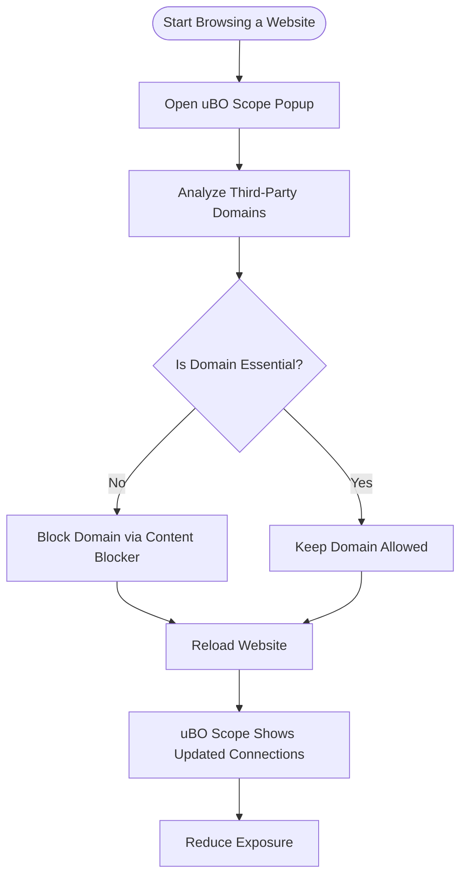

# Strategies for Minimizing Third-Party Connections

Discover practical workflows for reducing unwanted third-party network connections in your browser using the real-time insights provided by uBO Scope. This guide offers actionable strategies and examples to help you identify, analyze, and limit third-party domains, enhancing your browsing privacy and security.

---

## 1. Understanding Third-Party Connections with uBO Scope

Before diving into reduction strategies, it’s essential to grasp what uBO Scope reveals and why managing third-party connections matters.

- **Third-party connections** refer to network requests made to domains different from the website you are visiting.
- uBO Scope surfaces **all** such connections by categorizing them into three outcomes: **allowed** (successful connections), **blocked**, and **stealth-blocked** (redirected or hidden from the web page).
- The **toolbar badge** number shows the count of distinct third-party domains with allowed connections — a lower number indicates fewer external domains interacting with the site.

Managing these connections reduces exposure to trackers, reduces potential privacy risks, and often improves page load performance.

---

## 2. Prerequisites and Setup

Ensure you have the following before proceeding:

- uBO Scope installed and activated in your supported browser (Chromium 122+, Firefox 128+, Safari 18.5+).
- Familiarity with the uBO Scope toolbar badge and popup panel (see [Interpreting the Toolbar Badge & Popup Panel](guides/workflows/interpreting-badge-data)).
- Ability to identify domains in the popup and understand their categories (allowed, blocked, stealth-blocked).

---

## 3. Step-by-Step Strategies to Reduce Third-Party Connections

### Step 1: Monitor and Identify Third-Party Domains

1. Navigate to a website of interest.
2. Click the uBO Scope toolbar icon to open the popup panel.
3. Observe the number of third-party domains under the **not blocked** section — these are active third-party connections.
4. Review the listed domains carefully, noting any unfamiliar or suspicious domains.

#### Outcome
You gain a clear list of third-party domains your current browsing session interacts with.

### Step 2: Analyze Domain Necessity

1. For each third-party domain in the allowed list, research its purpose using a search engine or trusted privacy resources.
2. Determine if the connection is essential for site functionality (e.g., CDNs, analytics) or potentially unwanted (e.g., trackers, ad networks).

#### Tip
Focus on domains appearing frequently across sites or known tracking domains as prime candidates for blocking.

### Step 3: Use Complementary Content Blockers to Limit Connections

1. Using uBO Scope alongside a content blocker (such as uBlock Origin), create or enable filter rules targeting the identified unwanted third-party domains.
2. Revisit the website and monitor the uBO Scope popup to confirm reduction in allowed third-party connections.
3. Adjust filters progressively, testing site functionality to avoid breaking essential features.

#### Callout
uBO Scope does not block connections itself but verifies what your content blocker allows or blocks.

### Step 4: Apply Best Practices to Maintain Reduced Exposure

- Regularly revisit sites and check uBO Scope for any new or unexpected third-party domains.
- Use trusted filter lists tailored to privacy-focused blocking.
- Beware of stealth connections appearing as redirects indicated in the uBO Scope popup.

---

## 4. Real-World Example

Imagine visiting `example.com` shows these third-party domains:

- allowed: `cdn.examplecdn.com`, `analytics.trackme.com`, `ads.delivery.net`
- blocked: `tracker.badads.com`
- stealth-blocked: `redirect.sneakytracker.com`

**Workflow:**

- Confirm that `cdn.examplecdn.com` is essential for delivering site resources.
- Recognize `analytics.trackme.com` as an analytics service you wish to block.
- Identify `ads.delivery.net` as an ad service; decide based on preference.
- Update your content blocker's filters to block `analytics.trackme.com` and `ads.delivery.net`.
- Reload `example.com` and use uBO Scope to verify these domains move from allowed to blocked or stealth-blocked.
- Continue orderly refinement for other sites.

---

## 5. Troubleshooting Common Challenges

### Issue: Unexpected Third-Party Domains Persist

- **Cause:** Content blocker filters may be incomplete or too permissive.
- **Solution:** Enhance your filters or use blocking lists focused on privacy/tracking.
- **Check:** Use uBO Scope popup to confirm domain categories updated correctly.

### Issue: Site Breakage After Blocking

- **Cause:** Essential third-party services mistakenly blocked.
- **Solution:** Identify critical domains needed by the site and whitelist them temporarily.
- **Tip:** Block domains one at a time and test to isolate problem domains.

### Issue: Confusing Stealth-Blocked Domains

- **Cause:** Redirected connections that do not make it to the site.
- **Solution:** Monitor stealth-blocked section; these are often less risky but worthy of occasional review.

---

## 6. Best Practices & Tips

- Lower third-party domain counts usually improve privacy but balance with website usability.
- Focus first on domains not belonging to well-known CDNs (e.g., Cloudflare, Akamai).
- Collaborate with filter list communities for updated blocking rules.
- Use uBO Scope's real-time data to verify effectiveness after each filter change.

---

## 7. Next Steps & Further Reading

- Learn how to [Monitor Network Connections Per Tab](guides/workflows/monitor-network) to grasp detailed request data.
- Deepen your understanding of [Interpreting the Toolbar Badge & Popup Panel](guides/workflows/interpreting-badge-data).
- Explore [Using uBO Scope with Any Content Blocker](guides/insights-advanced/using-ubo-scope-with-content-blockers) for integration strategies.
- If new to uBO Scope, start with the [Getting Started Guide](guides/workflows/getting-started).

---

## 8. Visual Overview of Using uBO Scope to Minimize Third-Party Connections

This flowchart summarizes the process of using uBO Scope alongside your content blocker to iteratively identify and reduce third-party connections.

---

# End of Guide

For detailed instructions on installation, setup, and interpreting the UI, refer to related documentation in the [Getting Started](getting-started/basics-installation/install-on-your-browser) and [Guides](guides/workflows/getting-started) sections.

---