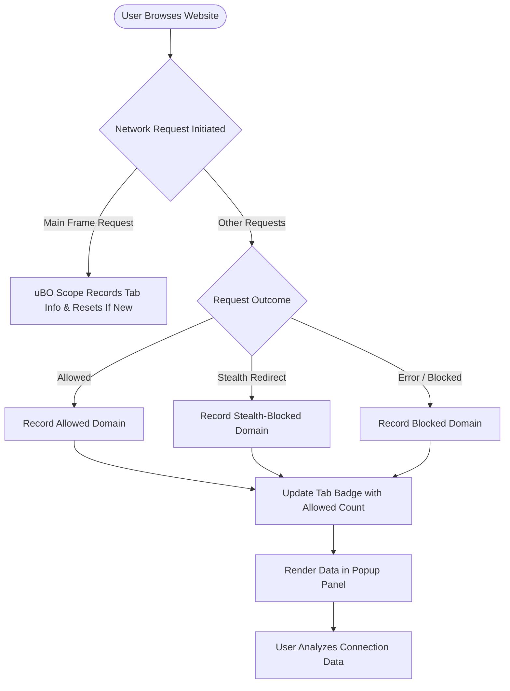

# Best Practices: Using uBO Scope for Privacy Analysis

## Overview
This guide empowers you to leverage uBO Scope effectively for everyday privacy and security assessments. You will learn how to distinguish legitimate third-party connections from potentially privacy-invasive ones, recognize stealth-blocked requests, and understand compatibility nuances with other blockers or DNS-based filtering. Whether you’re a privacy enthusiast, power user, or filter list maintainer, you’ll gain practical skills to make sense of connection data and optimize your browsing privacy.

---

## 1. Understanding the uBO Scope Popup Panel

### What You See
Upon clicking the uBO Scope icon, the popup displays:
- **Domain Header:** Shows the current tab's hostname and its base domain.
- **Summary Section:** Total number of distinct connected domains.
- **Outcome Sections:** Categorized lists of third-party domains segmented as:
  - **Not Blocked (Allowed):** Domains your browser connected to successfully.
  - **Stealth-Blocked:** Domains detected and blocked silently without page breakage.
  - **Blocked:** Domains explicitly blocked or failed to connect.

### Why It Matters
The badge on the extension icon indicates the count of distinct allowed third-party domains. Fewer allowed third parties usually means better privacy.

<Check>
Remember, not all third-party connections are harmful; some are necessary for content delivery (such as CDN providers).
</Check>

---

## 2. Preparing for Effective Privacy Analysis

### Prerequisites
- uBO Scope properly installed with required permissions granted.
- Active uBO or content blocker enabled for your browser to observe blocking effects.
- Familiarity with interpreting hostnames and domains.

### Setup Tip
Use the popup immediately after browsing a site with typical content to gather realistic connection data.

---

## 3. Step-by-Step Guide to Privacy Analysis with uBO Scope

### Step 1: Open the uBO Scope Popup
- Click the uBO Scope icon next to your browser's address bar.
- Observe the domain header reflecting the current tab’s hostname.

### Step 2: Review the Summary Count
- Check the total number of third-party domains connected.
- Lower counts generally signify fewer external connections.

### Step 3: Explore the Allowed Section
- This section lists domains successfully connected.
- **Action:** Look for familiar domains (e.g., major CDNs, essential APIs).

### Step 4: Investigate Stealth-Blocked Domains
- Stealth blocking means requests were intercepted silently by your content blocker.
- Typical for trackers or ad servers blocked without triggering page errors.
- **Action:** Confirm these domains align with known advertising or tracking services.

### Step 5: Examine Blocked Domains
- These failed connections were actively blocked or errored out.
- **Action:** Identify unwanted or suspicious domains you intended to block.

### Step 6: Cross-Check Domain Legitimacy
- Use public suffix knowledge (embedded within uBO Scope) to understand domain groupings.
- Be cautious of subdomains under large third-party domains.

### Step 7: Adjust Expectations with Other Filters
- Recognize that uBO Scope reports outcomes based on the browser's `webRequest` API.
- Content blockers using DNS filtering outside this API won’t necessarily reflect here.

<Warning>
If your DNS-based blocker runs outside the browser’s webRequest visibility, uBO Scope may not detect those blocks.
</Warning>

---

## 4. Practical Scenarios and Tips

### Scenario 1: A Common Website
You visit a popular news site.
- Expect several allowed connections for images, scripts, and CDNs.
- Stealth-blocked entries often feature trackers and ad networks.
- Blocked entries should correspond to known blocked trackers.

### Scenario 2: Assessing a Privacy-Focused Site
On sites that promote privacy:
- Allowed third parties should be minimal or known entities.
- Stealth-blocked and blocked domains should effectively cover known trackers.

### Tips for Success
- Always note the baseline “allowed” domains; some third parties are required for functionality.
- Use domain names as clues — e.g., internal analytic services vs. giant ad networks.
- Consistently monitor across multiple pages to detect persistent third-party connections.

---

## 5. Common Pitfalls and How to Avoid Them

### Pitfall: Misinterpreting Allowed Domains as Malicious
- Not all allowed third parties are harmful.
- Example: Content Delivery Networks (CDNs) and essential APIs.
- **Best Practice:** Research unknown domains using trusted domain lookup services before assuming risk.

### Pitfall: Expecting uBO Scope to Block Connections
- uBO Scope reports connection status but does not block traffic itself.
- Use in tandem with uBlock Origin or other blockers for effective filtering.

### Pitfall: Missing Stealth Blocking Insight
- Some blockers stealth-block to preserve site integrity.
- Ignoring stealth-blocked results can understate your actual blocking strength.

### Troubleshooting
- If no data appears, ensure permissions are granted and the extension is active.
- Reload the page and check for badge count changes to verify live monitoring.

---

## 6. Advanced Considerations

### Compatibility with Other Blockers
- uBO Scope detects connection attempts visible to the browser's webRequest API.
- It works well alongside extension-based blockers like uBlock Origin.
- DNS-based external filtering may not reflect directly in the popup.

### Using uBO Scope for Filter List Development
- Use real-world connection data from uBO Scope to validate your filter rules.
- Stealth-blocked domains provide insight into silent blocking effectiveness.
- Monitor multiple browsing sessions to identify patterns.

---

## 7. Summary Workflow Diagram

---

## 8. Next Steps & Related Resources

- Explore [Reading the Popup Panel: Interpreting Connection Data](../guides/getting-started-essentials/understanding-the-popup) to master the UI.
- Review [Understanding Outcomes: Allowed, Blocked, and Stealth](../guides/interpreting-advanced-insights/understanding-outcomes) for detailed outcome explanations.
- For filter list maintainers, consult [How Filter List Maintainers Use uBO Scope](../guides/interpreting-advanced-insights/use-case-filter-list-maintainers) for expert workflows.
- Check installation and troubleshooting guides if you encounter issues.

---

## Additional Tips

- Regularly update your blockers and filter lists alongside using uBO Scope for accurate privacy insights.
- When encountering unknown domains, use reputable domain lookup tools to confirm their legitimacy.
- Combine uBO Scope findings with browser developer tools for deeper network analysis when necessary.

---

<u>By following these best practices, you maximize the value of uBO Scope as a privacy analysis companion, gaining actionable insights into your browser’s real network behaviors.</u>
