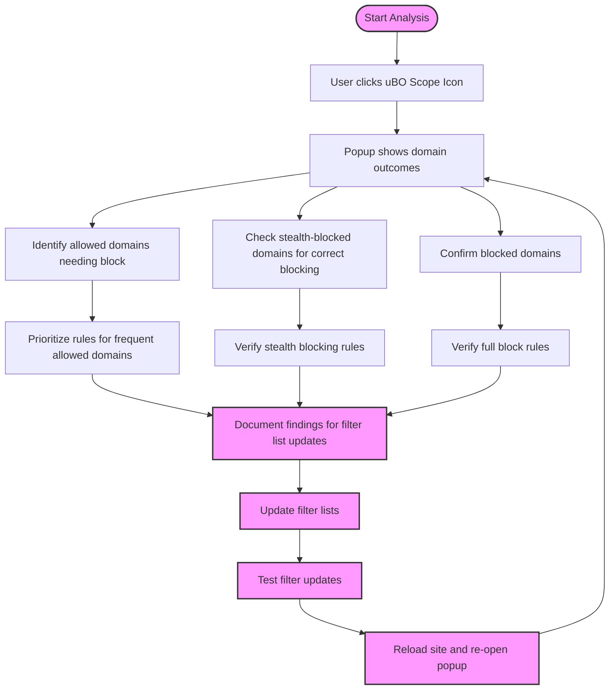

# How Filter List Maintainers Use uBO Scope

Discover practical, real-world methods for filter list maintainers to leverage uBO Scope in validating and refining filter lists—particularly on devices where browser developer tools are limited or unavailable. This guide breaks down step-by-step approaches to extracting critical network request insights and using them to optimize your filter rules effectively.

---

## 1. Understanding the Context

Filter list maintainers aim to create rules that block or stealthily handle unwanted network requests while minimizing false positives and maintaining website functionality. uBO Scope provides unparalleled visibility into all network connections (allowed, stealth-blocked, and fully blocked) initiated by the browser, regardless of which blocker or DNS-layer protection is active.

This capability is especially valuable on devices like mobile browsers or locked-down environments where traditional developer tools are not accessible.

---

## 2. Prerequisites

Before diving into the workflow, ensure the following:

- **uBO Scope is installed and active** on the intended browser (Chromium, Firefox, Safari) and properly captures network events.
- Basic familiarity with filter list concepts and the difference between "allowed," "blocked," and "stealth-blocked" outcomes as reported by uBO Scope.
- An understanding of domain and hostname hierarchies to interpret network requests by domain level.

---

## 3. Workflow Overview

### Goal
Extract actionable network connection data from uBO Scope’s popup interface to validate and fine-tune filter list rules.

### Time Estimate
15-30 minutes per session depending on site complexity.

### Difficulty Level
Intermediate - requires basic knowledge of privacy-oriented filter list tuning and domain analysis.

### Expected Outcome
You will be able to:

- Identify third-party domains that are allowed, blocked, or stealth-blocked.
- Determine if filter list rules are effectively blocking connections as intended.
- Collect domain-level metrics needed to refine or troubleshoot filter rules.

---

## 4. Step-by-Step Instructions

<Steps>
<Step title="Open uBO Scope's Popup Panel">
Click the uBO Scope toolbar icon while on the webpage you want to analyze. The popup panel displays a summary of network connections for the active tab.
</Step>
<Step title="Interpret Outcome Categories">
Inspect the three distinct sections:

- **Not Blocked:** Domains for which network requests were allowed.
- **Stealth-Blocked:** Domains where requests were stealthily blocked (request made but blocked invisibly).
- **Blocked:** Domains whose requests were fully blocked.

Each section lists domains with counts indicating how many requests were observed.
</Step>
<Step title="Identify Domains of Interest">
Focus on:

- Allowed domains that should have been blocked (possible gaps in filter rules).
- Stealth-blocked domains to validate that stealth blocking works as intended.
- Blocked domains for confirmation and spotting any unexpected allowed connections.

Note domains with unusually high request counts, as these are often important to scrutinize.
</Step>
<Step title="Use Domain Counts to Prioritize Refinement">
High-frequency domains typically have the biggest impact on user privacy and webpage behavior.

Prioritize adding or adjusting filter rules for these domains to improve blocking coverage.

Lower-frequency domains can be tested and added incrementally.
</Step>
<Step title="Check for Domain Grouping Logic">
Domains may be grouped by their public suffix or domain heuristics (e.g., example.com vs ad.example.com).

Use uBO Scope’s tab domain and hostname readout in the popup's header to understand the site's context.
</Step>
<Step title="Document Findings for Filters Updates">
Record domain names and request counts from each outcome category, noting any unexpected allowed connections or stealth blocking behavior to guide future filter list changes.
</Step>
</Steps>

---

## 5. Practical Examples

### Scenario: Auditing a News Website

1. Navigate to the news website (e.g., example-news.com).
2. Open the uBO Scope popup and observe the 'allowed' domains.
3. Spot a third-party analytics domain in the 'allowed' list with multiple requests.
4. Confirm that this domain is not listed in the filter rules.
5. Plan to add a filter rule targeting this domain to improve privacy.

### Scenario: Verifying Stealth-Blocking on Social Media

1. While on socialmedia.example, open the uBO Scope popup.
2. Note a domain in the stealth-blocked section frequently requested (e.g., trackers.socialmedia.net).
3. Compare this behavior with your filter list rules to ensure consistent stealth blocking.
4. If the domain is unexpectedly in 'allowed', investigate filter rule limitations.

---

## 6. Tips and Best Practices

- **Favor domains over raw hostnames** for filter rules to cover broader subdomains.
- **Regularly refresh the popup** to capture changes after filter list updates or page reloads.
- **Combine insights with other privacy tools** to cross-validate block effectiveness.
- **Use the badge count as a quick privacy metric, but do not rely solely on it**—inspect the popup data.
- Test filter improvements progressively to avoid breaking site functionality.

---

## 7. Common Pitfalls and Troubleshooting

<AccordionGroup title="Common Issues and Fixes">
<Accordion title="Unexpectedly Allowed Third-Party Domains">
This often indicates missing or improperly scoped filter rules. Verify your filter syntax and scope domains carefully; consider adding wildcard or domain-wide rules.
</Accordion>
<Accordion title="Empty or Incomplete Popup Data">
Refresh the page and popup. Ensure uBO Scope has the necessary permissions and is actively monitoring.
Check for browser compatibility (minimum version requirements).
</Accordion>
<Accordion title="Stealth-Blocked Domains Not Showing as Expected">
Confirm that your content blocker supports stealth mode blocking.
Ensure the extension is monitoring network requests correctly and the browser exposes needed APIs.
</Accordion>
</AccordionGroup>

---

## 8. Next Steps & Related Content

- After identifying domains to refine, update your filter lists accordingly and re-validate with uBO Scope.
- Review the guide [What Do 'Allowed', 'Blocked', and 'Stealth' Mean?](https://example.com/guides/interpreting-advanced-insights/understanding-outcomes) for deeper understanding of outcome categories.
- Consult [Reading the Popup Panel: Interpreting Connection Data](https://example.com/guides/getting-started-essentials/understanding-the-popup) to master popup interface usage.
- Explore the [Typical Use Cases](https://example.com/overview/getting-started-with-uboscope/key-use-cases) to see broader scenarios.

For collaborative filter list maintenance, share uBO Scope screenshots or exported data with your team.

---

<Note>
Filter list maintainers gain decisive advantage by using uBO Scope for real-world, per site connection analytics, enabling precise, evidence-based refinement of blocking rules even on devices lacking advanced browser tools.
</Note>

---

## 9. Source Code Reference

- Background script captures network requests, categorizes by tab and outcome (allowed, stealth, blocked). See `js/background.js`.
- Popup UI renders domain lists with counts per outcome category, accessible from the toolbar icon. See `js/popup.js`.

Explore the [GitHub repository](https://github.com/gorhill/uBO-Scope) for full source and issue tracking.

---

## 10. Diagram: Filter List Maintainer Workflow Using uBO Scope

---
