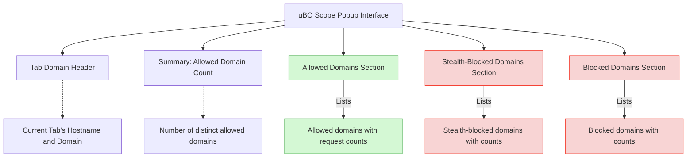

# Reading Allowed, Blocked, and Stealth Domains

uBO Scope reveals every network connection your browser makes on the active tab, categorizing these connections into three distinct groups: **allowed**, **blocked**, and **stealth-blocked**. This guide explains what each category means, how to recognize them in the popup interface, and what their presence implies for your privacy and resource loading.

---

## Understanding the Domain Categories

When you open the uBO Scope popup for a browser tab, the network connections established or attempted by that tab are grouped into three sections:

### 1. Allowed Domains

- **What it means:** These are domains your browser successfully connected to without any blockage.
- **Privacy implication:** These connections represent active data exchanges and resource loading from these servers.
- **Resource impact:** Allowed domains supply content such as images, scripts, or other assets necessary for the webpage or embedded services.

### 2. Blocked Domains

- **What it means:** These are domains where connection attempts were explicitly blocked by your content blocker or browser settings.
- **Privacy implication:** Blocking these reduces exposure to third-party trackers, ads, or potentially unwanted connections.
- **Resource impact:** Content from these domains does not load, potentially improving page load time and reducing data usage.

### 3. Stealth-Blocked Domains

- **What it means:** Domains where connections were blocked silently or via indirect methods, often to prevent detection by the webpage.
- **Privacy implication:** These stealth blocks improve privacy by hiding blocking actions from the page’s scripts and anti-ad-block defenses.
- **Resource impact:** Similar to blocked connections, stealth-blocked domains do not supply resources.

<Tip>
The distinction between "blocked" and "stealth-blocked" helps you understand how your extension interacts with webpages to balance functionality and privacy.
</Tip>

---

## How Domains Appear in the uBO Scope Popup

When you activate the popup on a browser tab, you’ll see three clear sections labeled:

- **not blocked** (Allowed)
- **blocked**
- **stealth-blocked**

Each section lists domains with a count badge indicating the number of requests made to that domain during the tab’s lifetime.

### User Flow for Interpreting Domain Status

1. **Open the uBO Scope popup** on the active tab.
2. **Look at the hostname header** at the top displaying the active tab's domain.
3. **Review the summary count** showing the number of distinct allowed domains.
4. **Scroll through each section:**
   - Confirm which third-party domains are loaded (allowed).
   - See which were blocked outright.
   - Identify stealth-blocked domains for deeper privacy insights.

### Visual Highlights

- Allowed domains have a green hue for quick identification.
- Blocked and stealth-blocked domains share a red background color, reinforcing their restrictive status.
- Empty sections are hidden automatically for a cleaner view.

---

## Practical Scenarios and Interpretation

Consider you are visiting a news website:

- The **allowed** list might include legitimate third-party CDNs or ad networks not blocked.
- The **blocked** list may show surveillance or advertising servers that your content blocker stopped.
- The **stealth-blocked** might include trackers that were silently prevented to avoid site breakage or detection.

By understanding these: you can assess which third parties are actively engaging with your browser and which are being filtered, giving you granular control and awareness of your privacy exposure.

---

## Step-by-Step: Reading the Popup

<Steps>
<Step title="Open uBO Scope Popup">
Click the uBO Scope icon next to your browser’s address bar to reveal the popup interface displaying network connections related to the current tab.
</Step>
<Step title="Identify the Tab Domain Header">
At the top, observe the tab’s fully qualified domain name, indicating which site’s connections are being reported.
</Step>
<Step title="Check the Summary Count">
Look at the "domains connected:" count showing how many distinct allowed domains your browser successfully connected to.
</Step>
<Step title="Review Allowed Domains Section">
This section lists domains that loaded content successfully. Use the count badges to see how many requests each domain received.
</Step>
<Step title="Review Stealth-Blocked Domains Section">
Explore which connections were blocked silently without the page’s awareness—important for privacy but might cause subtle site behavior changes.
</Step>
<Step title="Review Blocked Domains Section">
See which domains were explicitly blocked. If this section is empty, no direct blocks occurred.
</Step>
</Steps>

<Note>
Domains in each section are sorted to make browsing easier. You can use this information to troubleshoot content loading issues or confirm your blocker’s effectiveness.
</Note>

---

## Troubleshooting and Best Practices

### Common Issues

- **Empty or No Data Shown for Active Tab:** 
  - Make sure the active tab is fully loaded.
  - Some browser or privacy settings can limit webRequest API visibility, impacting data.

- **Domains Appear in Allowed but You Believe They Should Be Blocked:** 
  - Check your content blocker’s filter lists and settings.
  - Some resources may bypass blocking if coming from the main frame or whitelisted.

- **Popups show only two sections:** 
  - If stealth-blocked or blocked sections are empty, those sections are omitted automatically.

### Best Practices

- Use the popup regularly to familiarize yourself with the domains commonly contacted by frequently visited sites.
- Combine insights from allowed and blocked domains to adjust filter lists or privacy settings if needed.
- Understand that lower counts in the allowed section typically mean better privacy.

---

## Summary

The "Reading Allowed, Blocked, and Stealth Domains" page empowers you to decode uBO Scope’s popup interface, revealing the real-time network interactions your browser performs. By understanding these categories, you gain control and transparency into your browsing privacy.

Use this knowledge to validate your content blocker’s performance and make informed adjustments to your privacy tools.

---

## Additional Resources

- [Core Concepts & Terminology](https://your-docs-link/overview/core-concepts-architecture/core-concepts-glossary) – Deep dive into key definitions.
- [Making Sense of Toolbar Badge Counts](https://your-docs-link/guides/interpreting-data/badge-counts-meaning) – Understand the importance of the badge count.
- [Running Your First Network Connection Analysis](https://your-docs-link/guides/getting-started/first-analysis) – Start analyzing traffic confidently.
- [Troubleshooting Common Setup Issues](https://your-docs-link/getting-started/first-run-validation/common-issues-solutions) – Resolve typical problems.

---

## How It Fits in Your Workflow

Consider this page as your primary reference for interpreting the popup data while using uBO Scope. After installation and first launch, your natural next step is to drill into what the data means, and this guide offers the foundation. Once comfortable, explore badge counts and deeper network analysis for advanced insights.

---

## Appendix: Visual Structure of the Popup Interface

This diagram summarizes how the popup visually separates and presents domain status information.

---

# Callouts

<Tip>
If you notice unexpected domains consistently allowed, consider updating your filter lists or tightening extension settings for enhanced privacy.
</Tip>

<Warning>
Stealth-blocked domains indicate sophisticated blocking methods; if a site breaks, try temporarily allowing these domains to identify problematic blocks.
</Warning>

<Check>
To confirm a domain is truly blocked, cross-reference with your content blocker settings and test by temporarily disabling the blocker.
</Check>
