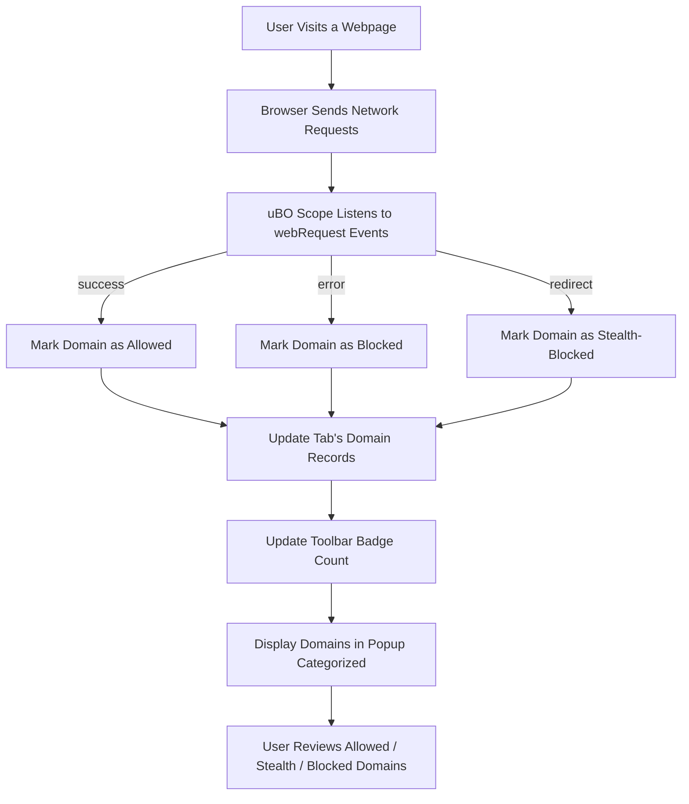

# Understanding Allowed, Stealth, and Blocked Domains in uBO Scope

## Introduction

This guide helps you clearly understand how uBO Scope categorizes remote server domains involved in your browser's network activity. You will learn what it means when domains are reported as **allowed**, **stealth-blocked**, or **blocked**, why a domain's presence is not inherently bad, and how outcomes are tracked regardless of other content blockers in place.

Understanding these distinctions is essential for interpreting the data uBO Scope reports in its popup panel and toolbar badge accurately and effectively.

---

## 1. Purpose of This Guide

- **Clarify Domain Statuses**: What does allowed, stealth-blocked, and blocked mean?
- **Explain Reporting Logic**: How does uBO Scope detect and categorize domains?
- **Contextualize Third-Party Connections**: Why aren't all third-party domains bad?
- **Guide Interpretation**: Help you make informed decisions about the connections shown.

---

## 2. Overview of Domain Categories

uBO Scope classifies remote server domains connected by your browser under three distinct categories, each reflecting the observed outcome of network requests:

### Allowed Domains

- These are **domains from which your browser successfully fetched resources**.
- Represent *allowed network requests* that completed without error or blocking.
- Often include essential content delivery networks (CDNs) and legitimate third parties.

### Stealth-Blocked Domains

- Domains involved in **redirects or indirect attempts to connect to remote servers that are blocked stealthily by content blockers or browser mechanisms**.
- These requests may never fully resolve or become visible to web content but are intercepted silently.
- Useful to detect networks indirectly affected by filters, even if not explicitly reported as blocked.

### Blocked Domains

- Domains from which **network requests failed due to errors or were actively blocked**.
- Includes requests that generated errors such as requests cut off by the content blocker or browser due to rules.
- Reporting these helps you understand what third parties your content blocker or network policies are actively preventing.

---

## 3. How uBO Scope Tracks and Categorizes Domains

### 3.1 Network Request Event Monitoring

uBO Scope uses the browser’s `webRequest` API to monitor all network requests made by active tabs. It listens for the following significant events:

- **onBeforeRedirect**: To detect redirects that may lead to stealth blocking.
- **onErrorOccurred**: To track failed or blocked connections.
- **onResponseStarted**: To register successful network responses.

### 3.2 Domain Extraction

For each network request, uBO Scope:

- Extracts the hostname from the URL.
- Uses the Public Suffix List and Punycodes to determine the base domain.

This ensures consistent identification and grouping of domains regardless of subdomains or internationalized domain names.

### 3.3 Categorization Logic

- Requests with `success` events are counted as **allowed**.
- Requests resulting in `error` events are marked as **blocked**.
- Requests involved in `redirect` events, especially those that do not result in a direct network connection, are counted as **stealth-blocked**.

Connections are tracked per tab to allow focused analysis for each browser tab.

---

## 4. Why Not All Third-Party Domains Are Desirable or Undesirable

### Legitimate Third-Parties Are Normal

- Many websites rely on third-party services such as CDNs, analytics providers, or payment processors.
- uBO Scope helps you see how many distinct third-party domains a page interacts with, but a *higher count does not necessarily mean a privacy or security issue*.

### Value of Transparency

- By showing all allowed and blocked domains, users gain visibility into their browser’s network footprint.
- Helps you **distinguish between innocuous third parties and potentially unwanted connections** by inspecting domain names and their categories.

### Avoid Mistaking Counts for Quality

- A low block count could mean the content blocker is allowing many connections (possibly undesirable).
- The **badge number only counts distinct allowed third-party domains**, encouraging users to minimize rather than maximize this count.

---

## 5. Interpreting the uBO Scope Popup and Toolbar Badge

- The **toolbar badge** shows the number of distinct allowed third-party domains for the active tab.
- The **popup panel** organizes network connection domains into three sections:
  - **Not Blocked** — successful connections
  - **Stealth Blocked** — stealth blocking via redirects
  - **Blocked** — explicit blocking or errors

### Example Scenario

A news website might:

- Load its main content from its own domain (allowed).
- Fetch images and scripts from various CDN domains (allowed).
- Attempt connections blocked by an aggressive content filter to tracking domains (blocked).
- Redirect some requests to stealth-blocked domains (stealth).

The popup clearly displays these groups, giving you insight into actual network activity.

---

## 6. Common Pitfalls and Misconceptions

- **Do not assume all blocked domains are malicious.** Some blocks are necessary for privacy; others may disrupt site functions.

- **Stealth-blocked domains may not appear in typical content blocker UIs,** but uBO Scope captures these to provide comprehensive insight.

- **The badge count is a metric of distinct allowed domains, not blocked domains.** Expect this number to change as you browse different sites.

- **Domain grouping depends on the Public Suffix List.** Rare domain structures may affect grouping but are handled by an up-to-date list.

---

## 7. Tips for Using This Information Effectively

- Use the popup panel frequently to identify unexpected or questionable third-party domains.

- Combine uBO Scope findings with your content blocker’s logs to understand block reasons.

- Remember a **lower allowed domain count typically means fewer active third parties**, implying stronger network privacy.

- Check stealth-blocked domains if you suspect indirect connections or concealed trackers.

---

## 8. Summary

| Category         | Description                                          | What It Means                                   |
|------------------|------------------------------------------------------|------------------------------------------------|
| Allowed          | Domains from which requests succeeded                | Active third parties with network connections  |
| Stealth-Blocked  | Domains blocked via redirects or silent filtering    | Indirectly blocked connections                  |
| Blocked          | Domains with failed or explicitly blocked requests   | Connections blocked by content filters or errors|

---

## 9. Further Learning & Related Documentation

- [How It Works (System Overview)](/overview/core-concepts-and-architecture/how-it-works-overview) — Understand the complete request tracking flow.
- [Your First Network Connection Analysis](/guides/getting-started-essentials/first-analysis) — Practical usage of the popup UI.
- [Validating uBO Scope Operation](/getting-started/setup-validation-and-troubleshooting/validating-ubo-scope-operation) — Confirm your extension works correctly.
- [Troubleshooting Common Issues](/getting-started/setup-validation-and-troubleshooting/troubleshooting-common-issues) — Fix display or data problems.

---

<u>By mastering the concepts of allowed, stealth, and blocked domains, you harness the power of uBO Scope to gain unmatched visibility into your browser’s network activity and the true effectiveness of your content blockers.</u>

<br><br>

---

## Appendix: Example Logic Snippet (Conceptual)

For users interested in the basic logic used internally by uBO Scope for categorization, here is a simplified conceptual explanation (not actual code):

```javascript
function classifyRequestEvent(event, url) {
  if (event === 'success') {
    return 'allowed';
  } else if (event === 'error') {
    return 'blocked';
  } else if (event === 'redirect') {
    return 'stealth-blocked';
  } else {
    return 'unknown';
  }
}
```

This logic is applied on each request and its outcome, grouped by domain and tab context.

---

## Illustrative User Flow



---