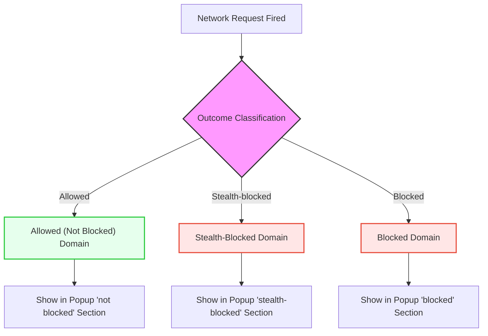

# Decoding Connection Outcomes

A practical guide to understanding how uBO Scope categorizes network requests and what each category means. This document helps you interpret the extension's interface and distinguish legitimate from suspicious third-party domains.

---

## 1. Why Understanding Connection Outcomes Matters

When browsing the web, your browser makes numerous network requests to various servers. uBO Scope shines a light on all these connections by categorizing them as **allowed**, **stealth-blocked**, or **blocked**. Decoding these outcomes enables you to:

- Assess your true third-party exposure per website.
- Identify potentially unwanted or suspicious domains.
- Verify that your content blocking measures are effective and stealthy.

This understanding directly supports your goal of improving privacy and knowing which external servers your browser interacts with.

---

## 2. uBO Scope Outcomes Explained

uBO Scope labels domains into three distinct categories, each with a clear meaning and implication:

### 2.1 Allowed ("not blocked")

These are third-party domains your browser successfully connected to, meaning the network request was completed without interference by content blockers or network filters.

- Listed under the "not blocked" section in the popup.
- The count here reflects distinct domains contacted.
- Higher counts may indicate more third-party exposure.

**What it means:** These domains are actively serving content to the page; some may be legitimate resources like CDNs, but others could be ads, tracking, or unwanted third-party content.

### 2.2 Stealth-blocked

Network requests attempted but were silently blocked to avoid detection by the webpage.

- Shown under the "stealth-blocked" heading.
- These connections are hidden from the page deliberately by the content blocker.

**What it means:** The extension or content blocker prevented these connections quietly to reduce page breakage and evade detection by anti-adblock techniques. It indicates strong, careful blocking.

### 2.3 Blocked

These are explicit blocked connection attempts where the browser or extension reported the block via a network error.

- Appears under the "blocked" category.
- Represents network failures due to blocking rules.

**What it means:** These connections were prevented and are visible to the webpage as failed requests. This can risk page breakage or detection by scripts on the page.

---

## 3. How to Interpret uBO Scope's Interface

### Popup Header

The header shows the current page's hostname and domain, helping you to quickly identify the active tab’s site.

### Summary Section

Displays the **total unique domains contacted** (allowed only), directly reflecting your exposure for the tab.

### Domain Lists Per Category

Each outcome section contains a list of domains with counts indicating how many requests were made to that domain within the active tab:

- Allowed domains show the sources that successfully delivered resources.
- Stealth-blocked domains represent those silently stopped.
- Blocked domains are those explicitly failed with errors.

Domain rows use color-coded badges: green for allowed, red for stealth or blocked — providing instant visual cues.

### Empty Outcome Sections

If no domains fall under stealth or blocked, those sections are hidden to keep the interface clean.

---

## 4. Practical User Workflow for Decoding Connection Outcomes

<Steps>
<Step title="Open the uBO Scope popup for your active tab">
Click the uBO Scope toolbar icon to view current network connection data for your tab.
</Step>
<Step title="Read the Summary count">
Note the 'domains connected' number reflecting allowed third-party domains contacted.
</Step>
<Step title="Inspect the Allowed Domains">
Review the "not blocked" list to see which third-party domains delivered content. Verify if these are expected domains like CDN providers or common services.
</Step>
<Step title="Check Stealth-blocked Domains">
Look for domains in the "stealth-blocked" section. Recognize these as blocked quietly without page disruption, indicating good stealthy blocking.
</Step>
<Step title="Examine Blocked Domains">
If present, blocked domains are connections explicitly prevented but detectable as failed by the page. Use caution, as excessive blocked domains can cause site breakdown.
</Step>
<Step title="Identify suspicious or unknown domains">
Research unfamiliar or suspicious domains appearing in allowed or stealth lists to assess privacy risks.
</Step>
</Steps>

---

## 5. Tips to Distinguish Legitimate From Suspicious Domains

- **Legitimate domains** tend to be known CDN providers (e.g., `cloudflare.com`, `akamai.net`), major analytics like `google-analytics.com`, popular services, or well-known embedded players.
- **Suspicious domains** may have unusual, obscure, or random-looking names, or be from countries or registrars known for spam or tracking.
- Use online tools for domain reputation checking.
- Consider the nature of the site (e.g., legitimate shopping site vs questionable ad-filled sites).

---

## 6. Common Pitfalls and How to Avoid Them

| Issue                                  | Solution/Advice                                     |
|--------------------------------------|---------------------------------------------------|
| Confusing stealth-blocked with allowed| Remember stealth-blocked means blocked but hidden; they do not count as successfully connected.
| Empty blocked list does not mean no blocking| Stealth blocking may be active and silent.
| Overinterpreting badge counts as "more blocking" | The badge reflects distinct allowed domains; a lower count is better privacy, not block count.
| Ignoring frame and redirect nuances  | uBO Scope tracks main frame and subrequests, but redirects may be stealth blocked silently.

<Note>
For a deeper understanding of these nuances, consult the 'Key Terms and Concepts' page which elaborates on technical definitions.
</Note>

---

## 7. Troubleshooting Common Issues With Connection Outcomes

- **No data shown or "NO DATA" header:** The extension might not have permission to monitor requests on the current tab. Verify permissions and ensure the site URL matches host permission patterns.
- **Summary count stuck at zero:** Reload the tab to refresh network request capture.
- **Mismatch between badge count and popup data:** Badge counts only allowed domains; popup shows all categories. Ensure extension is enabled and up to date.
- **Domains showing only in blocked but resources still appear:** Some connections may be retried or loaded from cache; observe behavior over time.

---

## 8. Summary Diagram of Connection Outcome Flow

---

## 9. Next Steps & Related Documentation

- Explore **[Understanding the uBO Scope Popup](/guides/getting-started-essentials/understanding-the-popup)** to enhance your UI interpretation skills.
- Read **[Using the Toolbar Badge Count Effectively](/guides/getting-started-essentials/using-the-badge-count)** for practical advice on badge count meanings.
- For troubleshooting and ensuring correct operation, consult **[Troubleshooting and Validation](/getting-started/getting-your-first-results/troubleshooting-and-validation)**.
- If you want to deepen your understanding of the terminology, visit **[Key Terms and Concepts](/overview/how-it-works-architecture/key-terms-and-concepts)**.

<Tip>
Decoding connection outcomes empowers you to make informed privacy decisions and understand what truly happens behind the scenes when you visit websites.
</Tip>

---

## 10. Additional Resources

- uBO Scope GitHub repository: [https://github.com/gorhill/uBO-Scope](https://github.com/gorhill/uBO-Scope)
- Public Suffix List explanation: [http://publicsuffix.org/](http://publicsuffix.org/)

