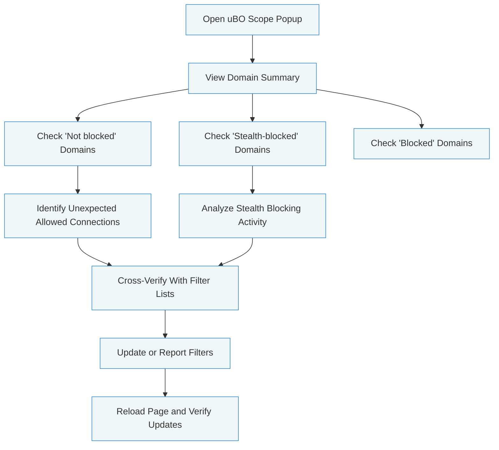

# Diagnosing Unexpected or Stealth Connections

## Workflow Overview

Understanding why certain third-party connections appear despite active content blocking is essential for maintaining privacy and filter list effectiveness. This guide shows you how to leverage uBO Scope to investigate such cases systematically by revealing stealth activity and validating block success. It is especially useful for filter list maintainers and privacy enthusiasts who need clear visibility into hidden or unexpected network requests.

### Prerequisites
- uBO Scope extension installed and properly configured on a supported browser (Chromium 122+, Firefox 128+, or Safari 18.5+).
- Basic familiarity with opening and interpreting the uBO Scope popup interface.
- Active content blocker running alongside uBO Scope (e.g., uBlock Origin).

### Expected Outcome
By following this guide, you will be able to:
- Identify stealth or unexpected third-party connections that bypass your content blocker.
- Understand the classification of network requests as allowed, stealth-blocked, or blocked.
- Use uBO Scope's detailed reporting to validate the effectiveness of your content blocking filters.
- Apply insights to improve filter lists or adjust browser privacy settings.

### Time Estimate
Approximately 15–30 minutes depending on familiarity with uBO Scope and complexity of the investigation.

### Difficulty Level
Intermediate — requires some experience with browser extensions and content blocking concepts.

---

## Step-by-Step Instructions

### 1. Open the uBO Scope Popup
- Navigate to the webpage where you suspect unexpected third-party connections are being made.
- Click the uBO Scope extension icon in your browser toolbar to open the popup window.

### 2. Review the Domain Connections Summary
- At the top of the popup, observe the domain name of the current tab.
- Check the **domains connected** count; this reflects the number of distinct third-party domains contacted.

### 3. Examine the Connection Categories
- The popup groups third-party connections into three categories:
  - **Not blocked:** Domains from which connections were allowed.
  - **Stealth-blocked:** Domains for which requests were blocked stealthily.
  - **Blocked:** Domains explicitly blocked with error outcomes.

These categories help differentiate between requests that succeeded, those blocked stealthily by the content blocker, and those that resulted in errors or explicit blocking.

### 4. Identify Unexpected or Stealth Connections
- Look for domains listed under **Not blocked** where you expected blocking.
- Confirm domains under **Stealth-blocked** to understand requests that were hidden from the webpage or appeared blocked without obvious errors.

### 5. Analyze Specific Domains
- For any suspicious domain:
  - Visit the website or use a domain lookup tool to get context about the service.
  - Cross-check filter lists and rules you use to verify if domains have corresponding blocking rules.
  - Consider whether stealth blocking is expected or indicative of missing or ineffective rules.

### 6. Validate Filter List Effectiveness
- Use uBO Scope to compare connections before and after applying or updating filter lists.
- Repeat inspection steps to confirm that known unwanted domains move from the **Not blocked** to **Stealth-blocked** or **Blocked** sections.

### 7. Use Outcomes to Adjust Filters
- Share findings with filter list maintainers or update your custom filters to target any missed connections.
- Revisit the webpage to verify the changes successfully block previously unexpected connections.

### Verification Steps
- The popup updates dynamically; you should see changes reflected when refreshing or reopening the domain summary.
- The toolbar badge count adjusting downward after filter updates indicates successful blocking.

---

## Practical Example

Imagine visiting a news website protected by uBlock Origin where you expect third-party tracking domains to be blocked.

- Upon opening uBO Scope, you see some tracking domains in the **Not blocked** section unexpectedly.
- Check the **Stealth-blocked** section; some similar domains appear, indicating stealth blocking.
- Investigate filter lists to confirm if these domains are covered.
- Update your filters or report missing entries to maintainers.
- Refresh the site and recheck uBO Scope popup: tracking domains now appear in **Blocked** or **Stealth-blocked**, and badge count decreases.

This flow confirms effective content blocking and reveals stealth activity that might otherwise go unnoticed.

---

## Troubleshooting & Tips

<AccordionGroup title="Common Issues and Solutions">
  <Accordion title="Unexpected Domains Still Appearing as 'Not Blocked'">
  Verify that your content blocker is active and synchronized with uBO Scope. Some extensions may require reloading the page or updating filter lists to take effect. Also, check if the domain is whitelisted in your blocker or inherited from the main site.
  </Accordion>

  <Accordion title="Stealth Blocking Confusion">
  Stealth blocking hides the blocking action from the webpage to avoid detection or breakage. It may appear that a connection is allowed, but uBO Scope shows it as stealth-blocked. Understand this is an advanced feature of content blockers to increase privacy without alerting scripts.
  </Accordion>

  <Accordion title="Badge Count Does Not Update"
  >
  The badge count updates when the extension processes recorded requests, typically within a second. If it does not update, try refreshing the tab or reopening the popup. Review the 'Troubleshooting Common Setup Issues' guide for permission or compatibility problems.
  </Accordion>
</AccordionGroup>

<Tip>
Always cross-reference domains you see logged in uBO Scope with reputable domain lookup or threat intelligence services to understand their nature before taking blocking actions.
</Tip>

<Note>
Stealth-blocked connections are an essential signal for filter list maintainers as they help identify requests intercepted quietly by content blockers, improving your blocking strategies.
</Note>

---

## Next Steps & Related Content

- After diagnosing connections with this guide, proceed to [Understanding Domain Connections and Badge Counts](/guides/interpreting-results/understanding-domain-connections) to deepen your insight into connection outcomes.
- Explore the [Comparing Content Blockers with uBO-Scope](/guides/interpreting-results/comparing-content-blockers) guide to benchmark multiple content blockers.
- For setup-related issues, consult [Troubleshooting Common Setup Issues](/getting-started/essential-setup-guide/troubleshooting-common-issues).
- If new to uBO Scope, review [First Use: Exploring the Popup](/guides/getting-started/first-use-and-ui-tour) for interface familiarity.

---

## Summary Diagram

---

By diagnosing unexpected or stealth connections effectively, you ensure your content blocking setup provides true privacy and control, empowering you to spot and eliminate hidden network activity transparently.
