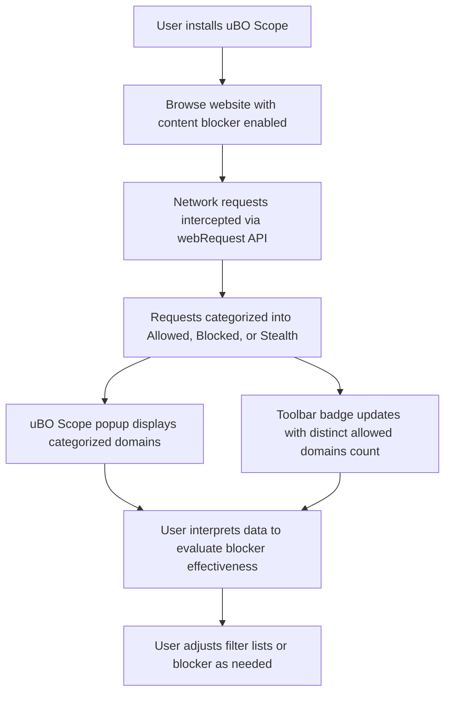

# Using uBO Scope to Evaluate Content Blockers

## Overview

This guide provides a practical walkthrough for filter list maintainers and privacy enthusiasts who want to use uBO Scope to test and compare the real effectiveness of content blockers. You will learn how to leverage uBO Scope's domain categorization, badge, and detailed popup display to surface real-world network outcomes, including stealthy blocking methods and DNS-based protections.

You will gain confidence in correctly interpreting the observed data and avoid common pitfalls in assessing content blocker efficacy.

---

## 1. Workflow Overview

### What This Guide Helps You Accomplish

- Evaluate the real effect of content blockers on network connections.
- Detect stealth-blocking and DNS-blocking behavior that traditional methods do not reveal.
- Compare blockers beyond block counts, focusing on distinct third-party domains allowed.
- Use uBO Scope's UI to derive actionable, accurate insights about your current content blocker setup.

### Prerequisites

Before you begin, ensure:

- You have uBO Scope installed on one of the supported browsers (Chromium, Firefox, or Safari).
- You have a content blocker enabled in your browser to evaluate.
- Basic familiarity with browser extensions, popups, and installing extensions.
- Understanding of domain concepts and third-party tracking basics is helpful but not required.

### Expected Outcome

By following this guide, you will be able to:

- Open uBO Scope on any active tab to see categorized domain connections.
- Understand actionable meaning behind allowed, stealth-blocked, and blocked domain lists.
- Use the toolbar badge numerically as a reliable indicator of third-party distinct connections.
- Interpret the UI to make informed decisions about your content blocking configuration.

### Time Estimate

Approximate time: 10-15 minutes to complete initial evaluation and comparison on a site or set of sites.

### Difficulty Level

Intermediate — some prior knowledge of browser networking helps but clear instructions guide you step-by-step.

---

## 2. Step-by-Step Instructions

### Step 1: Install and Launch uBO Scope

1. Install uBO Scope from your browser's official extension store:
   - [Chrome Web Store](https://chromewebstore.google.com/detail/ubo-scope/bbdpgcaljkaaigfcomhidmneffjjjfgp)
   - [Firefox Add-ons](https://addons.mozilla.org/firefox/addon/ubo-scope/)
   - Safari via Safari Extensions Gallery or from developer if applicable.

2. Confirm the uBO Scope icon appears in your toolbar.
3. Visit a website where you want to analyze content blocking effectiveness.

### Step 2: Open uBO Scope Popup

1. Click the uBO Scope toolbar icon while on the webpage you want to inspect.
2. The popup will load connection data once uBO Scope has processed network requests.
3. If 'NO DATA' appears, reload the page to generate network traffic.

### Step 3: Understand the Popup Sections

The popup categorizes third-party domains into three sections:

- **Not Blocked (Allowed)**: Domains from which the browser successfully loaded resources.
- **Stealth-Blocked**: Domains for which blocking happened stealthily — the page behaves as if allowed but some connections are blocked or redirected invisibly to the webpage.
- **Blocked**: Domains whose requests were explicitly blocked and failed.

Each domain entry shows the domain name and the number of network requests involved.

### Step 4: Use Badge Count for Quick Insight

- The toolbar icon badge displays the **count of distinct third-party remote domains allowed** during page load.
- A **lower badge count indicates fewer third-party connections, typically better privacy**.
- Avoid relying solely on block counts or stealth-block counts to judge blocker efficiency.

### Step 5: Compare Multiple Content Blockers

To evaluate different blockers:

1. Enable one blocker in your browser, load the website, and review the uBO Scope popup.
2. Note the allowed domains count on the badge and the blocked/stealth domain lists.
3. Disable the current blocker and enable another.
4. Reload the same website and repeat inspection.
5. Compare:
   - Which blocker results in the **lowest allowed third-party domain count**?
   - Look at stealth blocking? Which blockers handle stealth blocking more effectively? 

### Step 6: Look Beyond Block Counts

- Do not trust higher blocked domain numbers as proof of better blocking.
- Blockers that allow fewer distinct domains (lower badge count) are more effective in reducing unwanted connections.
- Stealth blocking is often used by sophisticated blockers to avoid page breakage; uBO Scope exposes this.

### Step 7: Use Insights to Improve Filter Lists

- Analyze stealth-blocked domains to identify gaps in your filter lists.
- Identify domains allowed by blockers where you expect blocking.
- Investigate suspicious allowed third-party connections.
- Adjust or maintain filter lists accordingly.

---

## 3. Examples & Real-World Scenarios

### Example 1: Evaluating a News Website

- Load the news site with a general-purpose blocker enabled.
- Observe badge count: 15.
- Popup shows 10 allowed domains, 3 stealth-blocked, 4 blocked.
- Disable the blocker and reload.
- Badge count is 40, with many new allowed domains.
- Conclusion: Blocker is effectively reducing third-party connections.

### Example 2: Testing a Strict Privacy Blocker

- Enable strict tracker-blocking extension.
- Badge shows 8 allowed domains, stealth-blocked: 0, blocked: 12.
- Stealth blocking absence indicates visible blocking.
- Some site functionality breaks because no stealth blocking.
- Evaluate if stealth blocking is desirable for user experience.

### Example 3: Misleading 'Ad Blocker Test' Pages

- Visit an 'ad blocker test' site.
- uBO Scope shows high blocked domain count.
- However, allowed domain count is also high, indicating many connections still allowed.
- Rely on uBO Scope’s allowed domain count and real world site testing over such artificial test sites.

---

## 4. Troubleshooting & Best Practices

### Common Issues

- **No data shows in popup:** Reload the page. uBO Scope only records requests after installation and page reload.
- **Badge count does not update:** Verify the extension has proper permissions and is enabled.
- **Confusing domain names (punycode):** uBO Scope translates punycode to Unicode in popup for readability.

### Best Practices

- Use a representative set of websites to evaluate blockers.
- Watch the badge for quick assessment.
- Use popup details to deep dive on specific domains.
- Remember, stealth-blocked domains imply subtle interference that may be missed by naive tests.

### Performance Considerations

- uBO Scope efficiently batches and processes network events.
- Large pages with many requests might have temporary delays in popup updates.

### Alternative Approaches

- Use uBO Scope in sequence with browser developer tools for detailed network activity.
- Combine with content blocker own logger or filter list analyzer.

---

## 5. Next Steps & Related Documentation

- Proceed to the [Understanding the Popup: Allowed, Blocked, and Stealth Domains guide](https://docs.u-bo.co/guides/interpreting-results/understanding-popup) to deepen your knowledge on domain categorization.
- Review [Making Sense of the Badge Count and Domain Lists](https://docs.u-bo.co/guides/interpreting-results/badge-interpretation-best-practices) for best interpretation practices.
- Visit [Quick Validation Checklist](https://docs.u-bo.co/getting-started/validation-troubleshooting/quick-validation) if you encounter issues.
- For installing and setting up the extension initially, see [Installing uBO Scope](https://docs.u-bo.co/getting-started/prerequisites-installation/installing-ubo-scope).
- Explore [Core Concepts and Data Flow](https://docs.u-bo.co/overview/core-concepts-overview/architecture-data-flow) to understand internal workings relevant to your workflow.

---

## Additional Resources

- uBO Scope GitHub Repository: [https://github.com/gorhill/uBO-Scope](https://github.com/gorhill/uBO-Scope)
- Official uBO Scope Installation Pages for each supported browser

---

## Summary

Using uBO Scope to evaluate content blockers empowers users to move beyond superficial block counts, uncovering stealth and DNS-based blocking through meticulous analysis of allowed, stealth-blocked, and blocked domains. This guide provides a clear, actionable workflow to harness the extension’s insights for better filter list management and privacy assessment.

---

# Visual Workflow Diagram

This diagram illustrates the end-to-end user interaction and data processing flow relevant when evaluating content blockers using uBO Scope.

---

<Tip>
Remember: The core measure of blocking quality is the number of distinct allowed third-party domains — a low badge count means fewer connections allowed and generally better privacy.
</Tip>

<Warning>
Avoid relying on 'ad blocker test' websites as they often use unrealistic scenarios and can mislead your assessment.
</Warning>

<Check>
Ensure your browser has the necessary permissions granted for uBO Scope (activeTab, webRequest, storage) for accurate monitoring.
</Check>
