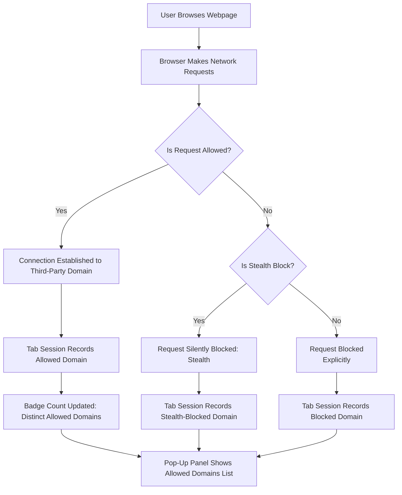

# Making Sense of the Badge Count and Pop-up

Welcome to the definitive guide on understanding the badge count and detailed pop-up panel of uBO Scope. This guide helps you interpret the numbers you see on the browser toolbar icon, why a lower count is better, and how to read the categorized domain lists in the pop-up. By mastering this, you’ll gain clear insights into your browser’s third-party network connections — distinguishing between harmless and potentially unwanted connections.

---

## 1. What This Guide Helps You Achieve

- **Task Description:** Learn what the badge count number means, how uBO Scope categorizes third-party connection outcomes, and why not all third-party connections should be treated equally.
- **Prerequisites:** Have uBO Scope installed and active in your browser, preferably with a recent browsing session to provide data.
- **Expected Outcome:** You will be able to read and interpret the toolbar badge count and fully understand the allowed, stealth-blocked, and blocked domains presented in the pop-up panel.
- **Time Estimate:** 10-15 minutes.
- **Difficulty Level:** Beginner to Intermediate.

---

## 2. Understanding the Badge Count: The First Clue

### What the Number on the Badge Represents

- The badge count reflects **the number of distinct third-party remote domains that your browser successfully connected to during the current tab session**.
- **Third-party** means any domain different from the main website you are visiting.
- The number shown is always the **count of distinct allowed third-party domains, not the total requests or blocked counts**.

### Why a Lower Badge Count Matters

- A **lower number indicates fewer third-party connections**, which often suggests better privacy and reduced tracking risk.
- Having fewer third-party domains improves your browsing safety and limits exposure to content from numerous external sources.
- Beware: a high badge count means your browser is connecting to many external services.

<Tip>
The badge count is not a count of blocked domains, nor is a higher number inherently better. It shows only domains from which data was actually fetched.
</Tip>

### What Doesn’t the Badge Count Tell You

- It’s **not a measure of block count or effectiveness of your content blocker**.
- It does **not include requests that failed or were stealth-blocked**, which appear separately in the pop-up.

---

## 3. Navigating the Pop-up Panel: Your Network Connection Report

Clicking the uBO Scope toolbar icon opens the pop-up panel. This panel breaks down all third-party network requests for the active tab into three categories:

### 3.1 Allowed (Not Blocked)

- Lists all third-party domains your browser connected to successfully.
- These domains contributed to loading resources or data.
- Typically includes legitimate services like Content Delivery Networks (CDNs), analytics providers, or social media widgets.

### 3.2 Stealth-Blocked

- These are domains for which network requests were intercepted and blocked silently without notifying the webpage.
- Often used by content blockers employing stealth techniques to avoid detection or webpage breakage.

### 3.3 Blocked

- These are domains where requests were outright blocked by your content blocking rules or by the browser’s network security.
- These blocked connections prevented any data transfer.

### Interpreting Domain Lists

- Each section shows domains along with a count indicating how many requests went to that domain.
- The counts help you understand the relative activity and prevalence of each third-party domain.
- Domains are displayed using Unicode decoding to correctly represent internationalized domains.

<Info>
Not all third-party domains are malicious or privacy-invasive. A small number of allowed third-party connections is perfectly normal and sometimes necessary for websites to function.
</Info>

---

## 4. Step-by-Step: How to Read and Interpret Your Current Tab's Network Activity

<Steps>
<Step title="Open the Pop-up Panel">
Click the uBO Scope icon on your browser toolbar to open the pop-up panel.
</Step>
<Step title="Check the Header for Active Tab Domain">
At the top, you'll see the domain of the current webpage as well as its registered domain part — helping you confirm which site is being analyzed.
</Step>
<Step title="Read the Summary Number">
Look at the 'domains connected' count near the top; this matches the badge count, showing distinct allowed third-party domains.
</Step>
<Step title="Explore the 'Not Blocked' Section">
Review the list of allowed third-party domains that connected successfully.
This helps you identify services your browser is talking to.
</Step>
<Step title="Review 'Stealth-Blocked' Domains">
See which domains had their requests silently blocked by stealth techniques to avoid website breakage or detection.
</Step>
<Step title="Review 'Blocked' Domains">
Check domains where connections were outright blocked, signifying enforced content blocking.
</Step>
<Step title="Interpret Counts per Domain">
Use the request count per domain to understand how active each third party was.
Larger counts do not necessarily mean more risk but indicate repeated interactions.
</Step>
</Steps>

---

## 5. Practical Tips and Best Practices

- **Aim for a low badge count:** While some third parties are benign and necessary, a lower count usually means less tracking surface.
- **Regularly review the pop-up:** Get familiar with domains you see regularly to distinguish trustworthy services from potential trackers.
- **Use stealth-blocking insight:** Domains in the stealth-blocked list represent network requests blocked silently; an unusual increase might warrant further investigation.
- **Remember that some domains may serve multiple purposes:** CDNs, analytics, social media embeds, and ads can use the same domain.
- **Don’t rely on 'ad blocker test' pages:** uBO Scope provides real-world visibility rather than artificial test scenarios.

---

## 6. Common Pitfalls and Troubleshooting

<AccordionGroup title="Troubleshooting Badge Count and Pop-up Issues">
<Accordion title="The Badge Doesn’t Appear or Show a Number">
- Ensure uBO Scope is properly installed and enabled.
- Confirm you have granted required webRequest permissions.
- Reload the page or open a new tab to trigger monitoring.
- Check for browser-specific quirks or extension conflicts.
</Accordion>
<Accordion title="Pop-up Shows No Data or Blank Sections">
- The active tab may not have any network activity yet.
- Reload the page and wait for connection data to accumulate.
- Ensure you clicked the icon on the tab you want to inspect.
- Confirm the extension's background script is running (if possible).
</Accordion>
<Accordion title="Badge Count Seems Too High or Inconsistent">
- Remember the badge counts distinct allowed third-party domains; heavy browsing may inflate this.
- Some websites dynamically load content from multiple providers.
- Consider your content blocker settings and other privacy tools that might interact.
</Accordion>
</AccordionGroup>

---

## 7. Summary

Your journey through interpreting uBO Scope’s badge and pop-up panel transforms cryptic numbers and domain lists into meaningful insights about your browser’s third-party connections. By understanding what the badge represents and how to decode the allowed, stealth-blocked, and blocked domain lists, you become empowered to assess network transparency and privacy.

---

## 8. Related Documentation and Next Steps

- [What is uBO Scope?](https://example.com/overview/product-introduction/what-is-uboscope): Understand the product purpose and mission.
- [Core Concepts & Terminology](https://example.com/overview/how-it-works/core-concepts-terminology): Deep dive on definitions like allowed, blocked, stealth.
- [Your First Session: Analyzing Network Requests](https://example.com/guides/getting-started/first-session-walkthrough): Practical session walkthrough.
- [Quick Validation Steps](https://example.com/getting-started/first-use-and-validation/quick-validation): How to confirm the extension operates correctly.
- [Troubleshooting Common Setup Issues](https://example.com/getting-started/first-use-and-validation/troubleshooting-and-support): Resolve frequent problems.

These resources will deepen your mastery and help you make confident privacy decisions based on uBO Scope’s network transparency.

---

## Appendix: Example Scenario

Imagine you visit a news website, and the badge count shows '4'. You open the pop-up and see:

- **Not Blocked:** cdn.example.com (12), analytics.tracker.com (3)
- **Stealth-Blocked:** ads.badadnetwork.com (5)
- **Blocked:** unwantedtracker.spam123.io (2)

Interpretation:

- Your browser successfully fetched resources from 2 legitimate third-party services.
- 5 ad-related requests were silently blocked, protecting your browsing experience without alerting the site.
- 2 requests to a known spam tracker were outright blocked.

This clear visibility confirms uBO Scope's role in shedding light on real connections, empowering you to understand your privacy landscape better.

---

## Visual Overview of Data Flow

Use this workflow to reinforce your understanding of how the badge and pop-up information is generated.

---

# Thank you for using uBO Scope! Your privacy transparency starts here.