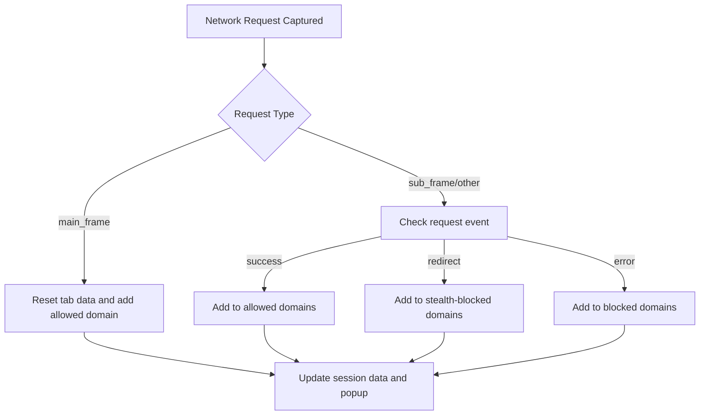

# Understanding the Popup: Allowed, Blocked, and Stealth Domains

## Overview
This guide breaks down the categories shown in uBO Scope's popup interface, explaining how the extension classifies network connections into **allowed**, **blocked**, and **stealth-blocked** domains. Understanding these distinctions empowers you to interpret the data accurately and make informed decisions about network activity and content blocking effectiveness.

## What This Guide Helps You Achieve
- Clarify the meaning behind each domain category in the popup.
- Learn how uBO Scope distinguishes between different connection outcomes.
- Understand the significance and impact of allowed, blocked, and stealth-blocked domains.
- Get practical insight into reading the popup data for troubleshooting and evaluation.

## Prerequisites
- uBO Scope extension installed and active in your browser.
- Basic familiarity with the popup interface and toolbar badge.
- A website loaded with network activity to analyze.

## Expected Outcome
By the end of this guide, you will confidently interpret the popup's categorized domain lists, understand what each connection status represents, and grasp how these insights reflect your browser's network behavior and content blocking.

---

## 1. Understanding the Domain Categories in the Popup
The popup interface groups domains contacted by the active tab into three outcome categories:

### a. Allowed Domains ("Not Blocked")
These are third-party domains where network requests were successfully allowed to connect. They represent remote servers from which resources were fetched without being blocked.

- **What counts here:** Domains that completed successful network requests.
- **Significance:** Reflects actual connected third parties delivering assets or content.
- **Example scenario:** A CDN domain delivering images or scripts.

### b. Blocked Domains
These domains represent network requests that were explicitly blocked.

- **What counts here:** Requests that failed due to blocking rules or errors indicating a blockage.
- **Significance:** Reflects domains actively prevented from loading resources.
- **Example scenario:** An ad or tracker domain blocked by a content filter.

### c. Stealth-Blocked Domains
Stealth blocking refers to requests that were redirected or altered in a way that prevents the webpage from easily detecting the block.

- **What counts here:** Domains involved in redirects or stealthy interference with network requests.
- **Significance:** Useful to identify subtle forms of blocking that are not immediately obvious to the webpage.
- **Example scenario:** Redirected requests to a placeholder domain or network-level blocking invisible to usual page scripts.

<Tip>
The stealth-blocked category helps debunk common misconceptions about what blocking looks like, showing that some content blockers operate stealthily to avoid website breakage or detection.
</Tip>

---

## 2. How uBO Scope Distinguishes Connection Outcomes

uBO Scope uses the browser's `webRequest` API events and maintains detailed per-tab session data to classify domains:

- It listens to network request events such as `onResponseStarted` (success), `onBeforeRedirect` (redirect), and `onErrorOccurred` (errors/block).
- The extension records outcomes per tab and per hostname.
- The categorization logic considers the request type, frame context (top-level or iframe), and request outcome.

### Workflow for Each Request Outcome

---

## 3. Impact of Each Domain Category

| Category        | Impact on User & Network | Interpretation Tips                 |
|-----------------|--------------------------|-----------------------------------|
| Allowed         | Resource loaded          | Fewer large counts here indicate fewer external connections, usually good for privacy.
| Blocked         | Resource prevented       | High counts might indicate aggressive blocking or many trackers.
| Stealth-Blocked | Subtle blocking effects  | Recognize stealth blocking as indirect blocking, showing stealthy filter actions.

<Warning>
A higher count in allowed domains means more active connections to third-party servers, potentially more tracking or resource loading.
</Warning>

---

## 4. Practical Tips for Interpreting the Popup Data

- **Focus on distinct domains, not raw request counts:** The popup shows unique domain counts rather than total requests.
- **Check the badge count alignment:** The toolbar badge reflects the sum of allowed domains, helping validate popup data.
- **Understand the context of domains:** Some allowed connections may be essential CDNs or content providers.
- **Use stealth-blocked domains to investigate indirect blocking:** If you notice stealth domains, it may explain why some network requests look successful yet are being redirected or modified.

<Check>
If you see NO DATA or zero counts, reload the page or verify that uBO Scope has permission to monitor network requests.
</Check>

---

## 5. Common Pitfalls and Troubleshooting

| Issue                      | Cause                                     | Solution                              |
|----------------------------|-------------------------------------------|-------------------------------------|
| Popup shows no domains      | No network activity, or insufficient permissions | Reload tab, check extension permissions |
| Badge count does not update | Background script issue or tab data cleared | Restart browser or reload extension  |
| Unexpected domains showing | Dynamic scripts loading or legitimate third parties | Verify with domain lookup and trusted content lists |

---

## 6. Summary

The uBO Scope popup provides a clear, categorized view of domains contacted by the active tab, grouped by their connection outcome:

- **Allowed:** Successful network connections.
- **Blocked:** Explicitly blocked requests.
- **Stealth-blocked:** Subtly redirected or stealthily blocked requests.

Armed with this knowledge, you can accurately interpret your browsing's network connections and gain deeper insight into content blocking behavior.

---

## Next Steps & Related Documentation

- Dive deeper with [Interpreting the Badge and Popup Data](/getting-started/first-run-setup/interpreting-badge-popup) for real-time summary analysis.
- Explore [Making Sense of the Badge Count and Domain Lists](/guides/interpreting-results/badge-interpretation-best-practices) to master badge insights.
- For advanced users, see [Spotting and Understanding Stealth-Blocked Requests](/guides/advanced-use/analyzing-stealth-blocks).
- If you encounter issues, consult [Troubleshooting Common Issues](/getting-started/validation-troubleshooting/common-install-issues).

---

## Additional Resources
- [uBO Scope on GitHub](https://github.com/gorhill/uBO-Scope)
- [Understanding Core Concepts and Terminology](/overview/core-concepts-overview/core-concepts-terminology)
- [System Architecture & Data Flow](/overview/core-concepts-overview/architecture-data-flow)

---

By understanding these categories, you are equipped to leverage uBO Scope effectively to monitor, analyze, and make decisions on your network connections and content blocking strategies.