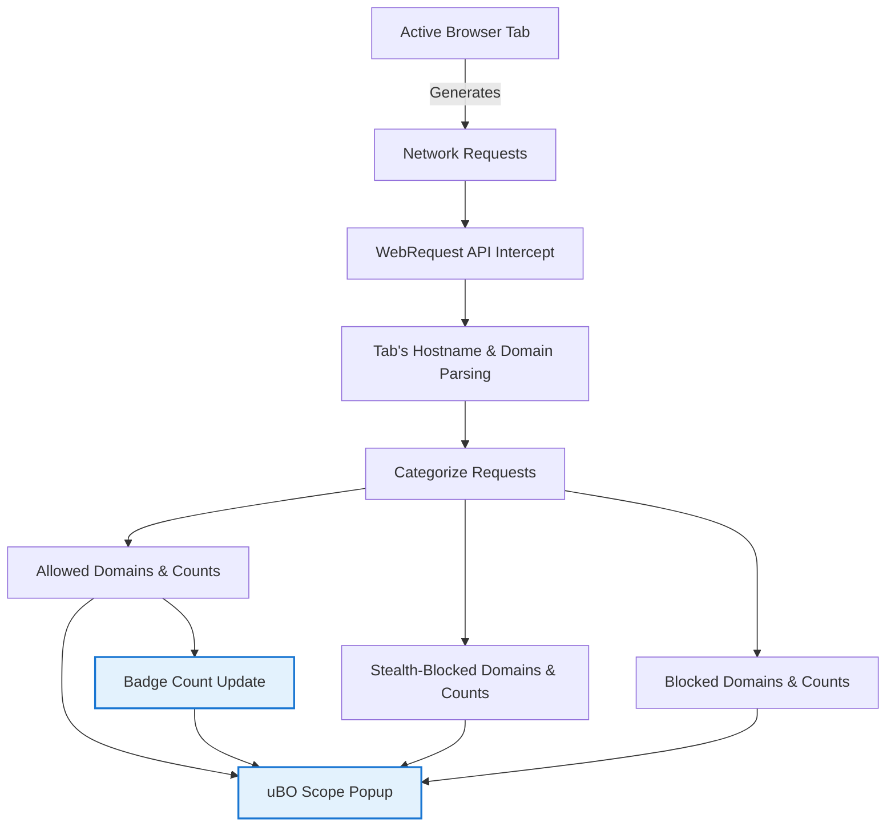

# Analyzing Third-Party Connections Per Tab

## Overview

uBO Scope enables you to monitor and analyze the network requests each browser tab makes to third-party remote servers. This guide demonstrates how to use the extension’s popup interface to view, categorize, and interpret these outgoing connections by domain. It also explains how to spot stealth or blocked requests and offers practical strategies to uncover hidden trackers or reduce excessive third-party connections.

## Prerequisites

- uBO Scope must be installed and enabled in your browser (Chrome 122+, Firefox 128+, or Safari 18.5+).
- The extension requires proper permissions (`webRequest` and `activeTab`) to monitor network requests.
- You should have an active browser tab loaded with a webpage to analyze.

## What You Will Achieve

By following this guide, you will:
- Access detailed reports of third-party connections for each active tab.
- Understand how requests are categorized as allowed, stealth-blocked, or blocked.
- Learn how to inspect and interpret domain-level connection counts.
- Apply tactics to expose stealthy trackers or detect over-connection.

## Time Estimate

Approximately 5-10 minutes for initial exploration per tab.

## Difficulty Level

Beginner to intermediate users with basic familiarity of browser extensions.

---

## Step-by-Step Instructions

### Step 1: Open the uBO Scope Popup for the Active Tab

1. Click the uBO Scope toolbar icon in your browser.
2. The popup window displays the current tab’s remote connections summary.

   > The extension automatically fetches and processes connection data for the active tab.

### Step 2: Identify the Tab Hostname and Domain

- At the top of the popup is the tab’s hostname shown in two parts:
  - The subdomain portion (if any) on the left.
  - The registered domain portion on the right.

   This makes it easier to confirm which site’s connections you are analyzing.

### Step 3: Review Domain Connection Counts by Category

The popup divides third-party domains into three clear sections:

- **Not Blocked (Allowed):** Domains with successful network requests.
- **Stealth-Blocked:** Domains subject to stealth blocking (redirects or resources silently blocked).
- **Blocked:** Domains where requests resulted in errors or explicit blocking.

Within each section, you will see:

- A list of domains connected to by the page.
- Next to each domain, the count of requests made or blocked.

### Step 4: Understand the Summary Count

- Above the domain lists is a summary line showing the total number of distinct domains contacted (allowed).
- This count is also reflected as the badge number on the toolbar icon.

### Step 5: Use the Domain Lists to Spot Potential Issues

- Look for unexpectedly high counts or unfamiliar domains in the **Allowed** section; these may indicate trackers or excessive connections.
- Domains appearing only in the **Stealth-Blocked** or **Blocked** sections can help verify if your content blocker or filters are effectively stopping unwanted requests.

### Step 6: Surface Hidden or Stealth Trackers

- Stealth-blocked domains often represent connections that some blockers hide to avoid website detection or breakage.
- Review the **Stealth-Blocked** list to identify suspicious domains that do not openly appear in block lists.

### Step 7: Refresh or Switch Tabs to Monitor Different Pages

- Close the popup and open it on other tabs to compare third-party connection patterns across websites.
- Refresh pages or perform user actions that trigger network requests to observe changes.

---

## Practical Example

Imagine visiting a news site and opening the uBO Scope popup. You notice:

- The **Allowed** section shows connections to common content delivery networks (CDNs) and analytics providers.
- The **Stealth-Blocked** section lists a domain related to an ad network often hidden by filters.
- The **Blocked** section includes several domains flagged as trackers by your filter list.
- The badge count is 12, indicating 12 distinct allowed third-party domains connected on this tab.

These insights confirm which third parties the site communicates with and how effective your filters are in blocking trackers.

---

## Best Practices and Tips

- Regularly monitor the popup on different sites to understand your typical third-party connection baseline.
- Pay close attention to stealth-blocked domains for potential trackers not evident in traditional block lists.
- Use the domain counts to identify sites that excessively connect to numerous third parties, which may impact privacy and performance.
- Lower badge counts usually signify better blocker performance and less third-party exposure.

---

## Troubleshooting Common Issues

<Accordion title="Popup Shows No Data or 'NO DATA'">
The popup may display 'NO DATA' or remain empty if:
- The extension lacks appropriate permissions, or the browser’s `webRequest` API is restricted.
- The active tab has no network activity (e.g., a new or blank tab).
- The extension failed to retrieve session data.

**Solution:**
- Ensure uBO Scope is granted all required permissions.
- Reload the webpage and reopen the popup.
- Check extension settings or reinstall if the problem persists.
</Accordion>

<Accordion title="Badge Count Does Not Update or Shows Incorrect Numbers">
Occasional lag or mismatch between the badge count and the popup data may occur due to:
- Delayed processing of network requests.
- Browser limiting extensions' background activity.

**Solution:**
- Wait a few seconds after loading the page to allow data synchronization.
- Reload the tab or restart the browser if issues consistently persist.
</Accordion>

---

## Next Steps

After mastering per-tab analysis of third-party connections:

- Explore the [Interpreting the Badge and Main UI guide](/guides/main-workflows/interpreting-badge) to deepen your understanding of badge significance.
- Review the [Troubleshooting Common Installation Issues](/getting-started/validation-troubleshooting/troubleshooting-common-issues) for setup reliability.
- For advanced users, see strategies in the [Tips for Clearer Results and Fewer Connections](/guides/advanced-use/tips-optimizing-insights) guide for optimizing filter lists.

---

## Additional Resources

- [Understanding uBO Scope's Core Concepts](../overview/core-concepts-architecture/core-terminology)
- [How uBO Scope Works Internally](../overview/core-concepts-architecture/how-ubo-scope-works)
- [Installing uBO Scope](../getting-started/installation-basics/extension-installation)

---

## Summary Diagram

---

<Check>
This guide assumes the user has installed uBO Scope with necessary permissions and is familiar with basic browser tab interaction. It focuses entirely on the Popup UI representing per-tab connections as per the product code and manifest.
</Check>