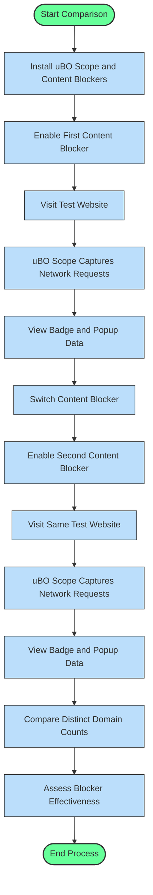

# Comparing Content Blockers: Debunking Badge Myths

## Overview
This guide helps you understand how to use uBO Scope alongside your preferred content blockers to objectively evaluate their effectiveness. Rather than relying on block counts shown by content blockers, which can be misleading, uBO Scope reveals the true number of distinct third-party domains your browser connects to.

By following this guide, you will learn to interpret uBO Scope’s reports to assess content blocker performance based on actual network connections, dispelling common myths about blocker reliability.

---

## Why Block Counts Can Be Misleading

Many users assume that a content blocker displaying a higher block count is more effective. However, this is a myth:

- **High block counts do NOT necessarily mean better blocking.** A blocker could display high block numbers but still allow connections to many different third-party domains, thereby exposing you more.
- **Block count vs. distinct connections:** What matters is how many unique third-party remote servers your browser successfully connects to, not how many requests were blocked.

<u>uBO Scope focuses on this crucial measure by counting distinct third-party domains actually contacted.</u>

<Tip>
Always trust the number of distinct allowed third-party domains rather than raw block counts to measure your content blocker’s real-world effectiveness.
</Tip>

---

## Using uBO Scope to Compare Content Blockers

### What uBO Scope Shows

- **Toolbar Badge:** Displays the number of distinct third-party domains your browser connected to in the active tab. A lower number indicates fewer exposed connections.
- **Popup UI:** Categorizes third-party domains by connection outcome:
  - **Allowed:** Domains from which content was successfully loaded.
  - **Stealth-Blocked:** Domains where blocking was done stealthily by a content blocker, hiding block events from the webpage.
  - **Blocked:** Domains where requests were outright blocked.

### Real Comparison Workflow

1. **Install uBO Scope alongside content blockers you want to compare.**
2. **Visit the same websites under each blocker configuration.**
3. **Open uBO Scope popup to review distinct domain connections for each tab.**
4. **Observe the toolbar badge counts and domain lists.**

<u>This lets you see which blocker results in fewer distinct third-party connections.</u>

### Interpreting Results

- A content blocker that shows fewer distinct connected third-party domains in uBO Scope is more restrictive, effectively reducing exposure.
- A blocker with many blocked requests but still a high count of connected domains may not be as effective.
- Stealth-blocking helps prevent webpage breakage or detection but should not mask connections; uBO Scope reveals these stealth-blocked domains.

<Info>
Content blocking via DNS or other out-of-band methods that do not generate `webRequest` events may not be fully visible. uBO Scope displays what the browser network stack reports.
</Info>

---

## Practical Example

You have two blockers: Blocker A and Blocker B.

| Content Blocker | Toolbar Badge Count (uBO Scope) | Meaning |
|-----------------|-------------------------------|---------|
| Blocker A       | 7                             | Allows connections to 7 distinct third-party domains.
| Blocker B       | 15                            | Allows connections to 15 distinct third-party domains.

Though Blocker B might report blocking more requests, uBO Scope shows it permits more distinct domain connections. So, Blocker A offers better third-party network restriction.

---

## Step-by-Step Guide to Compare Content Blockers with uBO Scope

<Steps>
<Step title="Install and Enable uBO Scope">
Install uBO Scope from the official browser extension store (Chrome Web Store, Firefox Add-ons, or Safari Extensions).

- Verify it appears as an icon beside your address bar.
- Ensure permissions include activeTab, storage, and webRequest.

</Step>
<Step title="Enable Your First Content Blocker">
Activate your primary content blocker (e.g., uBlock Origin, AdGuard).

- Navigate to a website you want to test.
- Wait for the page to load completely.
</Step>
<Step title="Check uBO Scope Badge and Popup">

- Look at the uBO Scope toolbar badge for this tab; the number is distinct third-party domains allowed.
- Click the uBO Scope icon to open the popup.
- Review the lists under **Not Blocked**, **Stealth-Blocked**, and **Blocked** domains.

</Step>
<Step title="Switch to Second Content Blocker">

- Disable the first blocker and enable the second content blocker.
- Repeat browsing the same website.
- Observe uBO Scope badge and popup for changes.

</Step>
<Step title="Compare Connection Counts and Domains">

- Note which blocker produces fewer distinct allowed domains.
- Pay attention to stealth-blocked domains to understand hidden blocking.
- Make decisions based on actual domain exposure, not raw block numbers.

</Step>
</Steps>

---

## Best Practices and Tips

- **Test on realistic websites** rather than artificial 'ad blocker test' pages, which often generate unrealistic network traffic.
- **Consider stealth-blocking presence**, as it can mask blocking activity from webpages but still restrict connections effectively.
- **Repeated tests** under various pages enhance reliability by smoothing traffic variances.
- **Keep your blockers and uBO Scope updated** to avoid bugs affecting measurements.

<Warning>
Do NOT rely solely on block counters shown by content blockers' interface; these can be inflated or misleading.
</Warning>

---

## Troubleshooting Common Issues

- **Empty or no data in uBO Scope popup:**
  - Ensure uBO Scope has the correct permissions.
  - Refresh the tab or restart the browser if data does not populate.
- **Badge count not updating:**
  - Confirm uBO Scope is running and receiving webRequest events.
  - Disable conflicting extensions or browser features that interfere.
- **Stealth-blocked domains list is empty despite known blocking:**
  - Some content blockers may not support stealth blocking or may block differently.

For detailed troubleshooting, consult the [Troubleshooting Common Installation Issues](https://docs.ubo-scope/getting-started/validation-troubleshooting/troubleshooting-common-issues) and [Validate uBO Scope Operation](https://docs.ubo-scope/getting-started/validation-troubleshooting/validation-steps) guides.

---

## How uBO Scope Works with Content Blockers

uBO Scope operates by listening to the browser's `webRequest` API, capturing network requests per tab and categorizing connection outcomes:

- Allowed (requests fetched successfully)
- Blocked (requests explicitly blocked)
- Stealth (requests blocked in a way that hides block events)

It then aggregates domains connected to and updates both the toolbar badge and popup UI with clear counts, independent of the content blocker’s internal block count interface.

This makes uBO Scope a neutral observer, showing what actually happens to network requests beyond blocker interfaces and potential UI tricks.

---

## Next Steps

- For understanding badge meaning and UI details, see [Interpreting the Badge and Main UI](https://docs.ubo-scope/guides/main-workflows/interpreting-badge).
- To learn how to analyze domain connections deeper, consult [Analyzing Third-Party Connections Per Tab](https://docs.ubo-scope/guides/main-workflows/analyzing-network-requests).
- If you maintain filter lists or want advanced troubleshooting, explore the Advanced Use Cases section.

---

## Additional Resources

- [What is uBO Scope?](https://docs.ubo-scope/overview/getting-started-core-value/product-purpose-value) — Understand the extension’s purpose and value.
- [Prerequisites & System Requirements](https://docs.ubo-scope/getting-started/installation-basics/prerequisites-system-requirements) — Verify your environment.
- [Installing uBO Scope](https://docs.ubo-scope/getting-started/installation-basics/extension-installation) — If you need to install or reinstall.

---

_This guide empowers you to objectively evaluate content blockers through uBO Scope’s unique insights, ensuring you make informed decisions about online privacy and exposure._

---

### uBO Scope FAQ: Debunking Badge Myths

<AccordionGroup title="Common Myths About Content Blocker Badge Counts">
<Accordion title="Myth: More blocks equals better blocking">
The higher block count shown by an extension does not necessarily mean it blocks more third-party connections. A blocker might allow more distinct domains behind the scenes despite blocking many requests.
</Accordion>
<Accordion title="Myth: Ad blocker test sites show reliable results">
Specialized test websites often generate fake network requests. They do not simulate real-world conditions and miss stealth-blocking techniques, rendering them unreliable for assessing content blockers.
</Accordion>
<Accordion title="Why uBO Scope’s domain count is superior">
uBO Scope counts unique remote domains your browser contacts, providing a direct measure of exposure, unaffected by block counts or content blocker UI tricks.
</Accordion>
</AccordionGroup>

---

## Visual Workflow of Content Blocker Comparison Using uBO Scope

---

## Summary
By objectively assessing allowed third-party domain connections with uBO Scope, you will clearly discern which content blocker restricts connections most effectively. This approach eliminates the confusion created by block count displays, enabling accurate evaluations to strengthen your browsing privacy.
