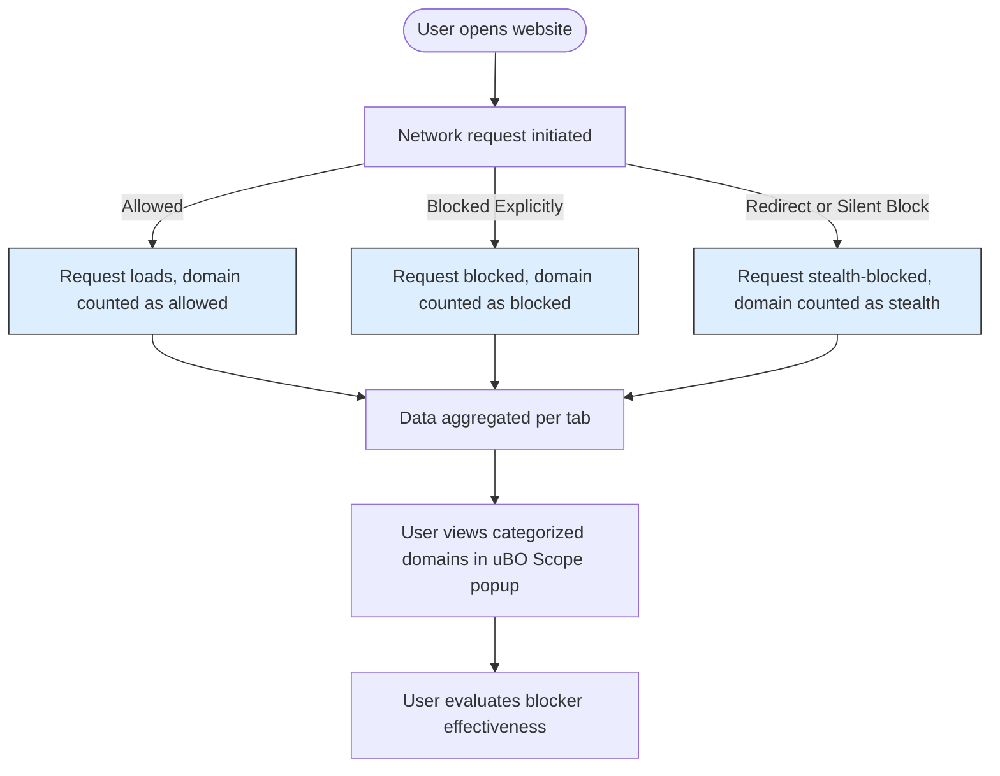

# Validating Content Blockers and Debunking Myths with uBO Scope

## Overview

This guide empowers users to leverage uBO Scope effectively to independently verify the real-world efficacy of content blockers. It helps you evaluate blockers beyond mere block counts by examining distinct third-party connections and exposes common misconceptions about ad blocking metrics. Whether you're assessing your own privacy setup or comparing multiple blockers, this guide walks you through practical validation workflows using uBO Scope's detailed reporting.

---

## Prerequisites

- **uBO Scope Installed:** Have the uBO Scope extension installed and active in your Chromium, Firefox, or Safari browser.
- **Basic Familiarity:** Know how to access the uBO Scope popup and read the toolbar badge count (refer to [Navigating the Popup and Interface](/guides/getting-started/explore-popup) if needed).
- **Content Blockers Enabled:** Have one or more content blockers installed and enabled for comparison.
- **Web Browser Access:** Use supported browsers with required permissions for network request monitoring.

---

## What You Will Achieve

- Confidently verify whether a content blocker effectively blocks third-party network connections.
- Understand why block counts alone do not provide a full picture of blocker effectiveness.
- Learn how to interpret the categorized results (allowed, blocked, stealth-blocked) in the uBO Scope popup.
- Debunk common ad blocker myths and assess reports fairly.

---

## Time Estimate

Typically 10–20 minutes, depending on the number of blockers tested and sites observed.

---

## Difficulty Level

Intermediate — assumes you are comfortable with browser extensions and interpreting network activity at a basic level.

---

## Step-by-Step Instructions

### 1. Open uBO Scope for the Target Webpage

- Navigate to the website you want to test.
- Click the uBO Scope toolbar icon to open the popup interface.
- Observe the badge count showing the number of distinct third-party remote domains successfully connected.

### 2. Review Connection Outcomes in the Popup

- Within the popup, you will see three sections:
  - **Not Blocked (Allowed):** Domains from which resources were successfully loaded.
  - **Stealth-Blocked:** Connections that were prevented silently or via redirections.
  - **Blocked:** Domains explicitly blocked by your content blocker or resulting in errors.
- Each section lists domains with counts representing how many requests were observed.

### 3. Interpret the Data Meaningfully

- **Focus on Allowed Domains:** The key indicator is the number of *distinct allowed third-party domains*—fewer allowed domains generally means stronger blocking.
- **Be Wary of Block Counts Alone:** A higher block count does not guarantee better protection if the allowed domains count is also high.
- **Consider Stealth Blocking:** Some blockers silently redirect or fail connections; these appear under 'stealth-blocked' and contribute to protection.

### 4. Validate Different Content Blockers Comparison

- Disable other blockers, enable the one under test.
- Repeat the test across a few real-world websites, not synthetic or 'adblock test' sites.
- Note the allowed domain counts and lists for each blocker.
- Compare results to draw conclusions — prioritize blockers that minimize allowed third-party domains.

### 5. Challenge Common Misconceptions

- Use uBO Scope to demonstrate that:
  - A toolbar badge showing more blocks does not automatically mean more effective blocking.
  - “Ad blocker test” webpages often produce misleading or unrealistic results due to fabricated or artificial network requests.
- Validate these points by testing known ad blocker test sites and contrasting with real-world websites.

### 6. Save or Share Findings

- For filter list maintainers or testers, uBO Scope data can supplement reports on blocker performance.
- Use screenshots of the popup sections or export logs if available (planned future feature).

---

## Practical Tips and Best Practices

- **Test Real Websites:** Focus on popular, legitimate websites with typical third-party content rather than niche or spoof ad blocker test pages.
- **Observe Over Time:** Some connections occur after delays or user interactions; revisit the popup after browsing a page for a while.
- **Use Multiple Sites:** Evaluate blockers across different sites to see consistent blocking effectiveness.
- **Understand Third Parties:** Not all third-party domains are harmful; some are CDNs essential for website functionality.
- **Check Permissions:** Ensure uBO Scope’s required permissions are granted for accurate tracking.

---

## Common Pitfalls & Troubleshooting

### Issue: Badge Count Seems Unchanged After Blocking

- **Cause:** uBO Scope counts the number of allowed distinct domains, not raw block events.
- **Solution:** Verify you are testing on an active tab with fresh navigation. Reload the page and open uBO Scope popup to refresh data.

### Issue: Unexpected Allowed Domains Appear

- **Cause:** Content blockers may permit required third-party CDNs or assets for site functionality.
- **Solution:** Identify domains carefully; not all allowed connections reduce privacy meaningfully.

### Issue: Data Missing or Populating Slowly

- **Cause:** WebRequest API limitation or delayed event processing.
- **Solution:** Wait a few seconds after page load before opening the popup; verify uBO Scope is up to date.

### Issue: Block Counts Don’t Reflect Actual Protection

- **Cause:** Block counts on badges or other blockers may not track distinct third-party domains.
- **Solution:** Use uBO Scope’s detailed domain-level reporting as ground truth.

---

## Real-World Scenario

Imagine you want to test two popular content blockers, A and B, to determine which better protects your privacy:

1. Enable Blocker A, visit example.com, and open uBO Scope. You find 5 allowed third-party domains.
2. Enable Blocker B, visit the same site, and open uBO Scope. It shows 3 allowed third-party domains but a higher block count badge on its own toolbar.
3. Despite Blocker B’s higher block count, uBO Scope reveals it lets through fewer distinct domains, thus providing stronger real-world blocking.
4. You repeat across other sites to confirm the pattern.

This validation disproves simple block count comparisons and directs you to use domain-focused analysis.

---

## Additional Resources

- [What is uBO Scope?](/overview/product-introduction-and-value/what-is-ubo-scope)
- [Core Concepts & Terminology](/overview/how-it-works-architecture/core-concepts-and-terminology)
- [Navigating the Popup and Interface](/guides/getting-started/explore-popup)
- [Troubleshooting Installation & Setup](/getting-started/basic-usage-validation/troubleshooting-installation)
- [FAQ: Does uBO Scope test ad blockers or reveal hidden activity?](/faq/getting-started-questions/adblocker-myths)

---

## Summary

| Outcome | Explanation |
|---------|-------------|
| **Allowed** | Domains with successful resource loading (indicates connections not blocked). |
| **Stealth-Blocked** | Domains where connections are silently blocked or redirected (blocker operates invisibly). |
| **Blocked** | Domains explicitly prevented from loading by the content blocker or via network errors. |

---

## Frequently Asked Questions

<AccordionGroup title="Common Questions About Content Blocking Validation">
<Accordion title="Why is the allowed third-party domain count more important than block counts?">
Blocked request counts can be misleading because a high block count doesn't necessarily mean fewer connections allowed; a blocker might block many requests but still allow connections to multiple distinct third parties, increasing privacy risks. The allowed distinct domains count indicates actual external resources loaded.
</Accordion>
<Accordion title="Can I rely on 'ad blocker test' websites to validate blockers using uBO Scope?">
No. Such websites use artificial or fabricated requests and often cannot detect stealth blocking measures, providing an inaccurate assessment. Always prefer real-world sites for meaningful validation.
</Accordion>
<Accordion title="What does stealth-blocked mean in uBO Scope?">
Stealth-blocking means requests were blocked quietly, often through redirections or other means, to avoid detection and webpage breakage. These domains do not load resources but don’t increase block counts visibly.
</Accordion>
</AccordionGroup>

---

## Troubleshooting Checklist

- Confirm the content blocker is active and permissions are properly set.
- Reload test pages fully before opening uBO Scope popup.
- Check that the browser is supported and uBO Scope is up to date.
- Avoid synthetic test pages; use real websites for validation.
- Don't confuse high block counts on other blockers’ badges with actual protection.

---

## Next Steps

After verifying blockers with uBO Scope, you may want to:

- Explore [Analyzing Page Connections and Third Parties](/guides/main-workflows/analyze-connections) to deepen understanding of connection sources.
- Consult [Supporting Filter List Maintainers with uBO Scope](/guides/main-workflows/support-maintainers) to see how this data aids filter improvements.
- Review [Best Practices for Privacy Diagnostics](/guides/advanced-tips/privacy-tips) for advanced privacy auditing techniques.

---

## References

- Official uBO Scope GitHub: <https://github.com/gorhill/uBO-Scope>

---

<u>Use uBO Scope not just as a tool for raw blocking counts, but as your trusted partner for informed, real-world, and accurate privacy validation.</u>

---

### Visual Flow: How uBO Scope Validates Blocking

