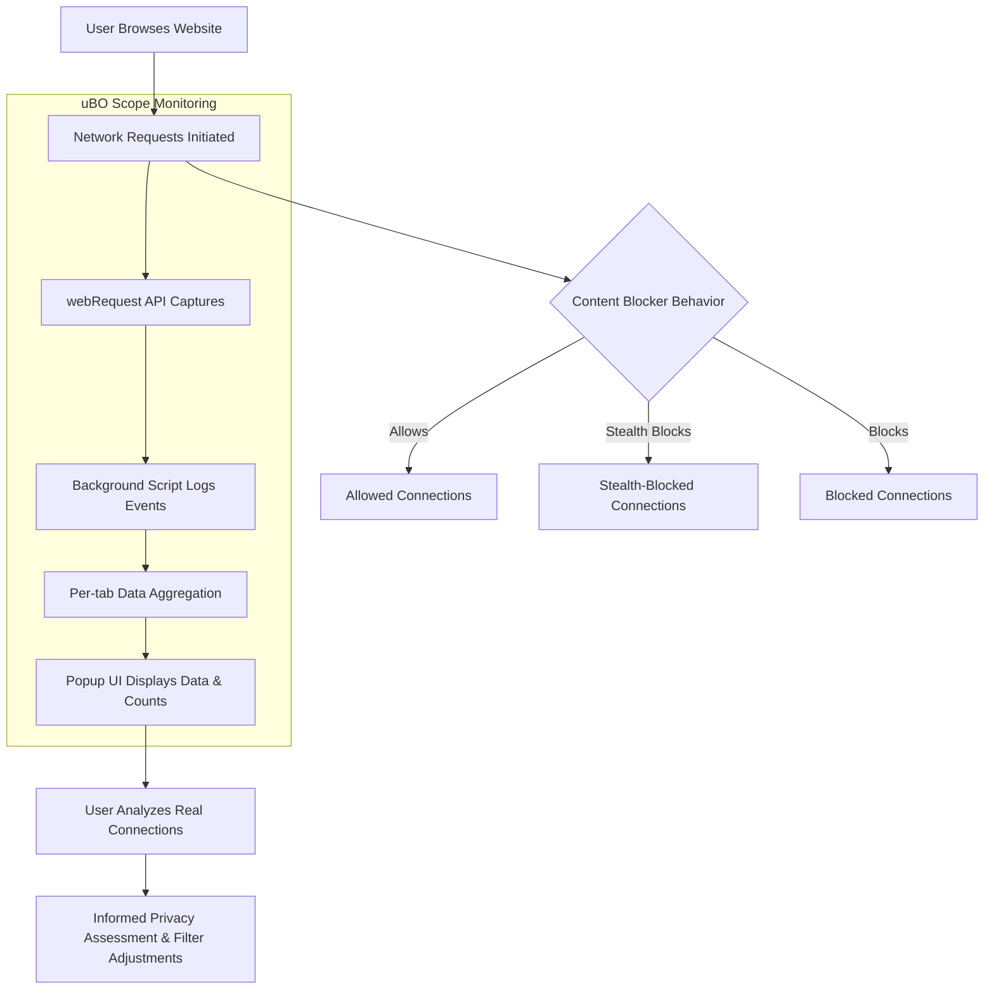

# Common Testing Myths and Best Practices

Discover why commonly used ad blocker "test" sites and raw block count comparisons can be misleading, and learn how to leverage uBO Scope for accurate, practical insights into your browsing privacy and the true behavior of websites.

---

## 1. Understanding the Landscape of Content Blocker Testing

### Why Conventional Testing Misleads

Many users and even developers rely on comparing block counts or trusting ad blocker test sites to evaluate the effectiveness of content blockers. However, these approaches often result in inaccurate or skewed conclusions:

- **Block Count Fallacy:** A higher block count on some extension does not necessarily mean better privacy or effectiveness. In fact, it can mean the opposite — allowing more distinct 3rd-party connections leads to more blockable requests, inflating the block count without reducing exposure.

- **Ad Blocker Test Sites Fallacy:** Special test pages designed to detect ad blockers or measure their block rates simulate non-realistic scenarios. These sites often:
  - Use fabricated or uncommon network requests unrelated to real-world browsing.
  - Cannot detect stealth techniques extensions use to avoid breakage or detection.

<u>These myths cause confusion and cause misjudgment about how well content blockers protect your privacy.</u>

### The Right Way to Assess

Instead of block counts or artificial test sites, focus on:

- The **number of distinct third-party servers actually contacted** when browsing real websites.
- The **effectiveness of stealth blocking**, which reduces tracking and unwanted requests without alerting sites.
- Real-world browsing observations rather than synthetic tests.

---

## 2. How uBO Scope Exposes Reality

uBO Scope is designed to report **all network connections attempted or completed by web pages**, regardless of content blocker or DNS filtering in place.

- It uses the browser's native `webRequest` API to monitor requests.
- Accurately counts distinct third-party remote servers for each active tab.
- Categorizes connection outcomes as:
  - **Allowed (not blocked):** Resources successfully fetched.
  - **Stealth-blocked:** Requests stealthily blocked or redirected without detection by sites.
  - **Blocked:** Requests explicitly blocked or failed.

### Value Proposition

- Provides a **true picture of privacy exposure** by showing distinct remote servers connected, which is the essential metric.
- **Debunks misleading block count myths** by showing how block counts alone are insufficient or misleading.
- Helps filter list maintainers identify real-world gaps and edge cases beyond what standard tools show.

---

## 3. Practical Approaches for Accurate Testing and Analysis

Follow this workflow to get meaningful insights using uBO Scope:

### Step 1: Install and Confirm uBO Scope Setup

- Install uBO Scope on your preferred supported browser (Chromium, Firefox, Safari).
- Verify permissions are granted and the extension is active.
- Reload the websites you want to analyze.

### Step 2: Opening the Popup to Analyze Connections

- Click the uBO Scope icon in your browser to open the popup UI.
- Observe the hostname and domain displayed for the current tab.
- Review the connection categories: **not blocked**, **stealth-blocked**, and **blocked** domains.
- Check the summary count at the top showing the number of distinct third-party domains connected.

### Step 3: Interpreting Connection Data

- Focus on the **'not blocked'** section to see which 3rd-party servers your browser actually connected to.
- Use the **'stealth-blocked'** list to understand which connections were hidden/block requests.
- The **'blocked'** section shows explicitly denied connections.

### Step 4: Draw Informed Conclusions

- A **lower count of allowed distinct domains** means fewer 3rd-party contacts, implying better privacy.
- Compare different scenarios or filter lists by analyzing how the allowed and stealth-blocked counts change.

### Step 5: Avoiding Pitfalls

- Do not solely rely on **block count badges** on other extensions; they may be misleading.
- Avoid using specialized “ad blocker test” pages as benchmarks.
- Focus on analyzing connections during **typical, real-world browsing** for relevant insights.

---

## 4. Real-World Examples

### Example: Comparing Two Filter Lists

1. Navigate to a popular news website.
2. Enable filter list A with your content blocker.
3. Open uBO Scope popup and note the count and allowed domains.
4. Switch to filter list B.
5. Refresh the page, then observe uBO Scope data again.

**Outcome:** You’ll see which list results in fewer allowed third-party domains, giving an accurate impression of actual privacy impact.

### Example: Understanding Stealth Blocking

- When browsing social media sites, stealth blocking prevents certain trackers silently.
- uBO Scope captures these stealth-blocked domains, showing the privacy work extensions do behind the scenes.

---

## 5. Best Practices and Tips

- Use uBO Scope regularly to monitor your browsing privacy footprint.
- Combine uBO Scope findings with your content blocker’s logs for comprehensive analysis.
- Understand that some legitimate services use third-party CDNs; a certain level of 3rd-party connections is normal.
- Keep your filter lists up to date and validate any custom filters with uBO Scope.
- Use uBO Scope data to inform filter list adjustments, especially when maintaining or building custom filters.

---

## 6. Troubleshooting Common Issues

<Tip>
If you see no data or stale data in the popup:
- Ensure the extension has the required `webRequest` and `activeTab` permissions.
- Reload the active tab to reset tracking.
- Check for any privacy or security settings blocking extension monitoring.
- Consult the [Troubleshooting Installation & Usage Issues](../getting-started/getting-using/troubleshooting) guide.
</Tip>

<Tip>
Badge counts not updating?
- Wait a few seconds after page load since data updates are batched.
- Reload the page and retry.
</Tip>

---

## 7. Next Steps & Related Resources

- Explore [Exploring the Popup UI: Domains and Statuses](../guides/getting-started-workflows/understanding-popup-ui) to deepen your understanding of the popup interface.
- Consult [Interpreting Toolbar Badge Counts and Metrics](../guides/getting-started-workflows/interpreting-badge-counts) to learn about badge insights.
- Use [Comparing Content Blockers Using uBO Scope](../guides/practical-analyses-advanced-usage/analyzing-content-blockers) for advanced analysis workflows.
- Visit [Using uBO Scope for Filter List Maintenance](../guides/practical-analyses-advanced-usage/filterlist-usage) to learn filter list refinement techniques.
- For foundational knowledge, see [Core Concepts & Terminology](../overview/architecture-concepts/core-terminology).

---

## 8. Additional Information

Remember, the goal is to understand actual third-party connections during browsing, not just to chase block counts or trust artificial test sites. Real privacy insight comes from analyzing genuine connections and stealth blocking behaviors over time using tools like uBO Scope.

---

# References
- [What is uBO Scope?](../overview/introduction-fundamentals/what-is-ubo-scope)
- [Core Features & Benefits](../overview/introduction-fundamentals/core-features-benefits)
- [System Architecture Overview](../overview/architecture-concepts/system-architecture)
- [Installation & Setup Guides](../getting-started/setup-installation/installing)
- [Troubleshooting Installation & Usage Issues](../getting-started/getting-using/troubleshooting)
- uBO Scope GitHub: [https://github.com/gorhill/uBO-Scope](https://github.com/gorhill/uBO-Scope)

---

# Summary Diagram of Insight Flow

