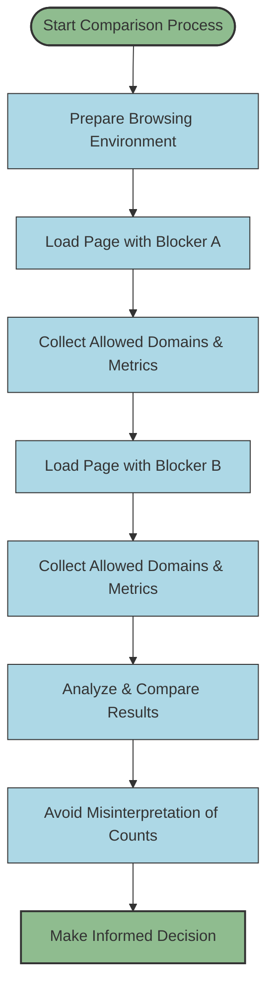

# Comparing Content Blockers With Connection Metrics

## Workflow Overview

**Task Description:**
This guide enables users to fairly evaluate and compare the effectiveness of different content blockers by observing the count and type of third-party domains their browser actually connects to. Instead of relying on misleading raw block counts—which can be counterintuitive—users will learn to interpret the true privacy impact by focusing on allowed remote connections reported by uBO Scope.

**Prerequisites:**
- uBO Scope installed and activated on your supported browser (Chrome ≥ 122, Firefox ≥ 128, Safari ≥ 18.5).
- Basic familiarity with the uBO Scope popup interface and badge (see "Understanding the Popup and Badge" guide).
- Multiple content blockers installed or enabled across distinct browser profiles or sessions to compare.

**Expected Outcome:**
After following this workflow, users will:
- Understand why block counts alone are unreliable measures of content blocker effectiveness.
- Be able to observe the count and nature of allowed third-party domains on a webpage.
- Avoid common pitfalls and misconceptions about content blocking based on superficial measurements.

**Time Estimate:** Approximately 10-15 minutes, including setup and side-by-side comparison.

**Difficulty Level:** Beginner to Intermediate.

---

## Step-by-Step Instructions

### Step 1: Prepare Your Browsing Environment
1. Ensure uBO Scope is active and correctly installed in your browser.
2. Identify the content blockers you want to compare (e.g., uBlock Origin, AdGuard, or built-in browser blockers).
3. For accurate comparison, isolate each content blocker:
   - Use separate browser profiles or sessions with only one blocker enabled at a time.
   - Alternatively, disable all but one blocker and reload the webpage for each comparison.
4. Choose a typical webpage you want to analyze that loads third-party content (avoid artificial "adblock test" sites).

### Step 2: Open the Webpage and Observe uBO Scope
1. Load the chosen webpage with the first content blocker enabled.
2. Click the uBO Scope toolbar icon to open the popup interface.
3. Note the number of distinct third-party domains connected, displayed in the "domains connected" summary.
4. Review the categorized lists:
   - **Not blocked:** Domains from which connections were allowed.
   - **Stealth-blocked:** Domains where requests were silently blocked without obvious blockage signals.
   - **Blocked:** Domains that had network requests explicitly blocked.
5. Record or screenshot this data for later comparison.

### Step 3: Repeat for Other Content Blockers
1. Disable the first content blocker and enable the next one.
2. Reload the same webpage to capture fresh data.
3. Open the uBO Scope popup again and collect the same data points.
4. Carefully compare the counts and domain lists between blockers.

### Step 4: Analyze and Interpret Results
1. Focus on the **number of distinct third-party domains allowed to connect**.
   - A lower count indicates fewer resources loaded from third parties, generally improving privacy.
2. Consider the nature of domains (e.g., CDN vs. advertising trackers).
3. Understand that a high block count doesn’t imply better blocking if actual allowed domains are also high.
4. Recognize that stealth-blocked domains indicate connection attempts blocked quietly, reflecting the subtlety of some blockers.

### Step 5: Avoid Common Misconceptions
- Do **not** conclude that a content blocker is better solely because it reports higher block counts.
- Do **not** rely on "ad blocker test" webpages, as they simulate unrealistic conditions and can mislead your assessment.
- Use uBO Scope’s metrics focused on connection outcomes for a realistic privacy measurement.

### Step 6: Confirm Your Understanding
- Verify that your recorded data matches the expected privacy improvement patterns.
- Use consistent test pages for repeatable results.

### Verification Steps
- Confirm uBO Scope popup updates accurately by refreshing the page after toggling blocker states.
- Check toolbar badge counts correspond roughly to the number of allowed third-party domains.

---

## Examples & Scenario

### Real-World Example
Suppose you want to compare "Content Blocker A" and "Content Blocker B" on a popular news website.

- With Content Blocker A:
  - Badge shows "45".
  - Popup lists 35 allowed third-party domains.
  - Blocked count is 20.

- With Content Blocker B:
  - Badge shows "30".
  - Popup lists 20 allowed third-party domains.
  - Blocked count is 40.

Despite Content Blocker A blocking fewer requests (lower block count), it allowed more domains overall, increasing your potential exposure. The preferable choice is Content Blocker B due to the lower number of allowed third-party connections.

### What Not To Do
Avoid drawing conclusions by comparing only block counts on third-party test sites. Such tests do not reflect real-world browsing and often fail to reveal stealth-block blocking techniques.

---

## Troubleshooting & Tips

<AccordionGroup title="Common Issues and Solutions">
<Accordion title="No Data or 'NO DATA' Shown in Popup">
- Ensure uBO Scope is installed and enabled.
- Refresh the webpage fully to trigger data capture.
- Verify the content blocker is allowing webRequest reporting.
</Accordion>
<Accordion title="Toolbar Badge Not Updating After Changing Content Blockers">
- Reload the current webpage.
- Restart the browser if necessary.
- Confirm that only one content blocker is active at a time to avoid conflicts.
</Accordion>
<Accordion title="Popup Shows Unexpectedly High Domain Counts">
- Verify the webpage tested is representative and not an artificial test site.
- Check for background tabs or extensions that may affect data.
</Accordion>
</AccordionGroup>

<Tip>
Use consistent webpages and always compare on real-world sites rather than "adblock test" pages to get truthful privacy insights.
</Tip>

<Warning>
Do not rely solely on numeric block counts; consider the total allowed connections and types of third-party domains for a complete evaluation.
</Warning>

---

## Next Steps & Related Content

- Review the [Understanding the Popup and Badge](/guides/getting-started-essentials/understanding-the-popup) guide for deeper familiarity with uBO Scope’s interface.
- Explore [Debunking Adblock Test Myths Using uBO Scope](/guides/practical-analysis-workflows/debunk-adblock-test-myths) to understand the limitations of popular test sites.
- After comparison, use [Analyzing Third-Party Connections on Any Page](/guides/practical-analysis-workflows/analyze-page-connections) to investigate specific domains in detail.
- For troubleshooting installation or setup issues, consult [Troubleshooting Installation & Setup](/getting-started/installation-and-setup/troubleshooting).

---

## Diagram: Content Blocker Comparison Workflow

