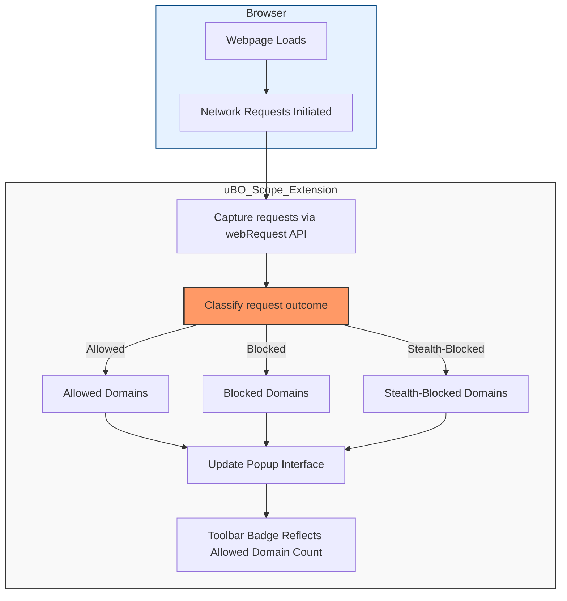

# Debunking Adblock Test Myths Using uBO Scope

## Overview
This guide demonstrates how to use **uBO Scope** to critically examine and dispel common misconceptions propagated by popular 'ad blocker test' websites. These test sites often produce misleading or inaccurate conclusions about content blocker effectiveness due to their artificial, unrealistic test scenarios.

By following this guide, users will learn how to investigate these claims through real network data captured by uBO Scope, gaining clarity on what actually happens when blocking extensions are working.

---

## Why This Matters
Many users rely on flashy "ad blocker test" pages that try to detect and evaluate content blockers. However, these tests often:
- Use contrived or fabricated network requests that don't represent real-world browsing
- Fail to recognize extensions’ stealth techniques designed to prevent webpage-based detection
- Overinterpret block counts as proxy for blocker quality

**uBO Scope** offers a direct window into genuine browser network activity, empowering users to:
- See all remote connections attempted by a webpage, regardless of blocking outcomes
- Distinguish between allowed, stealth-blocked, and outright blocked network requests
- Evaluate content blocking behavior based on actual remote server connections, not synthetic tests

## Prerequisites
- uBO Scope installed and activated in your compatible browser (Chrome≥122, Firefox≥128, Safari≥18.5)
- Basic familiarity with the uBO Scope popup interface showing allowed, stealth-blocked, and blocked domains
- A test environment including an "ad blocker test" website of your choice

## What You Will Achieve
After completing this guide, you will be able to:
- Use uBO Scope to observe real network connections from 'ad blocker test' pages
- Interpret the connection outcomes with clarity on what these tests reveal and obscure
- Confidently debunk misleading claims made by these tests

## Estimated Time
15–25 minutes

---

# Step-by-Step Guide

### 1. Open uBO Scope Popup on the Test Site
- Navigate to a popular ad blocker test webpage in a browser with uBO Scope installed.
- Click the uBO Scope extension icon to open the popup.

**Expected Outcome:** Popup shows lists of domains under Allowed, Stealth-Blocked, and Blocked categories.

<Check>
If the popup shows no data, reload the page and check browser permissions according to the [Installation & Setup Troubleshooting](/getting-started/installation-and-setup/troubleshooting).
</Check>

### 2. Review the Toolbar Badge Count
The toolbar icon badge indicates the number of distinct third-party domains truly allowed by your browser on that tab.

**Why it matters:** A lower count means fewer third-party remote servers successfully connected.

### 3. Compare Connection Lists
Within the popup, review:
- **Allowed domains:** Servers your browser connected to successfully.
- **Stealth-blocked domains:** Requests blocked quietly to avoid detection.
- **Blocked domains:** Requests blocked outright.

**Tip:** Pay attention to whether the test site’s reported blocks match actual network activity.

### 4. Cross-Check with Real-World Sites
To understand how these tests differ from real browsing:
- Open a common website you regularly visit.
- Open uBO Scope popup for that tab.

Compare the number and type of third-party connections with those on the test site.

**Expected Result:** Typical sites show limited, legitimate third-party connections, differing drastically from test pages.

### 5. Understand the Stealth Nature of Content Blockers
Many extensions, including uBO Origin, avoid blatant blocking detectable by test pages by using stealth blocking techniques. This means some requests appear allowed or succeed superficially but are actually blocked or neutralized.

**How uBO Scope helps:** It categorizes stealth-blocked domains separately, revealing these subtleties.

### 6. Use uBO Scope Data to Debunk Test Myths
Leverage recorded connection data:
- If the test page shows large block counts, but uBO Scope reports many allowed third-party domains, it indicates the blocker is permitting more connections than claimed.
- If the test site shows fewer blocks but the number of allowed third-parties is low, uBO Scope confirms actual blocking strength.
- Fabricated domain requests by test sites often do not map to any real domain, visible as unusual hostnames in uBO Scope’s detailed view.

---

# Practical Tips and Best Practices
- **Always prioritize allowed third-party domain count over block counts on toolbar badges or test pages.**
- Avoid relying on any fake or artificial adblock test website results for blocker reliability evaluation.
- Use uBO Scope alongside your content blocker popup to validate real network behavior.
- Regularly update your filter lists and extension versions to maintain accurate blocking performance.

# Common Pitfalls to Avoid
- Assuming higher block counts equal better blocking — uBO Scope shows this is often misleading.
- Trusting adblock test webpages’ fabricated scenarios instead of actual network data.
- Ignoring stealth-blocked requests, which can mask how blocking is performed.

# Troubleshooting

<AccordionGroup title="Troubleshooting uBO Scope Analysis on Test Pages">
<Accordion title="No Data Shows in Popup After Opening Test Site">
- Ensure uBO Scope extension has necessary permissions enabled.
- Reload the page to refresh collected data.
- Confirm using supported browser and version (Chrome ≥ 122, Firefox ≥ 128, Safari ≥ 18.5).
- Check for other extensions possibly interfering with uBO Scope.
</Accordion>
<Accordion title="Toolbar Badge Count Remains at Zero">
- Verify your browser allows webRequest API access.
- Confirm the test page is causing network requests (open developer tools to check).
</Accordion>
<Accordion title="Blocked Domains Never Appear">
- Content blockers may use stealth blocking — check stealth category in popup.
- Some requests may fail silently at protocol level; uBO Scope tracks errors as blocked.
</Accordion>
</AccordionGroup>

---

# Understanding Real vs. Fake Test Scenarios

Many 'ad blocker test' pages use unrealistic domains or scripted calls uncommon in everyday browsing. They try to detect blockers by:
- Checking if scripts or resources load from fake ad servers.
- Using anomalous network requests with unusual URLs.

**uBO Scope** reveals these artifacts by:
- Showing domain names in unicode or punycode form
- Categorizing domains as allowed / stealth-blocked / blocked based on real network events

This contrast underscores that "ad block tests" often stress extensions with artificial tests irrelevant to genuine web privacy.

---

# Next Steps

- Explore the [Understanding the Popup and Badge](/guides/getting-started-essentials/understanding-the-popup) guide to better parse uBO Scope data.
- Read the [Analyzing Third-Party Connections on Any Page](/guides/practical-analysis-workflows/analyze-page-connections) guide to deepen your analysis skills.
- Visit the [Comparing Content Blockers With Connection Metrics](/guides/practical-analysis-workflows/compare-content-blockers) guide for fair and data-driven blocker comparisons.
- Continue using uBO Scope to monitor your browser's network behavior across various browsing sessions to build concrete insights.

---

# Reference Diagram: How uBO Scope Measures and Categorizes Network Requests

---

# Additional Resources
- [uBO Scope GitHub Repository](https://github.com/gorhill/uBO-Scope)
- [Installation and Setup Guide](/getting-started/installation-and-setup/installation)
- [Troubleshooting Installation & Setup](/getting-started/installation-and-setup/troubleshooting)
- [Core Concepts & Terminology](/overview/core-concepts-architecture/core-concepts-terminology)

---

# Summary
Use uBO Scope to move beyond misleading 'ad blocker test' websites by directly observing real network connections from webpages. This guide empowers you to critically assess content blocker effectiveness through actual data on allowed, blocked, and stealth-blocked third-party domains, enabling evidence-based conclusions.

---