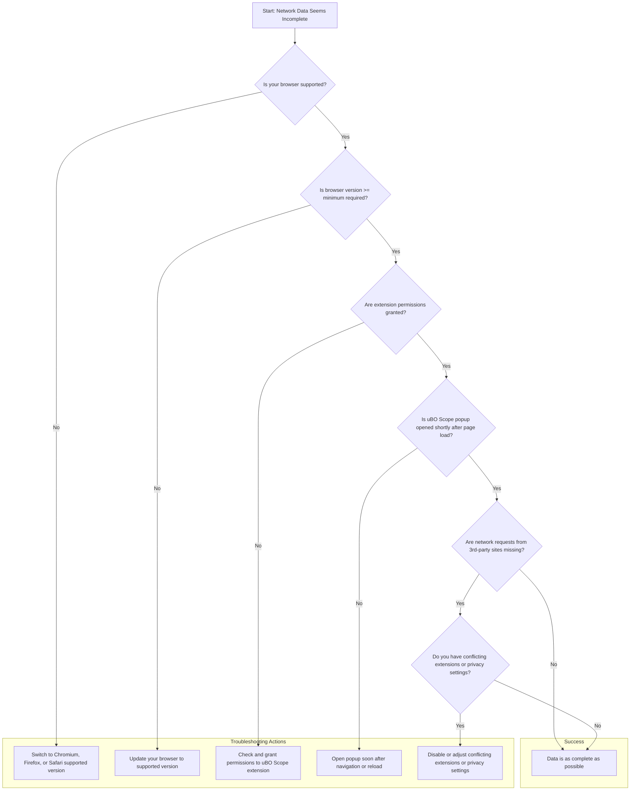

# Troubleshooting and FAQ

This guide addresses common scenarios where uBO Scope's reported data may not align with user expectations. It explains limitations of the webRequest API that uBO Scope relies on, why certain requests might not appear, and how particular browser settings or conditions impact the visibility of connections. Additionally, this page provides answers to frequently asked questions to help users resolve typical challenges and better understand the extension's behavior.

---

## Understanding uBO Scope's Data Limitations

### Why Aren't Some Network Requests Shown?

uBO Scope listens to your browser's `webRequest` API to capture network activity. However, some requests might not be visible due to the following reasons:

- **Browser API Restrictions:** Some network requests, such as certain internal or extension-initiated requests, are not surfaced by the webRequest API for privacy or security reasons.
- **Protocol Limitations:** uBO Scope currently tracks only `http`, `https`, `ws`, and `wss` protocols. Requests using other protocols won't appear.
- **Browser Version or Platform Limitations:** Minimum required versions, like Chrome 122+, Firefox 128+, or Safari 18.5+, are necessary for full tracking support. Older or unsupported versions may show incomplete data.

### What is "Stealth-Blocked" and Why Does it Appear?

The "stealth-blocked" category includes network requests that were blocked indirectly or invisibly. This could occur when content blockers or browser privacy features prevent certain network communications without explicit user interaction or direct blocking messages.

### Why Does the Toolbar Badge Show Fewer or Different Counts?

The badge number represents the count of **distinct third-party domains where connections were allowed** during the current tab’s session. Reasons for count variation include:

- Filtering logic excluding some domains that didn't produce distinct connections.
- Requests failing silently or marked as redirects.
- Timing, as the badge updates asynchronously (roughly every second).

## Troubleshooting Steps

### 1. Verify Browser Compatibility and Version

- Ensure you are using one of the supported browsers:
  - Chromium-based (Chrome, Edge) version 122 or higher
  - Firefox version 128 or higher
  - Safari version 18.5 or higher

### 2. Confirm Installed Permissions

uBO Scope requires these permissions for accurate tracking:

- `activeTab` – to monitor current tab activity
- `storage` – to save session data
- `webRequest` – to observe network requests

If any permission is missing or revoked, network requests may not be detected properly.

### 3. Check for Conflicting Extensions or Settings

- Other extensions that aggressively block or modify network requests might interfere with uBO Scope’s data collection.
- Browser privacy or security settings (e.g. enhanced tracking protection levels) can limit webRequest API visibility.

### 4. Inspect Page Reload Timing

- uBO Scope resets connection data on main frame navigation (page reload or navigation).
- Network requests recorded are tied to the active tab session—you should open the uBO Scope popup shortly after page navigation to see accurate data.

### 5. Review Network Conditions

- Some network requests occur outside `webRequest` API scope, such as WebRTC or native app communication, and these will not be reported.

### 6. Update uBO Scope

- Running the latest extension version ensures bug fixes, improved compatibility, and feature updates that may enhance data accuracy.

## Frequently Asked Questions (FAQ)

### Q1: "Why doesn't uBO Scope show all requests that my browser made?"

**Answer:** uBO Scope relies exclusively on the browser’s `webRequest` API. Certain types of network activity, like requests made by plugins, native code, or some WebSocket scenarios, might not be captured. Additionally, browser privacy controls and version limitations can hide some requests.

### Q2: "What does a 'redirect' event mean in uBO Scope's data?"

**Answer:** Redirects indicate that a network request was automatically rerouted to another URL by the server or browser. These are logged as 'stealth' connections because they do not result in direct resource loading from the original URL but still represent network activity.

### Q3: "Why is the badge number sometimes zero even when I visit a website?"

**Answer:** The badge counts distinct third-party domains with allowed connections in the current tab session. If the site either blocks most third-party content or uses only first-party requests, the count will be low or zero. Some requests may be filtered out due to failures or browser API unavailability.

### Q4: "Can uBO Scope detect requests blocked by DNS filtering or external firewalls?"

**Answer:** No. uBO Scope only observes network activity visible to the browser via the webRequest API. External blocking at the DNS or network level, which does not generate network events in the browser, will not be recorded.

### Q5: "How can I tell if a request was blocked explicitly or stealthily?"

**Answer:** In the uBO Scope popup, requests are categorized:

- **Blocked:** Explicitly intercepted and prevented by the content blocker.
- **Stealth-blocked:** Indirect or invisible blocking, often caused by stealth techniques in the content blocker or browser privacy features.
- **Not blocked:** Requests that successfully connected.

### Q6: "Why does uBO Scope sometimes lose data when switching tabs or closing a tab?"

**Answer:** uBO Scope maintains per-tab session data which is cleared when a tab is closed. Data from closed tabs is no longer retained, and switching tabs resets the visible data scope to the active tab.

---

## Practical Tips and Best Practices

- **Open the uBO Scope popup soon after loading a page** to view the most complete network request data.
- **Use supported browsers at or above minimum versions** to ensure access to all relevant webRequest events.
- **Keep permissions intact**; if permissions are revoked, reinstalling or resetting the extension may be required.
- **Avoid relying on badge count alone**; examine detailed domain lists in the popup for deeper insights.
- **Be aware of browser privacy settings** that might hide network events.
- **Combine uBO Scope with filter list management tools** to make informed decisions on blocking rules.

---

## Related Documentation

- [Understanding Connection Counting](https://docs.uboscope.local/overview/core-concepts-and-features/connection-counting-explained) – Learn how domain counts are calculated.
- [Validating Extension Activity](https://docs.uboscope.local/getting-started/first-run-and-troubleshooting/validating-extension-activity) – Methods to verify uBO Scope is working correctly.
- [Troubleshooting Common Setup Issues](https://docs.uboscope.local/getting-started/first-run-and-troubleshooting/common-setup-issues) – Solutions to installation and configuration problems.
- [Supported Browsers & Integration Points](https://docs.uboscope.local/overview/architecture-and-system-overview/platform-support-integration) – Browser compatibility and extension permissions.

---

## Troubleshooting Flowchart

---

## Summary
This page equips you to address discrepancies in uBO Scope's data by explaining API and browser constraints, guiding troubleshooting, and answering frequent questions. Understanding these factors empowers you to interpret uBO Scope’s output accurately and troubleshoot effectively.

<Tip>
If you consistently observe missing network requests, confirm your browser and extension versions meet minimum requirements and verify extension permissions before investigating further.
</Tip>

<Tip>
Remember, the badge count updates asynchronously and reflects unique third-party domains, not raw request counts. For detailed inspection, always review the popup’s domain lists.
</Tip>

---

## Example Scenario: Diagnosing Low Badge Count

1. You load a popular website but see no badge count or very low numbers.
2. Open uBO Scope’s popup immediately.
3. Confirm the browser version is at least Chrome 122, Firefox 128, or Safari 18.5.
4. Check your extension permissions under browser settings.
5. Disable other extensions that may block or alter network requests.
6. Reload the page and observe the badge and popup for updated counts.

If issues persist, consult the FAQs and troubleshooting checklist.

---

## Where to Go Next

- Visit [Validating Extension Activity](https://docs.uboscope.local/getting-started/first-run-and-troubleshooting/validating-extension-activity) to confirm uBO Scope’s operational status.
- Review [Interpreting Domain Data and Counts](https://docs.uboscope.local/guides/practical-guides/interpreting-domain-data) to understand data meaning.
- Explore [Supported Browsers & Integration Points](https://docs.uboscope.local/overview/architecture-and-system-overview/platform-support-integration) for environment setup.

These resources will deepen your comprehension and enable effective use of uBO Scope.

---

## Additional Resources

- **uBO Scope GitHub Repository:** <https://github.com/gorhill/uBO-Scope>
- **Browser Extension Stores:**
  - [Chrome Web Store](https://chrome.google.com/webstore/detail/ubo-scope/bbdpgcaljkaaigfcomhidmneffjjjfgp)
  - [Firefox Add-ons](https://addons.mozilla.org/firefox/addon/ubo-scope/)

---

## Contact & Feedback

For issues beyond this guide, consider reporting bugs or asking for help through the GitHub repository issues page to engage with the developer community.

---

## License

uBO Scope is licensed under the GNU General Public License v3 or later. See details in the license file in the source repository.
