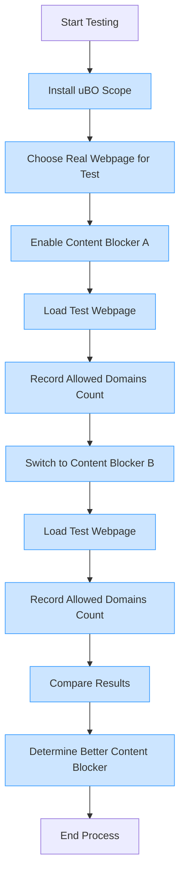

# Validating Content Blocker Effectiveness with uBO Scope

## 1. Introduction

This guide walks you through an effective workflow to objectively compare content blockers based on the _actual_ number of third-party network connections allowed during web page loads, using uBO Scope. Instead of relying on simplistic block counts or misleading test pages, you will learn to run controlled tests, interpret real connection data, and avoid common pitfalls that lead to incorrect conclusions.

<u>Why this matters:</u> Many users mistakenly assume that a content blocker that shows a higher block count is better. In reality, fewer distinct third-party connections mean better privacy. uBO Scope provides an accurate, platform-independent measure to validate what happens behind the scenes.

---

## 2. Prerequisites

- **uBO Scope Extension Installed:** Ensure you have installed uBO Scope for your supported browser (Chromium, Firefox, or Safari). See the [Installation Guide](/guides/getting-started/installation-and-setup).
- **Basic Familiarity:** You understand the general function of content blockers and can access the uBO Scope popup interface in your browser.
- **Content Blockers to Test:** Have the content blockers installed and ready to enable/disable.
- **Test Webpages:** Select real-world webpages for testing, avoiding fabricated "ad blocker test" sites.

---

## 3. Expected Outcome

By following this guide, you will:

- Obtain an accurate count of distinct third-party domains contacted with each content blocker.
- Identify which content blocker allows fewer third-party connections, indicating better privacy protection.
- Develop the skill to avoid common misconceptions and flawed comparative methods.
- Use uBO Scope’s data-driven insights to confidently evaluate and choose content blocking tools.

---

## 4. Time Estimate

Approximately 15–30 minutes, depending on the number of blockers and pages you test.

---

## 5. Difficulty Level

Beginner to Intermediate

---

## 6. Step-by-Step Instructions

<Steps>
<Step title="Install and Open uBO Scope">
1. Install the uBO Scope extension from your browser's official store.
2. Click the uBO Scope toolbar icon to open the popup interface.
3. Confirm uBO Scope is active and monitoring the current tab (you should see data about connected domains).

**Expected Result:** You see domain connection counts and categorized domains listed under “not blocked,” “stealth-blocked,” and “blocked.”
</Step>

<Step title="Prepare the Test Environment">
1. Pick a real, commonly visited webpage (e.g., a news site or popular blog) for testing.
2. Ensure you know which content blocker is currently enabled.
3. Clear your browser cache and reload the page to reset connection data.

**Expected Result:** The uBO Scope popup shows a fresh count of third-party connections for the loaded page.
</Step>

<Step title="Record Baseline Connection Count">
1. With the current content blocker enabled, note the number displayed on the uBO Scope badge.
2. Open the popup and document the number of distinct third-party domains under the “not blocked” section.

**Expected Result:** Accurate baseline for allowed connections during page load.
</Step>

<Step title="Switch Content Blocker and Repeat">
1. Disable the current content blocker.
2. Enable the next content blocker you want to test.
3. Clear cache or open a new browser profile/session (recommended for clean testing).
4. Load the same test webpage.
5. Check the uBO Scope badge and popup data again.
6. Record and compare the allowed third-party domain count.

**Decision Point:** Choose how many blockers to test. Repeat this step for each.
</Step>

<Step title="Interpret the Results">
1. Compare the badge counts across blockers: lower is better for privacy.
2. Review the listed domains to understand which third parties are allowed or blocked.
3. If unexpected domains appear, consider if they are legitimate CDNs or potential trackers.

**Verification:** Confirm that uBO Scope reports consistent data across tests.
</Step>

<Step title="Avoid Misleading Test Pages">
1. Do not rely on “ad blocker test” or benchmark pages that simulate blocking behavior.
2. These pages often create unrealistic network requests and cannot detect stealth blocking.
3. Always use real-world web pages to validate content blocker effectiveness.
</Step>
</Steps>

---

## 7. Real-World Example

### Testing Two Content Blockers on ExampleNews.com

| Step           | Content Blocker A          | Content Blocker B          | Interpretation                                 |
|----------------|---------------------------|---------------------------|-----------------------------------------------|
| Allowed Domains| 12                        | 7                         | Content Blocker B allows fewer third party domains, better privacy.
| Blocked Domains| 8                         | 13                        | Block count alone is misleading — B blocks more domains but allows fewer connections.
| Stealth Blocked| 1                         | 2                         | Minor difference; focus on allowed count.

---

### Notes:
- A lower number of allowed distinct third-party domains means fewer external connections, which translates to better privacy.
- A higher block count can sometimes indicate the content blocker struggled to block some requests stealthily.

---

## 8. Common Pitfalls & Troubleshooting

<AccordionGroup title="Common Issues When Validating Content Blockers">
<Accordion title="1. Badge Count Not Updating">
- Ensure the browser tab is active.
- Reload the tab after changing content blocker settings.
- Verify uBO Scope permissions are intact: activeTab, storage, webRequest.
- Restart browser if needed.
</Accordion>

<Accordion title="2. Testing on Ad Blocker Test Pages">
- Avoid synthetic test pages which simulate ads and trackers.
- Such pages do not represent real browsing behavior and often ignore stealth blocking.
- Use popular real websites instead.
</Accordion>

<Accordion title="3. Misinterpreting Block Count vs. Allowed Connections">
- Block counts are not a reliable indicator of content blocker effectiveness.
- Focus on the number of allowed third-party domains.
- Remember: fewer allowed domains mean fewer possible privacy leaks.
</Accordion>

<Accordion title="4. Inconsistent Data Across Tests">
- Clear browser cache and cookies to avoid cached connections.
- Use a fresh private window or separate browser profile.
- Disable other extensions that could interfere.
</Accordion>
</AccordionGroup>

<Tip>
For the most reliable validation, run multiple tests and average the results. Network fluctuations and dynamic content can cause minor variations.
</Tip>

---

## 9. Best Practices

- Always conduct tests on real-world webpages for genuine insights.
- Use uBO Scope’s popup data combined with its badge to get both overview and detail.
- Compare not only counts but also domain names to assess legitimacy.
- Remember that some third-party domains are essential CDNs, not trackers.

---

## 10. Next Steps & Related Guides

- Explore [Monitoring Network Connections](/guides/getting-started/monitoring-network-connections) to learn interface details.
- Visit [Interpreting Domain Data and Counts](/guides/practical-guides/interpreting-domain-data) for deeper understanding of domain lists.
- Consult [Validating Extension Activity](/getting-started/first-run-and-troubleshooting/validating-extension-activity) for initial setup verification.
- Review [Troubleshooting and FAQ](/guides/practical-guides/troubleshooting-and-faqs) for common problem resolutions.

---

## 11. References

- uBO Scope GitHub Repository: [github.com/gorhill/uBO-Scope](https://github.com/gorhill/uBO-Scope)

---

## 12. Summary Diagram (User Workflow)

