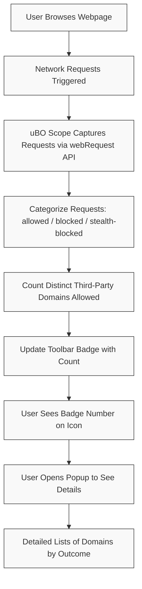

# Interpreting Toolbar Badge Counts in uBO Scope

## Workflow Overview

### What This Guide Helps You Accomplish
Understand the meaning behind the numeric badge shown on the uBO Scope browser extension icon. Learn how to interpret higher or lower numbers as indicators of web connection activity and content blocker effectiveness. Use this insight to accurately evaluate your browser’s connection profile and content blocker performance.

### Prerequisites
- uBO Scope browser extension installed and enabled in Chrome (v122+), Firefox (v128+), or Safari (v18.5+).
- Basic familiarity with browser extensions and webRequest API.
- Have active browsing sessions generating network requests.

### Expected Outcome
You will be able to:
- Interpret what the badge count represents.
- Understand why a lower count is preferable.
- Use badge numbers to assess content blocker real-world performance.
- Avoid common misconceptions that arise from raw block counts.

### Time Estimate
Approximately 5-10 minutes to read and assimilate concepts.

### Difficulty Level
Beginner to intermediate, no advanced technical knowledge required.

---

## Understanding the Badge Count

### What Does the Number Mean?
The badge on the uBO Scope toolbar icon represents the **number of distinct third-party remote servers with which the active tab has established connections**. This includes any remote server that a webpage tried to connect to or successfully connected to, regardless of whether the connection was allowed, blocked, or stealth-blocked.

### Why Distinct Third-Party Remote Servers?
Focusing on third-party distinct domains provides an accurate count of network connections that your browser engages with beyond the main site you visit. This sheds light on:
- How many unique external services a website communicates with
- The real exposure surface to external domains
- The effectiveness of content blockers in reducing these connections

### Lower Is Better
A lower badge count indicates fewer unique third-party servers were contacted, signaling a more privacy-conscious or minimal external exposure. Conversely, a higher count reveals a greater number of external connections.

<Tip>
Remember, a high number means more distinct connections were made, increasing potential privacy risks or tracking surfaces.
</Tip>

---

## Badge Count vs. Block Count: Avoiding Common Pitfalls

### The Myth of “More Blocks = Better Blocking”
It’s a common misconception that a higher blocking count suggests stronger content blocking. uBO Scope clarifies that:

- A blocker reporting many blocks may still allow connections to a **larger number of distinct third-party servers**.
- A high block count **is not an indicator of better privacy protection** if the total allowed distinct connections remain high.

### Real-World Example
If Blocker A shows 100 blocks but allows connections to 30 third-party servers, and Blocker B shows 60 blocks but only allows 10 third-party servers, Blocker B provides better privacy protection despite a lower block count.

### How uBO Scope Helps
uBO Scope’s badge count directly reflects the **number of allowed third-party servers**, giving you a fact-based measure of exposure rather than just block tallies.

---

## Using Badge Counts to Evaluate Content Blockers

### Step 1: Observe Badge Counts Over Time
Monitor the badge count as you browse various websites to understand the typical number of allowed external connections.

### Step 2: Test Different Content Blockers
Toggle your content blockers on and off, or switch between different blockers, to see changes in badge counts. Favor configurations that reduce third-party distinct connections.

### Step 3: Consider Legitimate Third Parties
Recognize that some third-party connections—such as Content Delivery Networks (CDNs)—are necessary and common. An extremely low count doesn’t always mean better; it must be balanced against site functionality.

### Step 4: Drill Down Using the Popup
Click the uBO Scope toolbar icon to open the popup panel, where you can see lists of not blocked, stealth-blocked, and blocked domains for the active tab.

---

## Practical Tips & Best Practices

- **Keep an eye on the badge count regularly:** It updates live, so use it to detect unusual or unexpected third-party network activity.
- **Use the popup data to contextualize the count:** Seeing which domains contribute to the count can highlight specific trackers or services.
- **Understand stealth-blocked connections:** Some requests may be blocked silently (stealth) which still influences total connection behavior.
- **Balance privacy and website usability:** Don’t rely solely on badge count; if a website breaks at a very low count, adjust accordingly.

<Warning>
Do not rely only on badge counts to determine blocker effectiveness. Combine with qualitative insights from the popup panel and your browsing experience.
</Warning>

---

## Troubleshooting Common Badge Count Scenarios

### Badge Count Shows No Number
- Ensure uBO Scope is properly installed and enabled.
- Reload or open a webpage to trigger network requests.
- Check extension permissions and browser compatibility.

### Badge Count is Always Very High
- Visit websites known for many third-party connections (news, shopping, streaming).
- Disable other content blockers and compare if their absence causes increase.
- Use the popup to identify which domains are contributing to the count.

### Badge Count Does Not Change When Switching Tabs
- Ensure you have focused the tab and popup is active.
- Sometimes the badge updates shortly after network activity; wait a moment.

---

## Summary
- The uBO Scope toolbar badge shows **distinct third-party remote servers** connected in the active tab.
- Lower badge counts mean fewer external connections and generally better privacy.
- Do not mistake high block counts for better blocking.
- Use the badge count alongside the popup detailed report for maximum insight.

---

## Next Steps & Related Documentation

- [Viewing Your First Connection Report](/guides/getting-started/first-connection-report): Learn how to open and read the popup panel lists.
- [Mythbusting Ad Blocker Claims](/guides/practical-scenarios/debunking-blocker-myths): Understand common misconceptions in blocker testing.
- [Using uBO Scope with Other Content Blockers](/guides/practical-scenarios/cross-checking-content-blockers): How to combine uBO Scope with existing blockers.
- [Troubleshooting Common Issues](/getting-started/essential-usage/troubleshooting): Resolve badge or data update problems.

---

## Resources
- Official GitHub Repository: [https://github.com/gorhill/uBO-Scope](https://github.com/gorhill/uBO-Scope)
- uBO Scope Extension Stores:
  - Chrome: [Chrome Web Store](https://chromewebstore.google.com/detail/ubo-scope/bbdpgcaljkaaigfcomhidmneffjjjfgp)
  - Firefox: [Firefox Add-ons](https://addons.mozilla.org/firefox/addon/ubo-scope/)

---

## Illustration of Badge Count Workflow

---

This completes your guide to understanding and interpreting the toolbar badge counts in uBO Scope.
