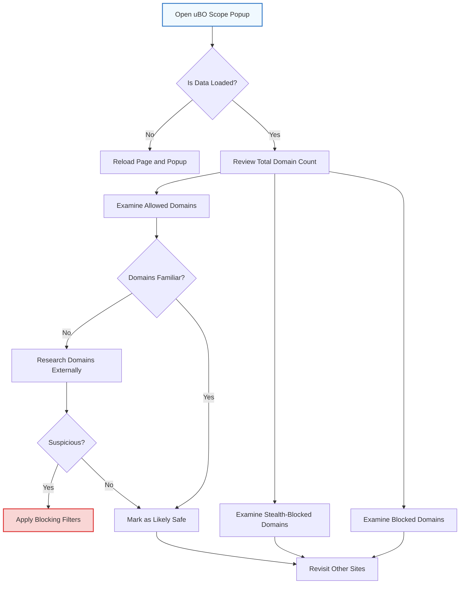

# Analyzing Third-Party Domains and Privacy Impact

## Overview
This guide empowers you to investigate which third-party domains a webpage connects to, distinguish between legitimate and questionable connections, and understand the privacy implications of these external contacts. By closely analyzing the categorized domain lists presented in uBO Scope's popup, you can make informed decisions to enhance your privacy posture and web browsing safety.

---

## 1. What You Will Achieve
- Identify all third-party domains contacted by the active webpage.
- Distinguish allowed, stealth-blocked, and blocked third parties.
- Assess which third parties are legitimate or potentially intrusive.
- Use strategic interpretation to decide on privacy actions.

---

## 2. Prerequisites
- uBO Scope extension installed and enabled in your browser.
- Basic familiarity with opening and using the uBO Scope popup panel.
- Active browsing tab with network activity (e.g., visiting any popular website).

---

## 3. Step-by-Step Guide to Analyzing Third-Party Domains

### Step 1: Open uBO Scope Popup Panel
- Click the uBO Scope toolbar icon while on the webpage you want to analyze.
- The popup displays the hostname of the current page and categorized lists of third-party domains.

### Step 2: Understand Domain Categories
- **Not Blocked (Allowed):** These are domains contacted successfully, without interference.
- **Stealth-Blocked:** Domains whose connections were redirected or otherwise stealthily blocked.
- **Blocked:** Domains whose network requests failed or were explicitly blocked.

### Step 3: Review the Domain Count Summary
- At the top, note the total unique domains count labeled as "domains connected".
- This count reflects the distinct third-party domains the page contacted.

### Step 4: Examine Allowed Domains for Legitimacy
- Look for familiar service providers such as CDNs (Content Delivery Networks), analytics services, or essential third parties.
- High counts of allowed unknown domains are a red flag indicating potential privacy risks.

### Step 5: Identify Potential Privacy Risks
- Domains in stealth-blocked or blocked sections may be unwanted trackers, malicious sites, or advertising domains.
- Investigate unfamiliar domains using external tools to verify legitimacy.

### Step 6: Make Privacy Decisions
- If an allowed domain appears questionable, consider applying stricter content blocking filters or adjusting privacy settings.
- Use uBO Scope data to guide filter list customization or enable additional privacy extensions.

### Step 7: Repeat Analysis Across Multiple Pages
- Revisit different websites to compare third-party domain behavior and refine your privacy evaluation.

---

## 4. Practical Examples

### Example: Analyzing a News Website
1. Navigate to the news site in your browser.
2. Open uBO Scope popup.
3. Observe 15 domains connected.
4. Among allowed domains, CDN services like `cdn.examplecdn.com` are expected.
5. Several unknown domains appear under stealth-blocked; research reveals tracking domains.
6. You decide to block these domains using custom filters.

### Example: Using Domain Lists to Verify Filter Effectiveness
1. Visit a content-rich website.
2. Use uBO Scope to capture domain connections.
3. Compare allowed versus blocked domains.
4. Adjust filter settings to reduce allowed suspicious connections.

---

## 5. Tips & Best Practices

- **Start with Low Counts:** Good privacy usually results in fewer unique allowed third-party domains.
- **Use External Domain Lookup:** To verify unknown domains, use tools like [whois.domaintools.com](https://whois.domaintools.com) or public filter list references.
- **Monitor Stealth-Blocked Domains:** Some sophisticated trackers are stealthily blocked but still visible here; that data helps refine blocking rules.
- **Be Wary of High Allowed Counts:** Sites with numerous allowed third-party domains increase privacy risk.
- **Customize Blocking Gradually:** Avoid breaking website functionality by blocking aggressively.

---

## 6. Common Pitfalls & Troubleshooting

### No Domains or No Data Showing
- Confirm uBO Scope is active and has necessary permissions.
- Reload the webpage and then open the popup again.
- Make sure the page is loaded over HTTP or HTTPS (websockets too on supported browsers).

### Domains List Seems Incomplete or Unusual
- Network requests outside browser APIs will not be tracked.
- Some extensions or privacy settings might interfere with request monitoring.

### Confusing Domain Names (Punycode or Encoded)
- uBO Scope decodes internationalized domain names to Unicode to ease identification.
- Use the decoded names to investigate domains.

---

## 7. Verification & Confirmation
- After analyzing domains, confirm your interpretations by cross-referencing with reputable filter lists or domain reputation databases.
- Look for reductions in allowed suspicious domains after applying blocking or privacy measures.
- Continuously validate using uBO Scope on different websites.

---

## 8. Next Steps & Further Reading
- For beginners, consult the [Basic Use: Monitoring Connections on Any Webpage](/guides/getting-started-essentials/basic-workflow-monitoring) guide to get comfortable with the popup interface.
- Deepen your understanding by reading [Interpreting the Toolbar Badge and Popup](/getting-started/first-steps-usage/interpreting-results).
- Explore [Using uBO Scope to Compare Content Blockers](/guides/practical-usage-patterns/comparing-content-blockers) to evaluate the effectiveness of various privacy tools.
- If you face issues with data not showing, review the [Extension Not Showing Data?](/getting-started/troubleshooting/extension-not-showing-data) troubleshooting guide.

---

## 9. Visual Diagram: User Flow for Domain Analysis

---

## 10. Summary
Analyzing third-party domains using uBO Scope is vital for understanding your browser's network connections and protecting your privacy. This guide walks you through interpreting domain categories, assessing legitimacy, and making informed privacy decisions with hands-on examples and best practices.

{/*
END OF DOCUMENT
*/}