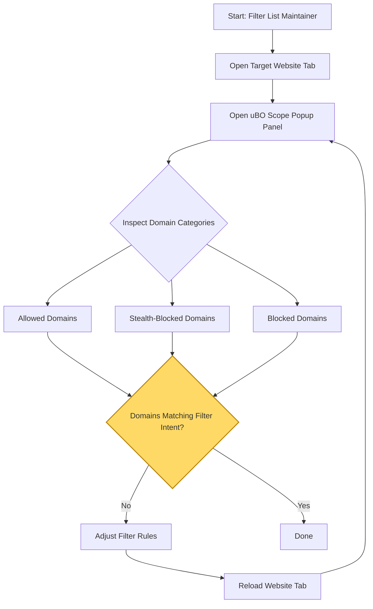

# Best Practices for Filter List Maintainers Using uBO Scope

uBO Scope is an indispensable tool for filter list maintainers seeking to validate and optimize content blocking filters. This guide provides practical workflows, tips, and actionable strategies to harness uBO Scope effectively, especially when conventional browser devtools are unavailable or inadequate. You'll learn how to leverage the extension's observed network request data to validate filter effectiveness, spot stealth blocking behaviors, and maintain precise control over third-party connections.

---

## 1. Understanding uBO Scope's Role for Filter Maintainers

Filter maintainers need reliable data to confirm that their filter rules achieve the intended block or allow states on third-party network requests. uBO Scope complements this task by:

- Reporting all attempted and successful remote connections per tab.
- Categorizing domains based on request outcomes: **allowed**, **blocked**, and **stealth-blocked**.
- Offering persistent session tracking independent of browser devtools availability.

This allows maintainers to see real-world network effects of filter lists and adjust rules accurately.

## 2. Prerequisites

Before starting your filter validation workflow, ensure:

- uBO Scope is installed and enabled on your browser (Chromium, Firefox, Safari).
- Your filter list is active in the content blocker running alongside uBO Scope.
- You have access to the uBO Scope popup panel for live inspection.

## 3. Typical Workflow for Validating Filters

Follow these sequential steps to effectively use uBO Scope for filter maintenance:

<Steps>
<Step title="Open the Target Website in a New Tab">
Start by navigating to the website where you want to validate your filters. Ensure this is a site where third-party connections are expected.
</Step>
<Step title="Open uBO Scope Popup Panel">
Click the uBO Scope toolbar icon to open the popup panel for the active tab.

- Observe the domain listed at the top—this confirms the tab's root hostname.
- Check the **domains connected** count, representing unique third-party domains with allowed connections.
</Step>
<Step title="Interpret Domain Categories">
Review domains separated into three distinct outcome categories:
- **Not Blocked (Allowed):** Domains from which resources loaded successfully.
- **Stealth-Blocked:** Domains blocked in a manner not detectable by the webpage itself (common with stealthy blockers).
- **Blocked:** Domains explicitly blocked with observable error event outcomes.

Focus on verifying that domains you expect to be blocked appear in the blocked or stealth sections.
</Step>
<Step title="Analyze Domain Counts and Request Frequencies">
For each domain, note the connection count badge indicating how many requests were observed.

- Use this to assess whether your filters are minimizing unwanted third-party unique hosts.
- High counts on unexpected domains reveal filter weaknesses or missing rules.
</Step>
<Step title="Iterate Filter Adjustments and Reload">
Adjust your filter list rules as needed based on the observations.

- Reload the website tab to refresh network request data.
- Repeat the inspection in the uBO Scope popup panel.

Aim for the badge count and allowed domains to decrease as your filters improve.
</Step>
<Step title="Use Badge Count as Immediate Feedback">
Near real-time badge counts on the toolbar icon provide continuous feedback on distinct allowed third-party domains.

- A drop in the badge count after filter edits indicates effective blocking.
- Beware stealth blocking cases that may impact interpretations.
</Step>
</Steps>

## 4. Practical Tips and Best Practices

- **Start Simple:** Focus first on blocking domains that clearly serve ads or trackers before applying complex rules.
- **Confirm Exact Domain Matches:** Use uBO Scope’s domain and hostname breakdowns to ensure you are blocking the right domain level.
- **Watch for Stealth Blocking:** When a domain moves to the stealth section, verify if the stealth blocking aligns with your filter logic or browser capabilities.
- **Avoid Overblocking:** Lower badge counts are better, but overzealous blocking may break site functionality. Test across varied sites.
- **Leverage Persistent Session Data:** uBO Scope saves session data to let you debug over multiple site visits and browser restarts.
- **Check Redirects:** Redirect events flagged by uBO Scope can reveal circumvented requests and help fine-tune redirect-based filters.

## 5. Common Pitfalls and How to Avoid Them

- **Relying on Block Counts Alone:** High numbers of blocked requests don’t always mean better blocking—focus on distinct third-party domains.
- **Ignoring Stealth Blocking:** Some filters cause stealth blocking that may not show as blocked in devtools; uBO Scope exposes this.
- **Assuming Badge Count Shows All Network Activity:** uBO Scope only counts third-party remote domains. First-party or internal connections are excluded.
- **Not Refreshing Data After Changes:** Always reload the tab after editing filters to see updated results in uBO Scope.
- **Confusing Domain Levels:** Blocking a domain may or may not affect subdomains; verify using uBO Scope’s domain/hostname distinctions.

## 6. Example Scenario: Blocking a Tracker Network

Suppose you want to block a tracker domain `tracker.example.net`:

1. Visit a popular news site that loads resources from `tracker.example.net`.
2. Open uBO Scope and verify `tracker.example.net` appears under the **Allowed** category.
3. Add or update your filter list rule to block `||tracker.example.net^`.
4. Reload the news site tab.
5. Open uBO Scope and confirm the domain moved to either **Blocked** or **Stealth-Blocked**.
6. Verify the toolbar badge count decreases, reflecting fewer allowed connections.

## 7. Troubleshooting Tips for Filter Validation

<AccordionGroup title="Troubleshooting Common Issues">  
<Accordion title="No Data Showing in Popup Panel">  
- Confirm uBO Scope is enabled and has permission to access the website.
- Reload the tab and reopen the popup panel.
- Check your browser’s extension page for potential conflicts or disabling.
</Accordion>

<Accordion title="Badge Count Not Changing After Filter Updates">  
- Make sure to reload the affected tab after changing filters.
- Verify the filter syntax is correct and active in your content blocker.
- Clear cached data by restarting the browser if stale data persists.
</Accordion>

<Accordion title="Unexpected Domains in Allowed List">  
- Check if the domains are first-party or trustworthy CDNs.
- Review stealth-blocked categories, as the domain might be hidden there.
- Refine filter rules by domain and subdomain specificity.
</Accordion>
</AccordionGroup>

## 8. How uBO Scope Fits Your Maintenance Workflow

By integrating uBO Scope into your filter maintenance workflow, you gain a robust, platform-independent means to:

- Monitor the outcome of network requests live and historically per tab.
- Distinguish stealth-blocking from regular blocking to understand blocker behavior.
- Iterate filter rules responsively with immediate visibility into their effects.

This approach reduces reliance on browser devtools, enhances cross-browser validation, and empowers confident filter list publishing.

---

## Related Documentation

- [Understanding the Popup Panel and Toolbar Badge](/guides/getting-started-essentials/understanding-popup-and-badge) — Learn to interpret uBO Scope’s UI elements.
- [Your First Website Analysis: Step-by-Step](/guides/getting-started-essentials/first-analysis-walkthrough) — Hands-on site review tutorial.
- [Interpreting Stealth Blocking and Anomalies](/guides/practical-usage-patterns/interpret-stealth-blocks) — Dive deeper into stealth blocking concepts.
- [System Requirements](/getting-started/prerequisites-installation/system-requirements) — Confirm your environment is ready.

---

## Summary Diagram: Filter Validator Workflow with uBO Scope

This diagram visualizes the iterative process of validating and improving filters by leveraging uBO Scope's monitoring.

---

## Final Notes

With uBO Scope, filter maintainers achieve unparalleled insight into actual network connections filtered or allowed at the domain level. By combining its persistent, cross-browser network visibility with methodical filter adjustments, you ensure your filters are precise, effective, and responsive to real-world website behaviors.

Embrace uBO Scope as your go-to companion for authoritative filter maintenance and highlight true privacy enforcement, beyond conventional devtools limitations.
