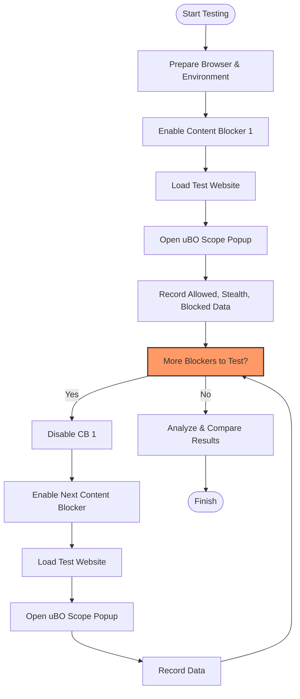

# Using uBO Scope to Compare Content Blockers

## Workflow Overview

### Task Description
This guide provides a practical, step-by-step workflow to leverage uBO Scope for evaluating the real-world effectiveness of different content blockers installed in your browser. By using uBO Scope's detailed metrics—including allowed, stealth-blocked, and blocked network connections—you can debunk common myths and objectively compare how various content blockers perform without bias.

### Prerequisites
- uBO Scope installed and configured on your browser ([see Installing uBO Scope guide](https://example.com/guides/getting-started-essentials/install-on-your-browser)).
- One or more content blockers installed that you want to compare (e.g., uBlock Origin, AdGuard, other extensions).
- Basic familiarity with interpreting uBO Scope’s popup interface and toolbar badge counts ([see Interpreting the Toolbar Badge and Popup](https://example.com/getting-started/first-steps-usage/interpreting-results)).
- At least one active browser tab with a real-world website loaded for testing.

### Expected Outcome
- Clear visibility into how many distinct third-party remote servers each content blocker allows, stealth blocks, or fully blocks.
- Confident, fact-based comparison of content blockers beyond simple block count numbers.
- Ability to debunk misleading assumptions about block counts and unreliable ad blocker test sites.

### Time Estimate
Approximately 10–15 minutes depending on the number of blockers tested and the sites chosen.

### Difficulty Level
Intermediate: Requires understanding of network connections, third-party domains, and uBO Scope’s metrics.

---

## Step-by-Step Instructions

### Step 1: Prepare Your Test Environment
1. Open your browser and ensure uBO Scope is active.
2. Disable or uninstall all content blockers except the first one you want to test.
3. Open a real-world website that is representative of your typical browsing habits.

### Step 2: Collect Data for the First Content Blocker
1. Navigate to the active tab with the test website.
2. Click the uBO Scope toolbar icon to open the popup panel.
3. Observe and note the numbers of:
   - **Not Blocked (Allowed)** domains — third-party connections permitted.
   - **Stealth-Blocked** domains — connections prevented through stealth blocking.
   - **Blocked** domains — connections fully blocked and failed.
4. Review the detailed domain lists beneath each category for further insight.
5. Write down or screenshot this data for comparison.

### Step 3: Repeat for Other Content Blockers
1. Disable the first content blocker.
2. Enable the next content blocker you wish to test.
3. Refresh the test website tab to generate fresh network traffic.
4. Open the uBO Scope popup again.
5. Record the same allowed, stealth, and blocked domain counts and lists.

### Step 4: Analyze and Compare Results
1. Compare the distinct domain counts under "not blocked" for each content blocker. A lower number represents fewer third-party servers allowed and generally better privacy protection.
2. Do not rely solely on block counts; a higher block count does not necessarily mean better blocking (see myth debunking below).
3. Pay attention to the stealth-blocked category, which captures subtle blocking methods some blockers use.
4. Use the detailed domain lists to identify any suspicious or undesired third-party connections allowed by the blockers.

### Step 5: Draw Conclusions and Document Findings
1. Identify which content blocker limits connections to the fewest distinct third-party domains.
2. Note any differences in stealth vs. full blocking techniques.
3. Consider the overall browsing experience and site functionality alongside the network data.
4. Keep your notes for future reference or sharing with filter list maintainers, if relevant.

---

## Practical Tips & Best Practices
- Use **real-world websites** with typical network behavior instead of artificially crafted "ad blocker test" pages, which produce unrealistic results.
- Always refresh the page after enabling or disabling a content blocker to ensure accurate, current data.
- Repeat tests multiple times or on multiple sites to confirm consistent behavior.
- Use the toolbar badge counts as a quick indicator, but rely on the popup’s detailed domain lists for nuanced understanding.
- Share your findings with filter list maintainers or communities to help improve blocking rules.

## Common Myths Debunked

<Tip>
<u>Block count is not the ultimate indicator of blocker effectiveness.</u> A content blocker reporting higher numbers of blocked requests might still allow connections to more distinct third-party domains, thus potentially blocking less effectively.
</Tip>

<Tip>
"Ad blocker test" websites are not reliable for evaluating content blockers. They create artificial and unrealistic network requests that do not represent real-world browsing and cannot detect stealth blocking techniques.
</Tip>

---

## Examples

Below is a simplified example illustrating how you might record and compare results for two content blockers.

| Content Blocker | Not Blocked Domains | Stealth-Blocked Domains | Blocked Domains |
| --------------- | ------------------- | ----------------------- | --------------- |
| Blocker A       | 5                   | 2                       | 3               |
| Blocker B       | 3                   | 1                       | 6               |

In this case, Blocker B allows connections to fewer distinct third-party domains and uses stealth-blocking less often, suggesting more thorough blocking.

---

## Troubleshooting

### No Data Appears When Opening the uBO Scope Popup
- Confirm the content blocker is enabled and the test page is fully loaded.
- Refresh the tab after changing blockers to reset network data.
- Ensure uBO Scope has all required permissions ([see Troubleshooting guide](https://example.com/getting-started/troubleshooting/extension-not-showing-data)).

### Unexpectedly High Number of Allowed Domains
- Check if stealth-blocked connections are being correctly reported.
- Review the test sites for embedded third-party content that may be legitimate (e.g., CDNs).
- Try different sites to confirm results are consistent.

### Conflicting Extensions Affecting Data
- Disable other extensions that may interfere with network requests or uBO Scope’s monitoring.

---

## Visual Workflow Diagram

---

## Next Steps & Related Content

- After comparing content blockers, explore **Analyzing Third-Party Domains and Privacy Impact** to deepen your understanding of the privacy implications of allowed connections: [Analyzing Third-Party Domains](https://example.com/guides/practical-usage-patterns/analyzing-third-party-domains)
- For troubleshooting network request visibility issues, consult: [Troubleshooting Network Request Visibility](https://example.com/guides/practical-usage-patterns/troubleshooting-network-request-visibility)
- Learn more about how uBO Scope integrates with browsers here: [Integration with Browsers & Content Blockers](https://example.com/overview/concepts-architecture/integration-ecosystem)
- For an introduction to uBO Scope’s metrics and badge interpretation, see: [Interpreting the Toolbar Badge and Popup](https://example.com/getting-started/first-steps-usage/interpreting-results)

---

By following this guide, users gain an actionable, unbiased way to evaluate content blockers through the lens of real network connections, empowering better privacy decisions and fostering community insights through data-driven comparisons.