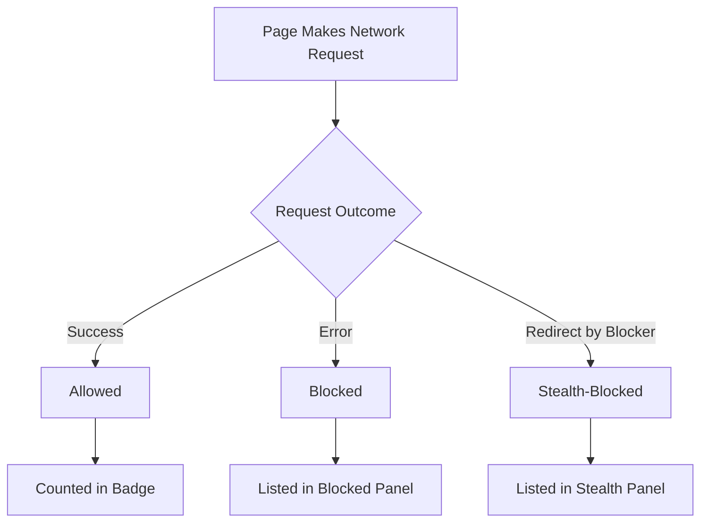

# Interpreting Stealth Blocking and Anomalies

uBO Scope offers a detailed view of all third-party remote server connections attempted or made by websites, categorizing network requests as **allowed**, **blocked**, or **stealth-blocked**. This guide dives into the nuanced category of **stealth blocking**, explains why some connections appear as stealth in the popup panel, and provides practical guidance for accurately interpreting these signals—especially when evaluating "ad blocker test" pages or claims about blocker effectiveness.

---

## 1. Understanding the Concept of Stealth Blocking

### What Is Stealth Blocking?

Stealth blocking is a technique used by some content blockers where network requests are blocked or rerouted in ways that make the block invisible or "invisible" to the webpage or certain monitoring tools. 

Unlike outright blocking, stealth blocking seeks to:

- Avoid webpage breakage by silently preventing network requests.
- Hide blocking activity from webpage scripts that try to detect content blockers.

In uBO Scope, connections labeled as **stealth-blocked** represent requests that were intercepted and altered or hidden before the webpage could observe them.

### Why Does Stealth Blocking Matter?

Stealth blocking complicates interpretations because it blurs the line between blocked and allowed connections:

- Webpages or test tools cannot reliably detect stealth blocks.
- Stealth blocking may reduce apparent block counts reported elsewhere.
- Stealth blocked requests appear in a distinct category in uBO Scope’s popup panel to show transparency.

<Tip>
Stealth blocking is a deliberate feature of advanced content blockers aiming for subtlety and compatibility with website functionality.
</Tip>

## 2. When and Why Connections Appear as Stealth in uBO Scope

uBO Scope detects network outcomes using browser APIs monitoring the lifecycle of requests. It categorizes connections based on network events:

- **Allowed:** Requests completed successfully and resources loaded.
- **Blocked:** Requests failed due to explicit blocking or errors.
- **Stealth-blocked:** Redirected or modified so the webpage does not observe a failure.

### How uBO Scope Identifies Stealth

- Stealth blocking links typically generate a **redirect** event caught by listener hooks.
- The background processing identifies these redirects caused by blocking filters.
- These requests are recorded under the stealth category in the popup.

### Impact on User Interpretation

For users analyzing domain connections on the popup panel:

- Stealth-blocked domains are counted separately and should not be interpreted as "allowed" or fully blocked.
- Understanding stealth blocking helps explain why some resources never appear as loaded or visibly failed yet are still effectively blocked.

<Check>
Remember: a high stealth count indicates subtle blocking, not a failure of the blocker.
</Check>

## 3. Evaluating "Ad Blocker Test" Pages with uBO Scope

### The Pitfalls of Relying on Test Pages

Many "ad blocker test" pages are crafted to detect blocking by simulating resource loading patterns. However, these pages are often misleading:

- They use **artificial and non-realistic** network requests never observed in the wild.
- They fail to account for stealth blocking techniques.
- They may produce false negatives or positives due to unrealistic detection logic.

### How uBO Scope Helps

Using uBO Scope, you can:

- See actual network requests and their real outcomes (allowed, blocked, stealth).
- Identify if a request was stealth-blocked, explaining why a test page may falsely say "not blocked."
- Avoid over-trusting synthetic test page results when assessing blocker reliability.

<Warning>
Avoid basing your blocker choice solely on "ad blocker test" webpages. Instead, use uBO Scope to observe real-world network activity to judge blocker performance.
</Warning>

## 4. Practical Steps for Interpreting Stealth Blocking and Anomalies

### Step 1: Open the uBO Scope Popup Panel

- Click the extension icon.
- View the hostname and domain summary at the top.
- Notice the three outcome sections: **not blocked (allowed)**, **stealth-blocked**, and **blocked**.

### Step 2: Review the Stealth-Blocked Domain List

- Domains under stealth-blocked indicate requests intercepted with stealth techniques.
- Consider that these requests were effectively blocked but without explicit failure.

### Step 3: Correlate with Badge Count

- The toolbar badge shows the count of distinct allowed third-party domains.
- Stealth-blocked domains do not add to this count.

### Step 4: Understand Anomalies

- Unexpected stealth blocks on legitimate domains may indicate over-blocking rules.
- No stealth blocks despite known blocking may indicate detection evasion or blocking limitations.

### Step 5: Combine with Other Observations

- Use uBO Scope in combination with browser developer tools when deeper analysis is required.
- Compare results when switching content blockers to spot differences in stealth behavior.

## 5. Common Pitfalls and How to Avoid Misinterpretation

- **Assuming stealth-blocked means allowed:** Stealth blocking is a form of blocking.
- **Misreading test page failures:** Synthetic test pages can give false impressions about stealth blocking.
- **Equating more blocking count with better blocking:** Total block count does not reflect quality or stealth effectiveness.

<Tip>
Focus on the total number of distinct allowed connections for a clearer privacy perspective rather than raw block counts.
</Tip>

## 6. Troubleshooting Interpretation Issues

<AccordionGroup title="Troubleshooting Stealth & Anomaly Issues">
<Accordion title="Popup Shows No Stealth Blocked Domains">
- Confirm you are on a page with content blocking enabled.
- Check the blocker rules applied; stealth blocking may not always trigger.
- Refresh the page and open the popup immediately.
</Accordion>
<Accordion title="Stealth Blocking Appears on Unexpected Domains">
- Review your filter lists for aggressive rules.
- Verify no site-specific exceptions or custom rules conflict.
- Test on multiple sites to rule out page-specific anomalies.
</Accordion>
<Accordion title="Badge Count Does Not Match Expected Values">
- Badge reflects distinct allowed domains only, not blocked or stealth.
- Reopen the popup to refresh counts.
- Verify extension permissions and functionality (see Troubleshooting guides).
</Accordion>
</AccordionGroup>

## 7. Best Practices for Using uBO Scope to Analyze Stealth Blocking

- Always use uBO Scope in real-world browsing scenarios for meaningful insights.
- Avoid relying on "ad blocker test" pages as a sole benchmark.
- Investigate stealth blocks as indicators of effective but hidden blocking.
- Use the distinct domain category lists to get an overall privacy picture.
- Combine with browser developer network tools for comprehensive analysis.

## 8. Next Steps & Related Resources

- After mastering stealth blocking interpretation, explore [Understanding the Popup Panel and Toolbar Badge](/guides/getting-started-essentials/understanding-popup-and-badge) to deepen your UI knowledge.
- Learn how to perform your [First Website Analysis: Step-by-Step](/guides/getting-started-essentials/first-analysis-walkthrough).
- For troubleshooting installation or operation issues, refer to [Resolving Common Installation & Activation Issues](/getting-started/troubleshooting/common-issues).
- Review foundational concepts in [Core Concepts & Terminology](/overview/introduction/core-concepts-and-terms) for clarity on network request outcomes.

---

## Glossary of Key Terms

| Term              | Definition                                                      |
|-------------------|----------------------------------------------------------------|
| Stealth Blocking  | Blocking network requests by redirecting or hiding them to avoid webpage detection and breakage |
| Allowed           | Requests that successfully fetched resources from third-party domains |
| Blocked           | Requests that were explicitly prevented or failed with errors |
| Ad Blocker Test Page | Synthetic webpage attempting to detect or measure ad blocker behavior, often unreliable |

---

## Visual Workflow: How uBO Scope Classifies Network Requests

## Example Scenario

Imagine loading a site that includes tracking scripts:

- The request to the tracker domain is intercepted and stealth-blocked, so uBO Scope shows it under stealth but the badge does not increment.
- The site also loads some CDN resources allowed normally, which show under allowed and increase the badge count.
- Malicious ad domains explicitly blocked appear in the blocked category.

By reviewing all three sections, you gain a comprehensive understanding of your blocker’s effectiveness including subtle stealth techniques.

---

## Summary

This guide equips you to interpret uBO Scope’s stealth blocking data confidently, avoid common misunderstandings with synthetic test pages, and use this knowledge to get a clearer, more accurate picture of content blocking efficacy in real browsing.

<Info>
For detailed usage and initial setup, see related guides on the [Popup Panel](/getting-started/first-run-experience/understanding-popup-panel) and [First Website Analysis](/guides/getting-started-essentials/first-analysis-walkthrough).
</Info>

---

##### Source
View the extension and background processing source code on GitHub: <https://github.com/gorhill/uBO-Scope>

