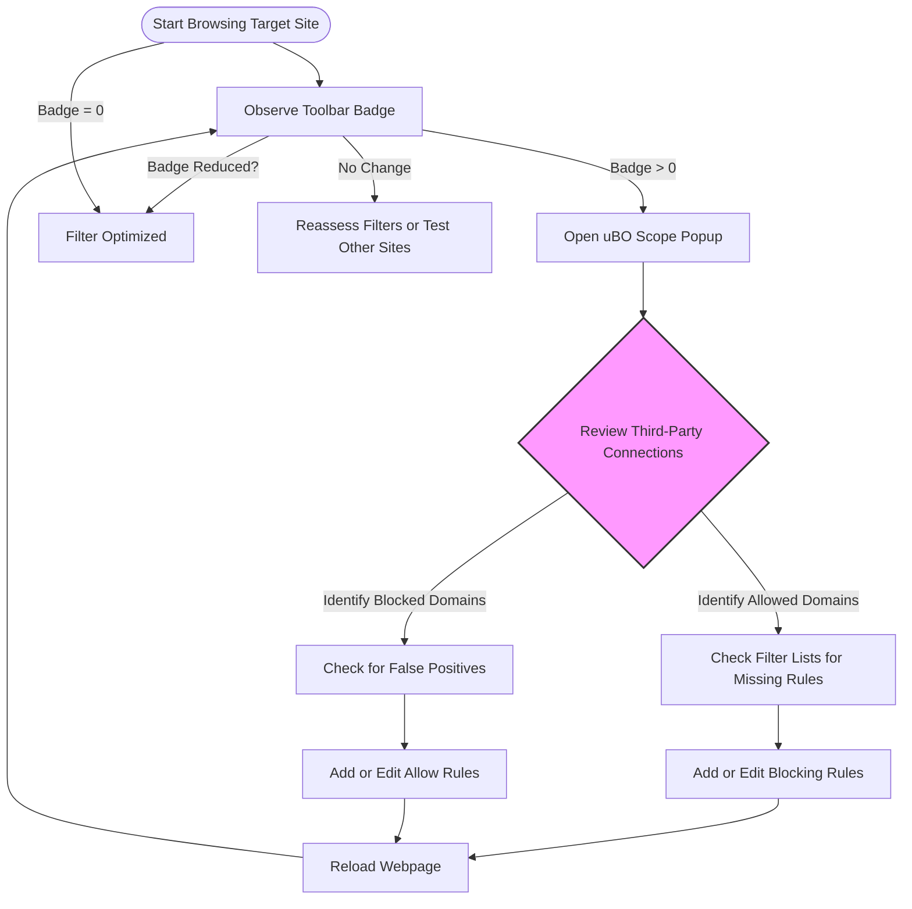

# Advanced: Using uBO Scope for Filter List Maintenance

## Overview

This guide is designed for filter list maintainers and advanced privacy enthusiasts aiming to leverage uBO Scope to audit real-world network connections. It walks you through using uBO Scope to monitor which third-party servers web pages actually contact during browsing sessions, verify the effectiveness of filtering rules, and optimize your filter lists by validating which third-party domains need blocking or allowing.

By following this guide, you will gain actionable insights on how to interpret uBO Scope’s data, identify unnecessary network connections, and improve your content blocking strategies.

---

- **Prerequisites:**
  - uBO Scope extension installed and properly configured in your browser.
  - Basic understanding of filter lists and content blocking rules.
  - Familiarity with the uBO Scope badge and popup UI for connection monitoring (see related guides).

- **Expected Outcome:**
  - Confident use of uBO Scope to audit actual third-party connections.
  - Ability to validate filter list efficacy.
  - Optimized filter list through informed identification of needed block or allow rules.

- **Estimated Time:**
  - 15-30 minutes for initial familiarization and practical auditing.

- **Difficulty Level:** Intermediate to Advanced

---

## Step-by-Step Instructions

### 1. Prepare Your Environment for Accurate Auditing

Set up uBO Scope and your filter list for testing.

- Ensure the uBO Scope extension is enabled and has all required permissions to monitor network requests.
- Select or create a filter list you want to maintain or audit.
- Open a browser window with uBO Scope active.

**Expected Result:** The toolbar badge will update as you browse, showing the count of distinct third-party servers contacted.

---

### 2. Browse Target Webpages Under Audit

- Visit the webpages or domains you want to validate for filter accuracy.
- Observe the toolbar badge number; a lower count of allowed third-party servers corresponds to more effective blocking.

**Tip:** It’s best to test over multiple page loads or sessions to see persistent connections and avoid one-off anomalies.

---

### 3. Open the uBO Scope Popup to Inspect Connections

- Click the uBO Scope toolbar icon to open the popup UI.
- Review the three categorized sections:
  - **Not Blocked** — third-party domains successfully connected.
  - **Stealth-blocked** — domains blocked in ways that prevent exposure.
  - **Blocked** — domains explicitly blocked by filters.

**Expected Result:** You see a real-time list of all third-party domains contacted or blocked on the current tab, with counts of connection attempts.

**Decision Point:**
- Identify any domains in **Not Blocked** that should be blocked.
- Notice any domains in **Blocked** that may be unnecessarily blocked (false positives).

---

### 4. Validate Filter Efficacy Using uBO Scope Data

- Compare the network connections shown by uBO Scope with your current filter rules.
- Investigate any unexpected allowed connections:
  - These might indicate missing rules or ineffective filters.
  - Consider adding or adjusting filter rules to catch these connections.

- Investigate false positives by checking if any blocked domains should be allowed to prevent breakage on websites.

**Practical Example:**
- If a trusted CDN domain persists in the blocked section causing page breakage, whitelist it by adjusting filter rules.
- If a suspicious ad or tracker domain is listed as allowed, create or update rules to block it.

---

### 5. Optimize Your Filter List

- Use the connection counts to prioritize filters that impact multiple connections.
- Remove redundant blocking or allowing rules by confirming connection patterns over time.
- Minimize filter list size while maximizing coverage based on real-world data.

**Best Practice:** Perform this analysis across a representative selection of websites to ensure broad coverage.

---

### 6. Repeat Auditing After Filter Updates

- After making filter list changes, reload tested webpages and observe uBO Scope’s updated connection data.
- Confirm that undesired third-party connections are now blocked and legitimate connections remain allowed.

---

## Practical Tips & Best Practices

- **Focus on Domains, Not URLs:** uBO Scope aggregates connections by domain. Reviewing this high-level view helps you spot dominant third parties.
- **Use Unicode Domain Names:** uBO Scope decodes punycode, so you can recognize internationalized domain names clearly.
- **Beware of Stealth-Blocked Connections:** Some connections are stealth-blocked by content blockers without full drops; understand their impact.
- **Multiple Testing Sessions:** Network conditions and webpage scripts change; multiple audits ensure accurate observations.
- **Cross-Check with Filter Lists:** Always validate findings against filter lists like EasyList, uBlock filters, and custom lists.

## Common Pitfalls to Avoid

- **Assuming Block Counts Equal Privacy:** The toolbar badge count reflects allowed distinct third-party domains, not block count effectiveness. A low badge count means fewer data leaks.
- **Relying on Test-Only Webpages:** Synthetic 'ad blocker test' pages do not represent real browsing and often mislead filter maintenance.
- **Forgetting to Clear Cache and Reload:** Browsers cache resources; always reload pages fully to capture fresh network data.

## Troubleshooting

- **No Data Shown in Popup:** Verify uBO Scope is enabled and browser permissions are granted.
- **Badge Doesn’t Update:** Refresh the tab or restart the browser to reset session data.
- **Unexpected Domains Always Allowed:** Confirm your filters do not whitelist these domains and that no other extensions interfere.

## Examples

Here’s a simplified scenario illustrating filter maintenance:

- You browse a popular news website.
- uBO Scope badge shows 15 allowed third-party domains.
- Upon popup inspection, you see domains like `ads.example.com` in **Not Blocked**.
- You realize your filter list lacks a blocking rule for that domain.
- You add a rule to block `||ads.example.com^`.
- Reload the page: the badge reduces to 14, and `ads.example.com` appears under **Blocked**.

This workflow confirms filter effectiveness and helps maintain tight content blocking.

## Diagram: Typical Audit Workflow Using uBO Scope

## Next Steps & Related Documentation

- For foundational understanding, read [What is uBO Scope?](/overview/introduction-core-value/what-is-ubo-scope).
- To get started with the UI, see [Monitoring Network Connections on Webpages](/guides/getting-started-usage/monitoring-connections).
- If new to the extension, review [Getting Your First Results](/getting-started/first-use-validation/getting-your-first-results).
- For common setup problems, consult [Troubleshooting Common Setup Issues](/getting-started/first-use-validation/troubleshooting-common-setup-issues).
- Understand domain classifications and badge readings better via [Interpreting the Toolbar Badge & Popup Categories](/guides/getting-started-usage/interpreting-badge-and-popup).

---

<Tip>
Using uBO Scope as an auditing tool empowers filter maintainers to see beyond static filter rules into the dynamic reality of web requests, making filter maintenance more precise and privacy-focused.
</Tip>

<Note>
Remember to perform testing with a variety of websites, as third-party networks can vary significantly across different domains and use cases.
</Note>

<Warning>
Changes to filter lists should be tested carefully to avoid breaking legitimate website functionality caused by over-blocking.
</Warning>
