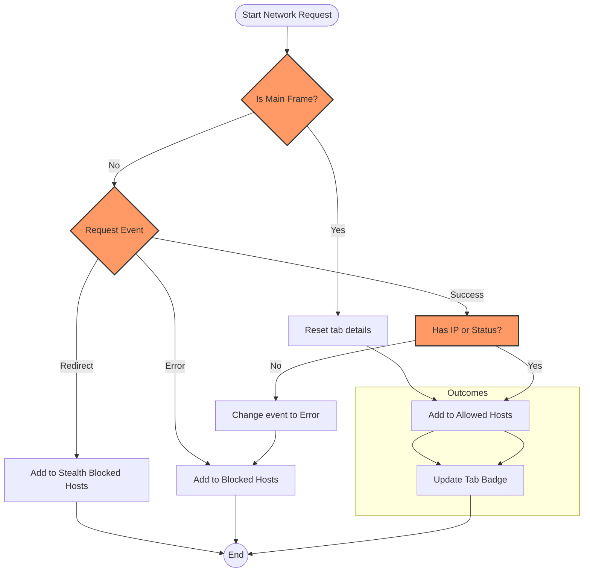

# Diagnosing Stealth Blocking & Network Request Outcomes

## Overview

This guide helps you understand how uBO Scope reports network request outcomes, especially focusing on the concept of **stealth blocking** and how blocked requests might be invisible to test sites but still affect your browsing experience. You will learn to interpret what happens behind the scenes when your browser interacts with content blockers or DNS filters, and how to distinguish requests that are completely blocked versus those stealthily blocked.

---

## What You Will Learn

- What stealth blocking means in the context of uBO Scope
- How uBO Scope captures and categorizes network request outcomes
- How to interpret the domains and counts shown in the popup UI
- Practical troubleshooting steps when blocked or stealth events seem confusing or unexpected

## Why This Matters

Many content blockers and DNS filtering solutions block requests silently without revealing their presence to webpages or testing sites. This leads to confusion, as "blocked" requests may never show in typical network test tools. uBO Scope exposes these stealth blocking activities, empowering you to make informed decisions about your privacy and browsing security.

---

## Prerequisites

- uBO Scope installed on your supported browser (Chromium 122+, Firefox 128+, or Safari 18.5+)
- Basic familiarity with the uBO Scope popup UI (see [Understanding the UI](../getting-started/first-use-configuration/understanding-the-ui))
- Awareness of your content blocker or DNS filter in use on your system

---

## Understanding Network Request Outcomes in uBO Scope

uBO Scope listens to your browser’s network traffic through the `webRequest` API, capturing every attempt to connect to remote third-party servers from webpages you visit. It categorizes these attempts into three outcomes:

- **Allowed**: The request successfully connected and loaded resources.
- **Blocked**: The request was explicitly prevented from completing (e.g., failed network with an error).
- **Stealth-Blocked**: The request was silently redirected or canceled by a blocker or filter without an explicit error visible to the webpage.

### What is Stealth Blocking?

Stealth blocking occurs when blocking mechanisms operate discreetly to avoid detection by webpages or test scripts. Instead of returning an error or blocking outright, these blockers intercept network requests to make them fail quietly or appear to succeed without transferring data. For example:

- A request may get redirected internally to a null or local address.
- A DNS filter may prevent resolution, causing a silent failure.

<u>uBO Scope reports stealth-blocked outcomes distinctly, allowing you to detect these otherwise invisible events.</u>

---

## Step-by-Step: How to Diagnose Stealth and Blocked Requests

<Steps>
<Step title="Open uBO Scope Popup on Your Active Tab">
Access the uBO Scope extension icon on your browser toolbar and click it to open the popup for the currently active tab.

Expected Result:
- The popup shows the **tab hostname and domain** at the top.
- Sections for **not blocked**, **stealth-blocked**, and **blocked** domains with counts.
</Step>

<Step title="Review the Domain Lists">
Carefully examine the domains listed under each section:

- **Not Blocked**: Domains from which resources have loaded successfully.
- **Stealth Blocked**: Domains where the connection attempt was covertly blocked or redirected.
- **Blocked**: Domains where requests produced explicit errors or failed.

Expected Result:
- Domains are sorted alphabetically with counts showing how many connections were attempted or processed.
</Step>

<Step title="Compare Stealth and Blocked Lists to Content Blocker Behavior">
Check your content blocker or DNS filter settings to cross-reference if the stealth-blocked domains correspond to your blocking rules or lists.

Decision Point:
- If stealth-blocked domains are unexpected, you may have silent blocking through DNS filters or stealthy extension rules.
- If blocked domains are not what you expect, verify your blocker’s configuration.
</Step>

<Step title="Test with Known Third-Party Sites">
Visit popular websites and observe uBO Scope reports. Notice some requests may appear in stealth blocking even though no visible error occurs.

Verification:
- Confirm stealth-blocked domains do not load resources.
- Note blocked domains should produce visible failures or not load.
</Step>
</Steps>

---

## Practical Examples

### Example 1: Detecting a DNS-Based Blocker

If you use a DNS filter that blocks access to tracking domains silently, uBO Scope may report those domains under **stealth-blocked** rather than **blocked**.

- You see domains like `tracker.example.com` listed under stealth blocking.
- No error is visible on the webpage, but these requests never complete.

This reflects stealth blocking by DNS filters invisible in conventional network tools.

### Example 2: Extension-Based Blocking with Redirects

An extension might redirect certain ad-serving domains to localhost or a null address, resulting in stealth blocking.

- uBO Scope logs those domains under stealth.
- The request flow shows a redirect event without a network error.

This prevents detection by test sites making fake ad network requests.

---

## Tips for Success

- **Always verify your blocker settings** alongside uBO Scope's reports to understand why certain domains are stealth blocked.
- Remember that stealth-blocked requests are not loading any data, preserving your privacy despite no explicit error visible.
- Use uBO Scope in real browsing scenarios rather than synthetic test sites which cannot detect stealth blocking reliably.
- Pay attention to the **count** column showing how many requests per domain were impacted.

---

## Common Issues & Troubleshooting

<AccordionGroup title="Stealth Blocking Troubleshooting">
<Accordion title="Why do some requests show as stealth blocked but still load content?">
Stealth blocking means the request is redirected or canceled silently. However, some scripts may fallback or retry via different domains, leading to successful content loads. Check if domains appear as both allowed and stealth blocked, which may indicate fallback mechanisms.
</Accordion>

<Accordion title="Why does the blocked count not match my content blocker’s block count?">
Content blocker block counts count rule hits, which are different from unique third-party domains. Also, stealth blocking by DNS or network layers might not be counted by your content blocker but is reported by uBO Scope.
</Accordion>

<Accordion title="The extension shows no blocked or stealth domains—what do I do?">
Ensure uBO Scope has the necessary permissions and that your browser supports the `webRequest` API. Review installation troubleshooting guides and verify you are viewing an active tab with network activity.
</Accordion>
</AccordionGroup>

---

## Next Steps & Related Documentation

- **Understanding the Popup UI:** Deep dive into how to interpret the full UI presentation of connection data.
- **Key Terminology & Metrics:** Learn detailed definitions of terms used in this guide.
- **Analyzing Third-Party Remote Connections:** Apply uBO Scope to audit privacy exposure across websites.
- **Compare Content Blockers:** Use uBO Scope to compare different blockers and their real-world effect.

---

## Diagram: Network Request Outcome Flow

---

# References

- [Understanding the Popup UI](/guides/getting-started/interpret-popup)
- [Key Terminology & Metrics](/overview/core_concepts_architecture/terms_and_metrics)
- [Analyzing Third-Party Remote Connections](/guides/practical-usage/analyze-third-party-connections)
- [Installing uBO Scope](/guides/getting-started/install-extension)
- [Troubleshooting Common Installation Issues](/getting-started/first-use-configuration/troubleshooting-common-issues)

---

# Quick Code Insight

The core categorization of requests is based on event types recorded by the browser's `webRequest` API:

- `success` indicates a completed request with valid IP or status code.
- `error` denotes failed network activities.
- `redirect` marks silent redirects treated as stealth blocking.

These events update per-tab outcome details by mapping hostnames and domains.

---