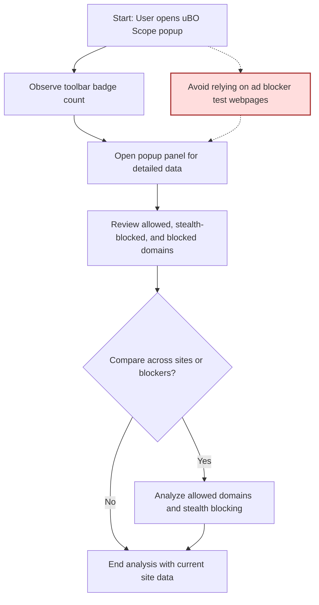

# Diagnosing Ad Blocker Effectiveness & Myths

## Overview
This guide helps you critically evaluate the commonly used 'block count' metric in content blockers, understand why popular ad blocker test webpages often provide misleading results, and use uBO Scope to gain a clear, reality-based insight into what is truly blocked or allowed by your content blockers.

### Prerequisites
- uBO Scope installed and active on your supported browser (Chrome, Firefox, Safari).
- Familiarity with opening the uBO Scope popup panel ([see Reading the Popup Panel guide](../getting-started/reading-the-popup.md)).
- Basic understanding of network connections and content blockers.

### Expected Outcome
By following this guide, you will be able to:
- Interpret block count metrics correctly by focusing on distinct third-party domains allowed versus blocked.
- Recognize limitations and myths propagated by common ad blocker test websites.
- Use uBO Scope's popup interface to see granular data about connections that are allowed, stealth-blocked, or blocked.

### Time Estimate
Approximately 10-15 minutes to complete this walkthrough and apply the practical insights.

### Difficulty Level
Beginner to Intermediate – suitable for privacy enthusiasts, web professionals, and general users curious about blocker effectiveness.

---

## Step-by-Step Instructions

### 1. Understand the Limitation of Block Count Metrics
- Open uBO Scope and observe the toolbar badge count. This number represents the distinct third-party remote servers your browser connected to on the active tab.
- Avoid judging content blocker effectiveness by comparing block counts alone. A higher block count doesn't necessarily mean better blocking – it may indicate that the browser made more requested connections, many of which might be allowed.

<Tip>
The badge count shows how many unique third-party domains were allowed, not the total number blocked. Focusing on this distinction helps avoid the trap of assuming that ‘more blocks = better protection.’
</Tip>

### 2. Use uBO Scope to Analyze Connection Outcomes on Any Website
- Activate uBO Scope by clicking its toolbar icon.
- The popup categorizes domains into three outcomes:
  - **Not Blocked (Allowed):** Domains from which connections were permitted.
  - **Stealth-blocked:** Connections silently blocked to avoid detection by the webpage.
  - **Blocked:** Explicitly blocked connections.
- Review the domain counts under each category. This breakdown helps you understand actual network exposure rather than relying on raw block counts.

<Tip>
Stealth blocking is a common technique by content blockers to block resources without alerting the webpage, often crucial to avoid page breakage or to maintain privacy aggressively.
</Tip>

### 3. Debunk Myths from Popular Ad Blocker Test Webpages
- Avoid relying on ‘ad blocker test’ sites because:
  - They typically generate artificial network requests not found on real websites.
  - They cannot see stealth-blocking effects, thus providing incomplete results.
  - They may misinterpret or misreport the actual blocking effectiveness.

- Instead, use uBO Scope's real-time tracking to see actual network connections your browser attempts and the true outcomes.

<Warning>
Using ad blocker test pages as your sole benchmark can lead to false assumptions about your blocker’s capabilities and weaknesses.
</Warning>

### 4. Practical Scenario: Validate a Content Blocker’s True Effectiveness
- Visit a website you wish to analyze.
- Open the uBO Scope popup.
- Check the number of domains listed as 'allowed' to gauge how many third-party connections are actually permitted.
- Compare these with domains under ‘blocked’ and ‘stealth-blocked.’
- If your content blocker shows a high block count badge but allows many distinct third-party domains, its effectiveness may be overestimated.

<Check>
A smaller 'allowed' domain count generally means better privacy protection, even if the block count badge is lower.
</Check>

---

## Examples & Real-World Insights

#### Example: Reading the Popup on a News Website
- After loading the news page, open uBO Scope.
- The popup displays:
  - 12 domains allowed
  - 5 stealth-blocked domains
  - 8 blocked domains
- Interpretation: Although some resources were technically blocked, 12 distinct third-party domains successfully connected, exposing you to tracking or ads.

#### Example: Comparing Two Content Blockers
- Content Blocker A shows a block count badge of 350, with 25 allowed domains.
- Content Blocker B shows a block count badge of 200, with 40 allowed domains.
- Despite Blocker A having a higher block count, it allows fewer third-party domains, making it more effective.

---

## Troubleshooting & Best Practices

### Common Issues
- **No Data in Popup:** Ensure uBO Scope has permission and is properly installed. See [Troubleshooting Common Setup Issues](../getting-started/usage-validation/troubleshooting-installation.md).
- **Confusing Badge Counts:** Remember badge counts are allowed domains only, not blocks. Use popup details to clarify.

### Best Practices
- Always use uBO Scope in conjunction with content blockers to get transparent insights.
- Do not rely solely on block counts or external test pages.
- Analyze stealth-blocked connections to understand covert blocking methods.
- Use uBO Scope regularly to audit your privacy exposure when visiting new or untrusted sites.

### Performance Considerations
- uBO Scope collects data in near real-time but batches network events to minimize overhead.
- Avoid heavy browsing on many tabs simultaneously if device resources are constrained, as this may delay data aggregation.

---

## Next Steps & Related Content

- Explore the [Reading the Popup Panel guide](../guides/getting-started/reading-the-popup.md) for a deeper dive into the popup UI.
- Check [Analyzing Third-Party Connections](../guides/practical-usage/analyzing-third-party-connections.md) to build skills for privacy evaluation.
- Refer to the [Key Terminology and Concepts](../overview/concepts-terminology/key-terminology.md) page to grasp essential definitions.
- Review [Integration with Browsers and Content Blockers](../overview/how-it-works/integration-with-other-systems.md) for technical context.

<Tip>
Using uBO Scope effectively empowers you to make informed decisions about your content blockers and web privacy beyond superficial metrics.
</Tip>

---

## Visual Summary: User Flow Diagnosing Blocker Effectiveness

---