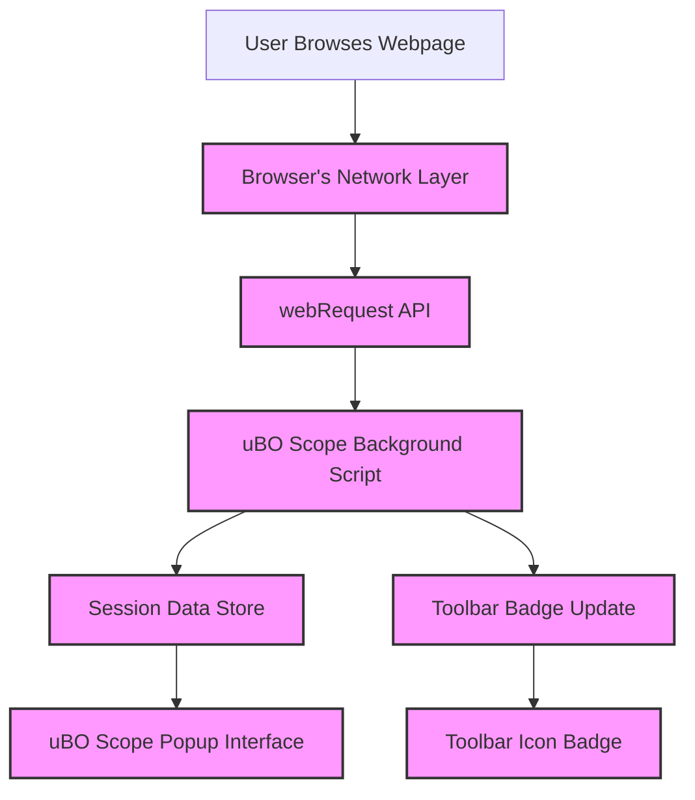

# Comparing Content Blockers with uBO Scope

## Overview

This guide empowers you to audit and compare the effectiveness of various browser content blockers using uBO Scope. It clarifies why focusing on the **number of distinct remote servers connected** offers a more reliable measure than merely counting blocked requests.

Many users are misled by simple block counts and "ad blocker test" results that do not accurately reflect real-world blocking performance. uBO Scope cuts through this confusion by revealing actual network connection exposure.

---

## Why Count Distinct Server Connections?

Traditional block counts can be deceptive:

- A high block count does not always mean better blocking, as it may correlate with the browser requesting resources from many more servers.
- True blocking effectiveness should be measured by how many **third-party domains** still successfully receive connections.

uBO Scope reports the **unique third-party remote servers** your browser contacts, providing an unobfuscated view of your actual exposure to external resources.

### Common Misconceptions Dispelled

- **"This extension blocks more requests, so it's better"** 
  - More blocked requests may mean more network requests made in the first place, increasing exposure unintentionally.

- **"Ad blocker test sites reflect real-world blocking"**
  - These sites often use unrealistic or fabricated network requests, failing to gauge stealth or nuanced blocking behavior.

---

## Step-by-Step Guide to Comparing Content Blockers

Follow this workflow to audit and compare multiple content blockers effectively.

### Prerequisites

- Have uBO Scope installed and working in your browser.
- Install or activate the content blockers you want to compare.
- Basic familiarity with uBO Scope's popup interface.

### Expected Outcome

You will understand which content blocker allows fewer unique third-party connections — the clearer metric for block efficiency.

### Time Estimate

10–20 minutes per content blocker evaluated.

### Difficulty Level

Beginner to Intermediate

---

### 1. Confirm uBO Scope is Operational

- Ensure uBO Scope's toolbar icon badge appears when you browse.
- Open uBO Scope's popup and confirm domain data displays for active tabs.

<Tip>
If the badge does not appear or the popup is empty, consult the [Troubleshooting Common Setup Issues](../getting-started/first-run-usage/troubleshooting-install) guide.
</Tip>

### 2. Prepare Your Browsing Environment

- Disable all content blockers.
- Open uBO Scope popup on a test website of your choice (preferably one with typical third-party requests).
- Note the number of distinct third-party domains contacted (shown as a badge count and detailed in the popup).

### 3. Activate Content Blocker A

- Enable the first content blocker you want to evaluate.
- Refresh the test website.
- Open uBO Scope popup and record the number of distinct third-party connections.

### 4. Activate Content Blocker B

- Disable Content Blocker A.
- Enable the second content blocker.
- Refresh the test website.
- Open uBO Scope popup and record third-party connection counts.

### 5. Analyze and Compare Results

- Evaluate which content blocker results in the **lowest number of distinct third-party domains connected**.
- Use the categorized lists within the popup:
  - **Not blocked**: Domains successfully connected.
  - **Stealth-blocked**: Requests prevented silently without apparent blocking.
  - **Blocked**: Requests explicitly blocked.

### 6. Repeat and Confirm

- Test across multiple websites for a broader understanding.
- Look for consistency in reducing third-party connections.

---

## Practical Examples

### Scenario 1: Evaluating Two Popular Blockers

| Blocker       | Distinct Third-Party Domains Connected |
|---------------|----------------------------------------|
| Blocker A     | 15                                     |
| Blocker B     | 25                                     |

Despite Blocker B showing a higher block count elsewhere, Blocker A exposes fewer actual third-party connections, indicating better real-world blocking.

### Scenario 2: Stealth Blocking Impact

Review the **stealth-blocked** section in the popup to discern which blocker prevents unseen connections, a feature some blockers use to avoid webpage breakage or detection.

---

## Best Practices

- Focus on **unique domain counts** rather than raw block event totals.
- Use multiple real-world sites to avoid biases from special cases.
- Pay attention to the stealth-blocked category for deeper insights.
- Keep uBO Scope updated for accurate public suffix list processing.

---

## Common Pitfalls and Troubleshooting

<AccordionGroup title="Troubleshooting Common Issues">
<Accordion title="No Data Appears in uBO Scope Popup">
- Confirm content blocker is enabled.
- Verify uBO Scope permissions are granted.
- Refresh the page and popup.
- Check developer console for errors.
- Consult [Troubleshooting Common Setup Issues](../getting-started/first-run-usage/troubleshooting-install).
</Accordion>
<Accordion title="Badge Count Does Not Update">
- Ensure active tab is supported and loaded.
- Wait a few seconds for the background script to process requests.
- Reload the tab.
</Accordion>
</AccordionGroup>

---

## Visualizing the Data Flow

This flow shows how network requests get monitored, processed, stored, and displayed, emphasizing how uBO Scope derives the distinct connection counts.

---

## Next Steps & Related Resources

- Review [Monitoring Third-party Connections](../practical-use-cases/monitoring-3rd-party-connections) for deep insights into interpreting popup data.
- Explore [Analyzing Stealth and Blocked Requests](../advanced-insights/analyzing-stealth-blocking) to understand silent blocking behaviors.
- Consult [System Requirements and Supported Browsers](../../getting-started/setup-and-installation/prerequisites-browsers) to ensure your environment supports accurate monitoring.
- For setup troubles, see [Troubleshooting Common Setup Issues](../../getting-started/first-run-usage/troubleshooting-install).

---

## Additional Tips

- Use uBO Scope alongside your favorite content blockers rather than replacing them.
- Remember that some domains contacted by browsers, like CDNs, are often legitimate and harmless.
- Consider the security impact of domains before blocking indiscriminately.

---

## Learn More
- [What is uBO Scope?](../../overview/product-introduction/what-is-ubo-scope) for foundational knowledge.
- [Feature Quick Tour](../../overview/core-architecture-concepts/feature-quick-tour) to get familiar with the UI.
- [Installation and Activation Guide](../../guides/getting-started/installation-activation) to set up uBO Scope.

---

_Last updated: version 1.0.1_

---

## Source Code & Further Exploration

You can explore the source code for the core baground processing in [js/background.js](https://github.com/gorhill/uBO-Scope/blob/main/js/background.js) and the domain suffix parsing in [js/lib/publicsuffixlist.js](https://github.com/gorhill/uBO-Scope/blob/main/js/lib/publicsuffixlist.js).

---