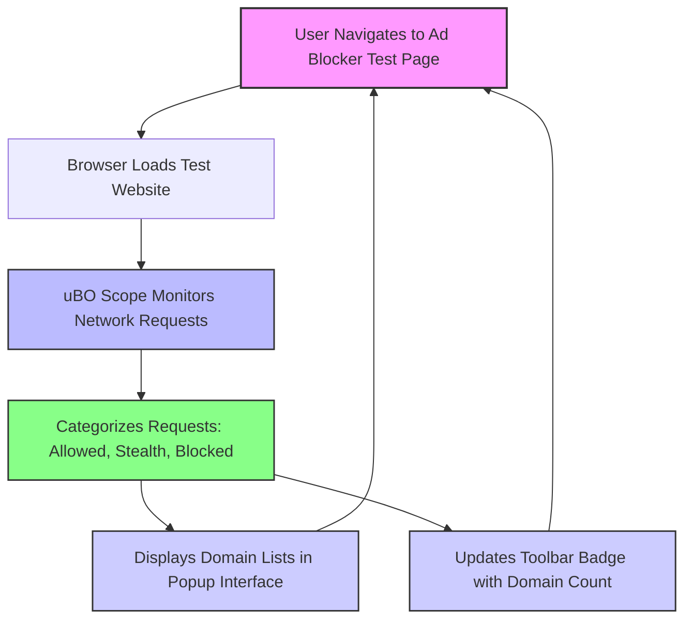

# Diagnosing Ad Blocker Test Pages with uBO Scope

## Overview

Ad blocker test websites often claim to evaluate how effectively your browser extension blocks ads and trackers. However, these test pages can be misleading and unreliable. This guide teaches you how to use uBO Scope to analyze the network requests these test sites generate, helping you spot their limitations and avoid being fooled by fabricated or stealthy scenarios.

### What You Will Achieve
- Understand how to interpret network request results shown by uBO Scope when visiting ad blocker test pages.
- Learn to identify stealth blocking, outright blocking, and allowed connections.
- Recognize why popular ad blocker test pages often produce unrealistic or misleading outcomes.

### Prerequisites
- Have uBO Scope installed and activated in your browser. See [Installing and Activating uBO Scope](/guides/getting-started/installation-activation) for setup instructions.
- Familiarity with the uBO Scope popup interface and badge as explained in [Exploring the Popup Interface](/guides/getting-started/exploring-popup) and [Verifying Operation and Understanding the Badge](/getting-started/first-run-usage/validation-and-badge).

### Time Estimate
15–20 minutes for a first detailed analysis.

### Difficulty Level
Intermediate — requires basic understanding of browser networking and ad blocking concepts.

---

## Step-by-Step Guide

### Step 1: Visit an Ad Blocker Test Website
1. Open your browser with uBO Scope enabled.
2. Navigate to a known ad blocker test page (e.g., a page that claims to test if ads are blocked).

**Expected Outcome:**
- The page will attempt to load various test network requests designed to simulate ad or tracker delivery.

### Step 2: Open uBO Scope’s Popup Interface
1. Click the uBO Scope toolbar icon.
2. Observe the summary showing the total number of distinct third-party domains contacted by the webpage.

**Expected Outcome:**
- You should see lists of domains under three categories:
  - **Not Blocked:** Domains to which requests succeeded and were allowed.
  - **Stealth-Blocked:** Requests that were intercepted and hidden to avoid detection by the page.
  - **Blocked:** Requests that were outright blocked.

### Step 3: Interpret the Domain Categories
- **Not Blocked Domains:** 
  These are real third-party servers contacted as normal.

- **Stealth-Blocked Domains:** 
  These demonstrate requests that were silently blocked or stealthily handled by your content blocker to avoid detection. Common in modern blockers to prevent test pages from detecting blocking.

- **Blocked Domains:** 
  Requests that failed or were actively stopped.

**Tip:** Compare the size and content of these lists carefully to understand the behavior of your blocker against the test page.

### Step 4: Analyze Network Request Outcomes
1. Using the domain lists, deduce whether the ad blocker test webpage is genuinely testing real-world behavior or relies on fabricated network calls.
2. Be suspicious if many domains appear only in the stealth-blocked or blocked categories but the page claims perfect or near-perfect blocking.
3. Consider the relevance of domains by checking if they correspond to known ad or tracker servers vs. made-up domains.

### Step 5: Use uBO Scope Badge for Quick Insights
- Observe the badge number on the uBO Scope toolbar icon during test page loading.
- Lower numbers indicate fewer distinct third-party connections, which may mean effective blocking.

**Warning:** Do not rely solely on blocked request counts reported by test pages, as these can be manipulated or meaningless.

### Step 6: Confirm Your Understanding
- Reload the test page without any content blocker enabled, then with uBO Scope alone, then with your usual blocker.
- Compare the domain counts and lists each time.

**Expected Outcome:**
- The test page’s results should differ substantially from uBO Scope’s real network observations, revealing inconsistencies in such test pages.

---

## Practical Example

Suppose you visit "example-adblock-test.com" (hypothetical):

1. The test page tries to load ads from domains like `ads.fakeadserver.test` and trackers from `trackers.fake.com`.
2. uBO Scope's popup shows:
   - **Not Blocked:** `cdn.realwebsite.com`
   - **Stealth-Blocked:** `ads.fakeadserver.test`
   - **Blocked:** None

This indicates the extension stealth-blocked the fake ad domain rather than outright blocking it.

Your real-world browsing would show connections only to legitimate CDN and services.

### Insight
Stealth blocking here means the ad blocker prevented the request quietly so the test page cannot easily detect blockage. A test page showing no blocks might be misleading since your blocker is stealthy rather than ineffective.

---

## Best Practices & Tips

- Always cross-reference domain names in allowed or blocked lists against real-world ad/tracker domains.
- Remember that many ad blocker test pages use unrealistic or outdated testing tactics that do not reflect normal web browsing.
- Use uBO Scope alongside your usual blocker to get a truthful picture of network requests made.
- Stealth blocking is a strength, not a weakness—don't expect every blocked request to be visible.
- Use the [Monitoring Third-party Connections](/guides/practical-use-cases/monitoring-3rd-party-connections) guide for in-depth techniques to analyze third-party exposure.

---

## Troubleshooting Common Issues

<AccordionGroup title="Troubleshooting Ad Blocker Test Diagnoses">
<Accordion title="The popup shows 'NO DATA' or empty results when visiting the test site">
This usually means uBO Scope isn’t capturing requests for the tab. Confirm the extension is enabled and permissions granted. Refer to [Troubleshooting Common Setup Issues](/getting-started/first-run-usage/troubleshooting-install).
</Accordion>
<Accordion title="Some expected blocked third-party domains don’t appear in the popup">
Content blockers may stealth block requests to avoid detection by test pages, so blocked domains might appear under stealth-blocked or be absent. This is an intentional feature.
</Accordion>
<Accordion title="The badge count is zero but test page claims blocking">
The test page might fabricate results or cannot detect stealth blocking. Rely on uBO Scope data for accurate network request observations.
</Accordion>
</AccordionGroup>

---

## Understanding the Data Flow

This workflow shows how uBO Scope passively observes all network activity initiated by the test page, classifies outcomes based on blocking state, and presents actionable insights directly to you.

---

## Next Steps

- Apply this method when visiting other ad blocker evaluation pages to critically assess their reliability.
- Explore [Comparing Content Blockers with uBO Scope](/guides/practical-use-cases/compare-blockers-effectiveness) for comprehensive blocker audits.
- Learn more about stealth and blocked requests in [Analyzing Stealth and Blocked Requests](/guides/advanced-insights/analyzing-stealth-blocking).
- Stay informed about privacy risks and exposure by frequent use of uBO Scope's domain monitoring.

---

## Helpful Resources
- [What is uBO Scope?](/overview/product-introduction/what-is-ubo-scope)
- [Core Concepts & Terminology](/overview/core-architecture-concepts/core-concepts-and-terminology)
- [Exploring the Popup Interface](/guides/getting-started/exploring-popup)
- [Monitoring Third-party Connections](/guides/practical-use-cases/monitoring-3rd-party-connections)
- [Troubleshooting Common Setup Issues](/getting-started/first-run-usage/troubleshooting-install)

<Tip>
Remember, uBO Scope reveals real network activity beyond what ad blocker test pages report. Trust direct observations over synthetic tests.
</Tip>

<Check>
Use this guide to sharpen your understanding of ad blocker test pages and avoid being misled by their often unrealistic evaluations.
</Check>
